# ALTA MODA — Deep Project Analysis

> **Generated:** 2026-04-05  
> **Stack:** Next.js 16.1.7 · React 19 · Prisma 7.5 · PostgreSQL · Tailwind CSS 4 · Zustand · NextAuth

---

## Table of Contents

1. [Architecture Overview & Diagram](#1-architecture-overview)
2. [Project Structure](#2-project-structure)
3. [Data Layer & ER Diagram](#3-data-layer)
4. [Authentication & Authorization](#4-authentication--authorization)
5. [API Endpoints](#5-api-endpoints)
6. [State Management Deep Dive](#6-state-management-deep-dive)
7. [Performance Bottlenecks](#7-performance-bottlenecks)
8. [Recommendations & Action Plan](#8-recommendations--action-plan)
9. [Performant Target Architecture](#9-performant-target-architecture)

---

## 1. Architecture Overview

Alta Moda is a **B2B/B2C e-commerce platform** for professional hair/beauty products. It uses the Next.js App Router with a clear separation between:

- **Public storefront** — products, brands, cart, checkout
- **B2B features** — quick order, bulk pricing, credit terms
- **Admin dashboard** — product management, orders, newsletter, ERP sync

### Key Architectural Decisions

| Decision | Choice | Trade-off |
|----------|--------|-----------|
| Session strategy | JWT (24h expiry) | Fewer DB queries, but no server-side revocation |
| DB adapter | PrismaPg (native) | Direct PostgreSQL connection pooling |
| State management | Zustand | Lightweight, no boilerplate vs Redux |
| Rate limiting | In-memory | Works for single instance; needs Redis for scaling |
| Image storage | Cloudinary CDN | External dependency, but offloads optimization |
| i18n | Custom context | Serbian (lat/cyr), English, Russian |

### 1.1 High-Level System Architecture

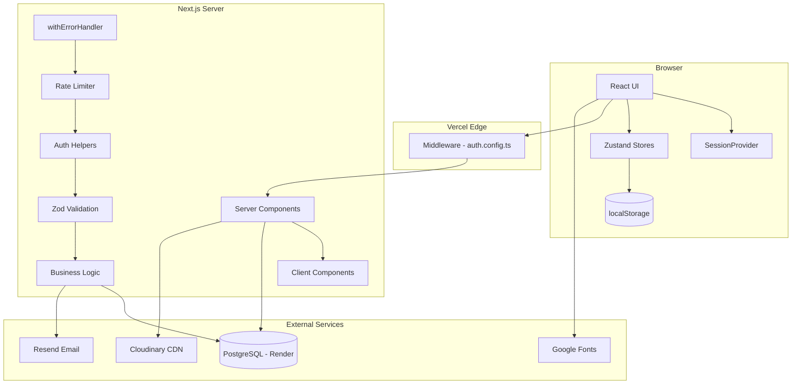

---

## 2. Project Structure

```
src/
├── app/                          # App Router
│   ├── admin/                    # Admin dashboard (protected)
│   │   ├── actions/, blog/, brands/, bundles/, colors/
│   │   ├── homepage/, import/, newsletter/, orders/
│   │   ├── products/, seminars/, settings/, users/
│   │   └── layout.tsx            # Admin layout with sidebar (13.5KB)
│   ├── api/                      # RESTful API routes
│   │   ├── admin/                # Admin-only APIs (colors, users, sync-cloudinary)
│   │   ├── auth/[...nextauth]/   # NextAuth handler
│   │   ├── products/             # Product CRUD + search, colors, import
│   │   ├── cart/, orders/, reviews/, wishlist/
│   │   ├── brands/, categories/, attributes/
│   │   ├── newsletter/           # Campaigns, templates, subscribers
│   │   └── upload/, users/
│   ├── products/                 # Product catalog & detail pages
│   ├── brands/, categories/, colors/
│   ├── cart/, checkout/, account/, wishlist/
│   ├── quick-order/              # B2B bulk ordering
│   ├── contact/, faq/, seminars/, salon-locator/, outlet/
│   ├── HomePageClient.tsx        # Homepage client component (858 lines)
│   └── layout.tsx                # Root layout
├── components/
│   ├── admin/                    # Admin UI components
│   ├── providers/
│   │   ├── AuthProvider.tsx      # NextAuth SessionProvider
│   │   └── CartProvider.tsx      # Cart/wishlist sync (guest -> DB on login)
│   ├── Header.tsx                # Main navigation (571 lines)
│   ├── Footer.tsx, ChatWidget.tsx, CookieConsent.tsx
│   └── LanguageToggle.tsx
├── lib/
│   ├── db.ts                     # Prisma singleton with PrismaPg adapter
│   ├── auth.ts, auth.config.ts, auth-helpers.ts
│   ├── api-utils.ts              # Error handling, pagination, response helpers
│   ├── cloudinary.ts             # Cloudinary SDK config + image listing
│   ├── upload.ts                 # File upload with magic byte verification
│   ├── rate-limit.ts             # In-memory sliding window rate limiter
│   ├── email.ts                  # Resend email service + batch support
│   ├── utils.ts, colors.ts, constants.ts
│   ├── i18n/                     # Language context + translation JSONs (sr, en, ru)
│   ├── validations/              # Zod schemas (cart, order, product, user, etc.)
│   └── stores/                   # Zustand stores (cart, wishlist, auth)
├── types/
│   └── next-auth.d.ts            # Type extensions for session
└── middleware.ts                  # Route protection (admin, account, checkout, quick-order)
```

---

## 3. Data Layer

**PostgreSQL** via Prisma 7.5 + PrismaPg adapter — **24 models** across 6 domains.

### 3.1 Entity Relationship Diagram

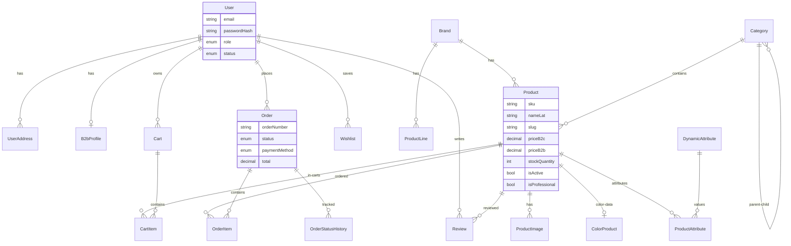

### 3.2 Model Domains

**Users & Auth:** `User`, `UserAddress`, `B2bProfile`  
**Catalog:** `Brand`, `ProductLine`, `Category`, `Product`, `ProductImage`, `ColorProduct`, `DynamicAttribute`, `ProductAttribute`  
**Commerce:** `Cart`, `CartItem`, `Wishlist`, `Order`, `OrderItem`, `OrderStatusHistory`, `Promotion`, `PromoCode`  
**Content:** `Banner`, `Faq`, `Bundle`, `BundleItem`  
**Newsletter:** `NewsletterTemplate`, `NewsletterSubscriber`, `NewsletterCampaign`, `NewsletterAutomation`  
**System:** `ShippingZone`, `ShippingRate`, `ErpSyncLog`, `ErpSyncQueue`, `SeoMetadata`

---

## 4. Authentication & Authorization

### 4.1 Auth Chain Flowchart

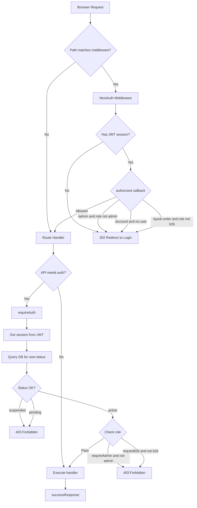

### 4.2 Security Layers

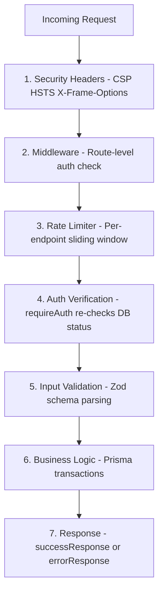

### 4.3 Role-Based Access

| Role | Access | Protected Routes |
|------|--------|-----------------|
| `b2c` | Browse, order, review, wishlist | `/products`, `/cart`, `/checkout`, `/account` |
| `b2b` | + Bulk ordering, volume discounts, credit | + `/quick-order` |
| `admin` | Full system control | + `/admin/*` |

---

## 5. API Endpoints

### 5.1 API Request Flow (Order Creation)

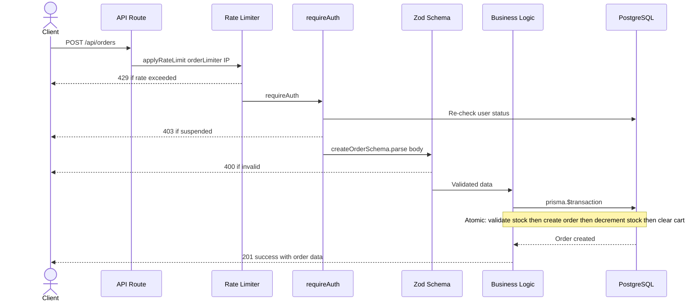

### 5.2 Complete Endpoint Map

**Products:**

| Method | Route | Auth | Description |
|--------|-------|------|-------------|
| GET | `/api/products` | Public | Paginated listing, filters, diacritics search, role-based pricing |
| GET | `/api/products/[id]` | Public | Full detail + related, color siblings, reviews |
| POST | `/api/products` | Admin | Create product with color data + images |
| PUT | `/api/products/[id]` | Admin | Update product |
| DELETE | `/api/products/[id]` | Admin | Soft delete (isActive: false) |
| GET | `/api/products/search` | Public | Autocomplete (top 5, diacritics-aware) |
| GET | `/api/products/colors` | Public | Color matrix grouped by level x undertone |
| POST | `/api/products/import` | Admin | CSV/XLSX import (10K row limit) |

**Cart:**

| Method | Route | Auth | Description |
|--------|-------|------|-------------|
| GET | `/api/cart` | Auth | User's cart items with product details |
| POST | `/api/cart` | Auth | Add item (upserts quantity) |
| PUT | `/api/cart/[itemId]` | Auth | Update quantity (ownership validated) |
| DELETE | `/api/cart/[itemId]` | Auth | Remove item (ownership validated) |
| POST | `/api/cart/merge` | Auth | Merge guest cart into DB on login (transactional) |
| POST | `/api/cart/validate-stock` | Public | Batch stock check (rate-limited) |

**Orders:**

| Method | Route | Auth | Description |
|--------|-------|------|-------------|
| GET | `/api/orders` | Auth | Paginated list (admin sees all, users see own) |
| POST | `/api/orders` | Auth | Create order — atomic transaction with stock validation |
| GET | `/api/orders/[id]` | Auth | Full detail with items, status history |
| PATCH | `/api/orders/[id]/status` | Admin | Status update with state machine validation |
| POST | `/api/orders/quick` | B2B | SKU lookup / CSV batch / order repeat |

**Users:**

| Method | Route | Auth | Description |
|--------|-------|------|-------------|
| POST | `/api/users` | Public | Registration (B2C=active, B2B=pending). Rate-limited. |
| GET | `/api/users/me` | Auth | Current user with B2B profile and addresses |
| PUT | `/api/users/me` | Auth | Update name/phone |
| PATCH | `/api/users/[id]/approve` | Admin | Approve B2B user |
| PATCH | `/api/users/[id]/reject` | Admin | Reject user |
| GET | `/api/admin/users` | Admin | Paginated user list with search/filter |

**Other:**

| Method | Route | Auth | Description |
|--------|-------|------|-------------|
| GET/POST | `/api/reviews` | Public/Auth | Product reviews (409 on duplicate) |
| GET/POST/DELETE | `/api/wishlist` | Auth | Wishlist toggle |
| POST/DELETE/GET | `/api/newsletter` | Mixed | Subscribe/unsubscribe + admin management |
| POST | `/api/upload` | Admin | File upload (10MB, magic byte validation) |
| POST | `/api/admin/sync-cloudinary` | Admin | Sync Cloudinary images to DB |

### 5.3 Order Status State Machine

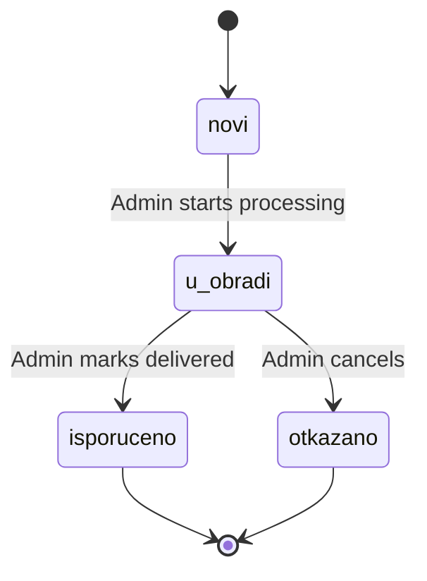

---

## 6. State Management Deep Dive

### 6.1 Provider Hierarchy

The root layout nests providers in this exact order (outermost to innermost):

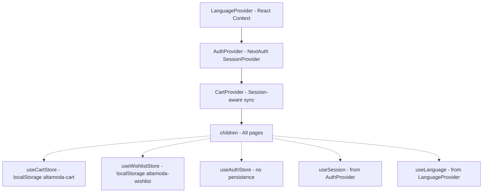

**Why this order matters:**
- `LanguageProvider` is outermost — language affects all rendering
- `AuthProvider` wraps `CartProvider` because `CartProvider` calls `useSession()`
- `CartProvider` syncs cart/wishlist on session changes

### 6.2 Zustand Store Architecture

**Cart Store** (`cart-store.ts`):
- **Persistence:** localStorage `altamoda-cart` — only persists `items[]`
- **State:** `items: CartItem[]`, `isLoading`, `isHydrated`
- **Actions:** `addItem`, `updateQuantity`, `removeItem`, `clearCart`, `setItems`, `setLoading`, `setHydrated`
- **Computed:** `getTotal()` = sum(price * qty), `getItemCount()` = sum(quantities)
- **CartItem:** `{id, productId, name, brand, price, quantity, image, sku, stockQuantity}`

**Wishlist Store** (`wishlist-store.ts`):
- **Persistence:** localStorage `altamoda-wishlist` — only persists `count`
- **State:** `count: number`
- **Actions:** `setCount(n)`, `increment()`, `decrement()`
- Only tracks count — full items fetched from API on demand

**Auth Store** (`auth-store.ts`):
- **Persistence:** None
- **State:** `isLoading: boolean`
- Minimal — real auth state lives in NextAuth session

### 6.3 Cart Sync Flow

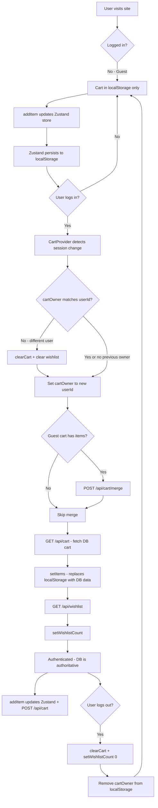

### 6.4 Server to Client Data Flow

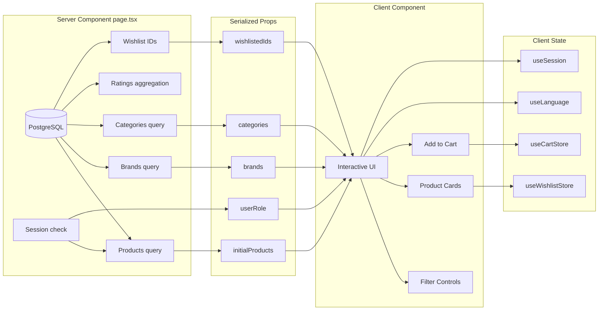

### 6.5 Where Each Piece of State Lives

| State | Owner | Storage | Access Pattern |
|-------|-------|---------|---------------|
| User session | NextAuth | JWT cookie (24h) | `useSession()` hook |
| User role/status | DB → JWT | JWT token | `session.user.role` |
| Cart items (guest) | Zustand | localStorage | `useCartStore()` |
| Cart items (auth) | DB (authoritative) | DB + localStorage cache | DB via API, local for UI |
| Wishlist count | Zustand | localStorage | `useWishlistStore()` |
| Wishlist items | DB | Fetched on demand | `GET /api/wishlist` |
| Language | React Context | localStorage | `useLanguage()` / `t()` |
| Product data | Server component | Props | Server passes to Client |
| Brands (header) | Module-level cache | Client memory | `fetch('/api/brands')` once |
| Search results | Local state | Component state | Debounced API call |
| Filter selections | URL params | URL search params | Client component state |

---

## 7. Performance Bottlenecks

### 7.1 Severity Overview

| Issue | Severity | Impact |
|-------|----------|--------|
| `force-dynamic` on all pages | **CRITICAL** | No caching, full DB hit every request |
| No caching strategy at all | **CRITICAL** | Zero edge caching, no ISR |
| Plain `` tags everywhere | **CRITICAL** | No lazy load, no WebP, bad LCP |
| No Suspense / loading states | **CRITICAL** | Blank screen until all queries finish |
| N+1 queries in product listing | **HIGH** | 24 extra queries per page load |
| 36+ unnecessary `"use client"` | **HIGH** | Over-hydration, large JS bundles |
| Sequential DB queries in detail | **HIGH** | Waterfall delays |
| ChatWidget on every page | **HIGH** | ~50KB unnecessary JS |
| Google Fonts not optimized | **HIGH** | Render blocking, layout shift |
| Large client components (1200+ lines) | **MEDIUM** | Hard to optimize/split |
| In-memory rate limiting | **MEDIUM** | Won't work in serverless at scale |

### 7.2 Current Request Flow (Why It's Slow)

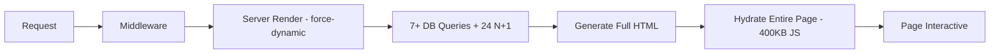

**What happens on every single page visit:**
1. No cache check — `force-dynamic` bypasses everything
2. Server runs 7+ database queries (some sequential, some N+1)
3. Full HTML generated from scratch
4. ~400KB of JavaScript shipped to hydrate the entire page
5. No skeletons — user sees blank screen during all of this

### 7.3 Bottleneck Details

**7.3.1 `force-dynamic` on ALL pages**  
Files: `page.tsx` in `/products`, `/products/[id]`, `/brands`, `/colors`, `/checkout`, home page  
Impact: Disables static generation, ISR, and edge caching. Every request hits DB.

**7.3.2 No caching strategy**  
- No `revalidate` exports on any page
- No React `cache()` usage
- No ISR (Incremental Static Regeneration)
- Header has fragile client-side cache: `let cachedBrands = []`

**7.3.3 Plain `` tags**  
Files: `HomePageClient.tsx`, `ProductDetailClient.tsx`, `ProductsPageClient.tsx`  
Missing: lazy loading, responsive srcset, WebP/AVIF, blur placeholder

**7.3.4 No loading.tsx or Suspense**  
User sees blank screen until ALL database queries complete.

**7.3.5 N+1 queries in product listing**  
For each of 12 products: separate rating query + separate variant count query = 24 extra queries.

**7.3.6 Sequential queries in product detail**  
`findFirst` → then `aggregate` → then `findMany` → then `findMany` — all sequential when they could run in parallel.

---

## 8. Recommendations & Action Plan

### Phase 1: Quick Wins (High Impact, Low Effort)

**1. Replace `force-dynamic` with ISR:**
```typescript
// Before (every page):
export const dynamic = 'force-dynamic'

// After:
export const revalidate = 300  // Products: 5 min
export const revalidate = 600  // Product detail: 10 min
export const revalidate = 3600 // Homepage: 1 hour
```

**2. Replace `` with Next.js `<Image>`:**
```typescript
import Image from 'next/image'
<Image src={product.image} alt={product.name}
  width={400} height={400} loading="lazy" />
```

**3. Add Suspense boundaries:**
```typescript
<Suspense fallback={<FiltersSkeleton />}>
  <Filters />
</Suspense>
<Suspense fallback={<ProductGridSkeleton />}>
  <ProductGrid />
</Suspense>
```

**4. Parallelize product detail queries:**
```typescript
const product = await prisma.product.findFirst({...})
const [avgRating, related, siblings, wishlist] = await Promise.all([
  prisma.review.aggregate({...}),
  prisma.product.findMany({...}),
  prisma.product.findMany({...}),
  session ? prisma.wishlist.findUnique({...}) : null,
])
```

**5. Use next/font for Google Fonts:**
```typescript
import { Inter, Noto_Serif } from 'next/font/google'
const inter = Inter({ subsets: ['latin', 'latin-ext'], weight: ['300','400','500','600','700'] })
```

### Phase 2: Medium Effort, High Impact

**6. Fix N+1 queries** — replace per-product rating queries with bulk `groupBy`  
**7. Convert static pages to server components** — remove `"use client"` from faq, about, contact, seminars  
**8. Lazy-load ChatWidget** — `dynamic(() => import(...), { ssr: false })`  
**9. Add React `cache()`** — deduplicate repeated queries within a request

### Phase 3: Architectural Improvements

**10. Add database indexes** on `isActive`, `slug`, `categoryId`, `productId`, `groupSlug`  
**11. Replace in-memory rate limiting with Upstash Redis**  
**12. Split large client components** into server components + small client islands  
**13. Add monitoring** — Vercel Analytics, Sentry, Web Vitals

### Performance Impact Estimates

| Fix | Estimated Impact |
|-----|-----------------|
| Remove force-dynamic + add ISR | **50-70% faster TTFB** for repeat visitors |
| Next.js Image component | **40-60% smaller** image payloads, better LCP |
| Suspense boundaries | **Perceived load time** drops significantly |
| Parallelize DB queries | **30-40% faster** product detail page |
| Fix N+1 in product listing | **60-80% fewer** DB queries per page |
| next/font self-hosting | **Eliminates FOUT/FOIT**, saves 2-3 DNS lookups |
| Lazy-load ChatWidget | **~50KB less** JS on initial load |

---

## 9. Performant Target Architecture

### 9.1 Target Request Flow (Fast)

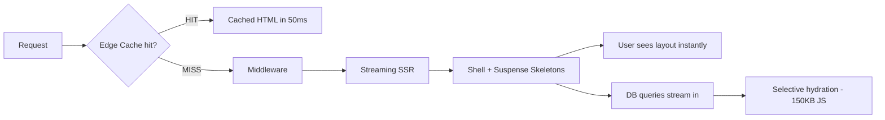

### 9.2 Target System Architecture

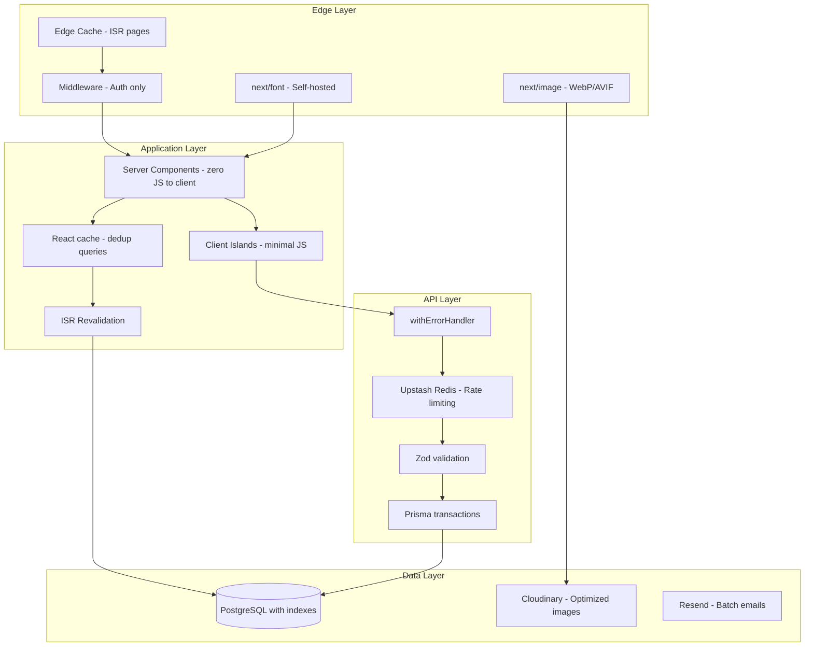

### 9.3 What Must Change

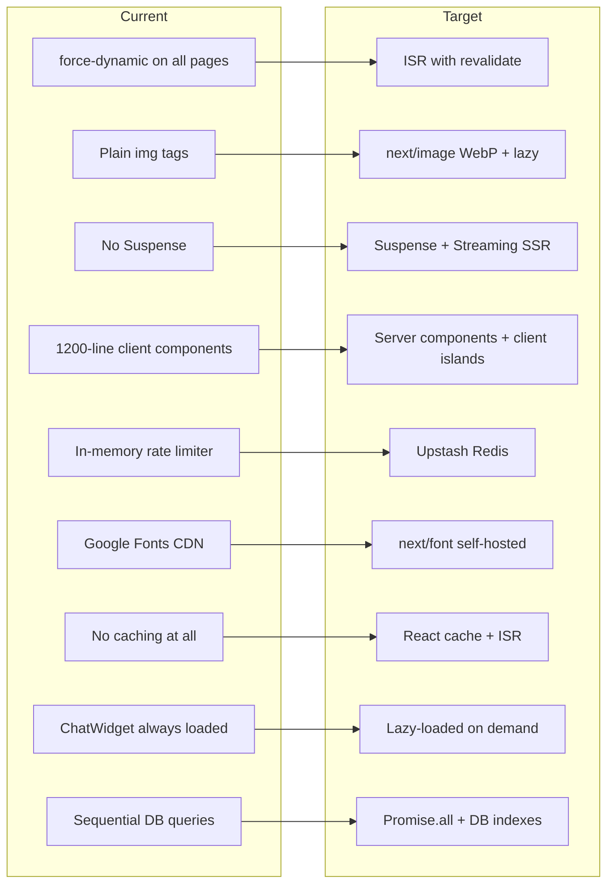

### 9.4 Target Products Page Component Split

Currently: 1 server component passes everything to 1 giant client component (1204 lines). The entire page is JavaScript-hydrated.

Target: Server components render layout, grid, and cards. Only interactive elements are client components.

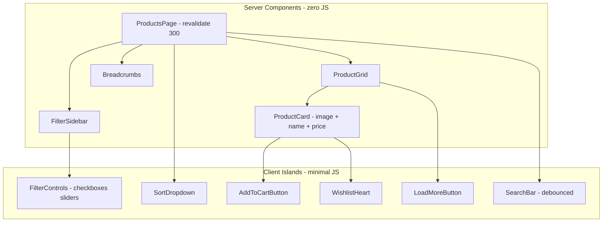

### 9.5 4-Layer Caching Strategy

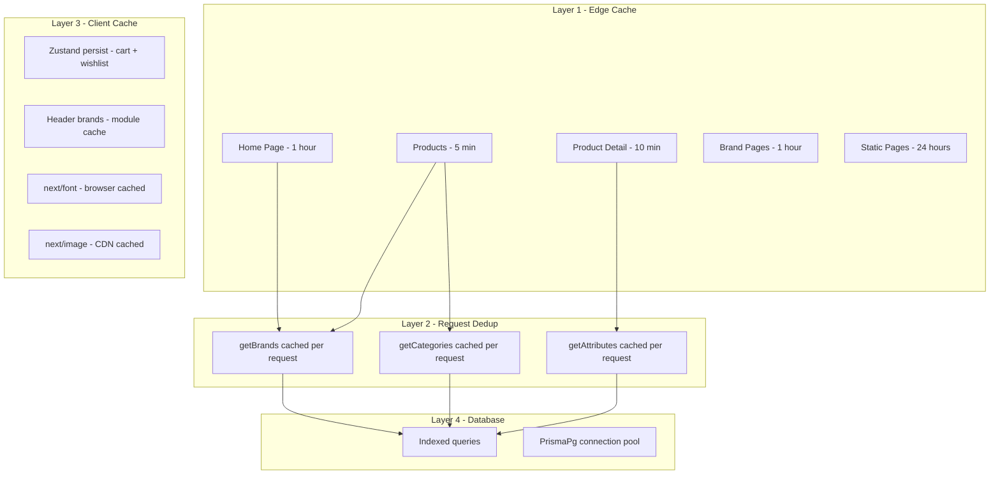

### 9.6 Performance Budget

| Metric | Current (Estimated) | Target | How to Achieve |
|--------|-------------------|--------|----------------|
| **TTFB** | 800-2000ms | <200ms | ISR + edge cache |
| **LCP** | 3-5s | <1.5s | next/image + Suspense streaming |
| **FCP** | 2-4s | <0.8s | Suspense shells + self-hosted fonts |
| **JS Bundle** | ~400KB | <150KB | Server components + code splitting |
| **DB queries (list)** | 7 + 24 N+1 | 7 bulk | groupBy aggregation |
| **DB queries (detail)** | 6 sequential | 1 + 5 parallel | Promise.all() |
| **Image payload** | Unoptimized | 40-60% smaller | next/image WebP/AVIF |

### 9.7 Priority Matrix

**Do first (high impact, low effort):**
- Remove `force-dynamic`, add `revalidate`
- Replace `` with `next/image`
- Add Suspense boundaries
- Use `next/font`
- Lazy-load ChatWidget

**Do next (high impact, medium effort):**
- Parallelize DB queries with `Promise.all()`
- Fix N+1 with bulk `groupBy`
- Split large client components
- Convert static pages to server components

**Do later (medium impact, high effort):**
- Upstash Redis rate limiting
- Add database indexes
- Add monitoring (Vercel Analytics, Sentry)

---

## API Health Summary

| Aspect | Status | Notes |
|--------|--------|-------|
| Consistent response format | **Good** | `{success, data/error}` everywhere |
| Input validation | **Good** | Zod schemas on all mutations |
| Auth protection | **Good** | Middleware + API helpers, DB re-check |
| Rate limiting | **Partial** | In-memory only, won't work at scale |
| Error handling | **Good** | `withErrorHandler` wrapper on all routes |
| Pagination | **Good** | Consistent with max limits |
| SQL injection prevention | **Good** | Prisma parameterized queries |
| Price trust | **Good** | Never trusts client prices |
| Soft deletes | **Good** | Products/categories use isActive flag |
