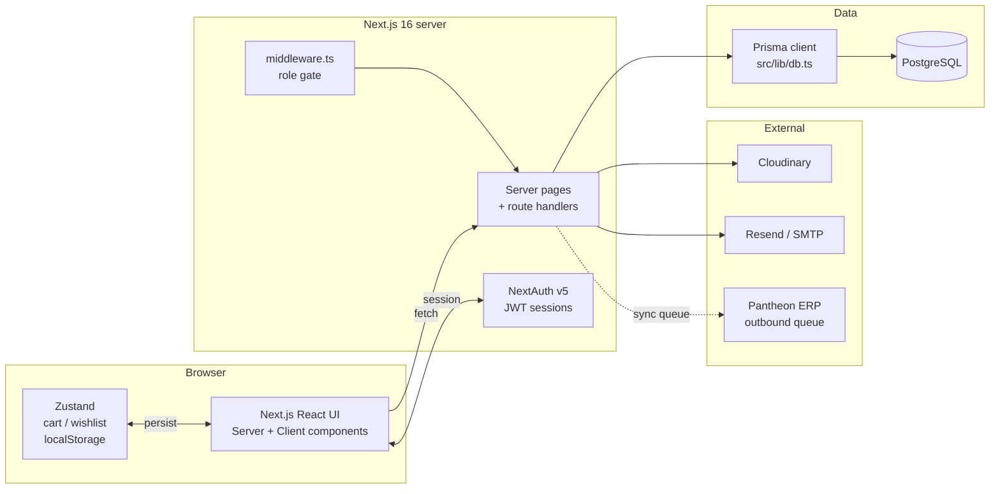
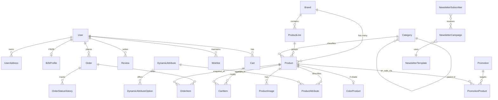
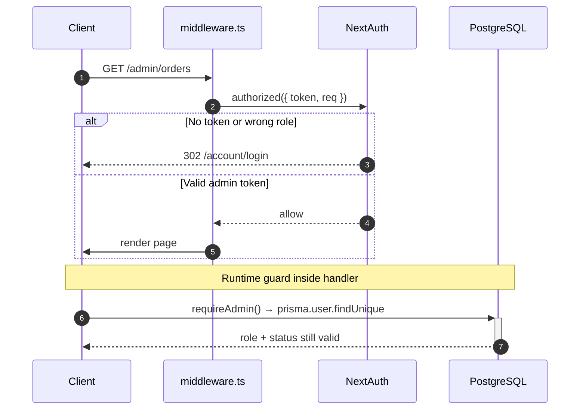
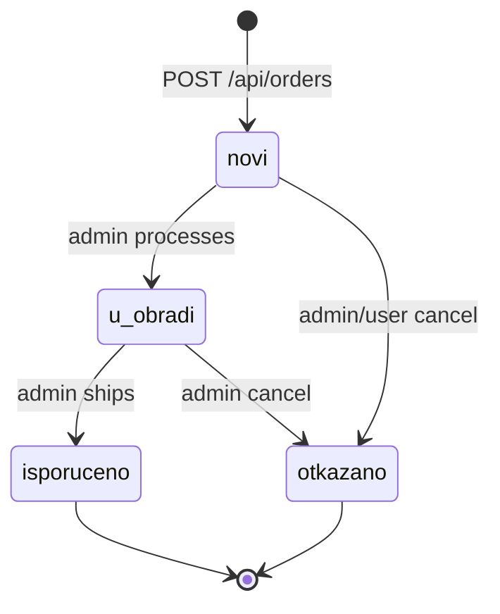

# Alta Moda — Architecture & Project Guide

> **Stack:** Next.js 16 · React 19 · PostgreSQL 16 · Prisma 7 · NextAuth v5 · Zustand 5 · Tailwind 4
> **Date:** 2026-04-17
> **Scope:** B2C + B2B e-commerce platform, Serbian market, multilingual (SR/EN/RU)

---

## 1. Overview

Alta Moda is the digital storefront for **Alta Moda d.o.o.** — a Serbian distributor (since 1996) of professional hair brands: Redken, Matrix, Biolage, Elchim, Mizutani, L'image, Kérastase, Olivia Garden, and others. The platform sells to both **retail customers (B2C)** and **approved salon partners (B2B)** and serves as the shop window for the **Id Hair Academy** educational centre.

**Core responsibilities:**
- Product catalogue with 1000+ SKUs, brand/line/category hierarchy, dynamic attributes, colour matrices
- Guest + authenticated cart → checkout → order flow with stock reservations
- B2B onboarding (application → admin approval → wholesale pricing)
- Newsletter engine with templates, campaigns, segmentation
- Admin CMS (products, brands, colours, promotions, orders, users, site settings)
- Editorial marketing pages (home, about, education, brands, FAQ, contact)

---

## 2. Tech Stack & Key Decisions

| Layer | Choice | Rationale |
|---|---|---|
| Framework | **Next.js 16 (App Router)** | Server components for SEO-heavy catalogue + React client interactivity for cart/filters |
| Database | **PostgreSQL** via `@prisma/adapter-pg` | Relational model fits catalogue + orders well |
| ORM | **Prisma 7** | Typed queries, migrations, introspection |
| Auth | **NextAuth v5 (Credentials)** | JWT sessions; no third-party OAuth |
| State | **Zustand 5** + `localStorage` | Cart + wishlist on client; auth via NextAuth session |
| Styling | **Tailwind CSS 4** + `Cormorant Garamond` (serif), `Inter` (sans) | Editorial aesthetic, minimal component library |
| Forms | **Zod** validation | Per-domain schemas in `src/lib/validations/` |
| Media | **Cloudinary** | Custom Next Image loader in `src/lib/cloudinary-loader.ts` |
| Email | **Resend (primary) + Nodemailer/SMTP (fallback)** | React Email templates in `src/lib/email-templates.ts` |
| Testing | **Vitest** | Unit + performance suites |

---

## 3. High-level architecture



**Request flow summary:**
1. `middleware.ts` intercepts `/admin`, `/account`, `/quick-order`, `/checkout` and delegates to `authConfig.authorized`.
2. Server pages fetch data through `src/lib/db.ts` (singleton Prisma) or cached query wrappers in `src/lib/cached-queries.ts`.
3. Client components call route handlers in `src/app/api/**/route.ts` for mutations.
4. Cart/wishlist state is mirrored in a Zustand store with `localStorage` persistence and fire-and-forget DB sync for authenticated users.

---

## 4. Directory layout

```
altamoda/
├── prisma/
│   └── schema.prisma           # Full data model (~40 models, 15 enums)
├── public/
│   ├── brands/                 # Local brand logo fallbacks (override broken CMS URLs)
│   ├── edukacija*.jpg          # Editorial imagery
│   └── uploads/                # Orphaned legacy uploads (candidates for cleanup)
├── src/
│   ├── app/                    # Next.js App Router
│   │   ├── (routes)/           # Public pages
│   │   ├── account/            # User account area
│   │   ├── admin/              # Admin CMS
│   │   ├── api/                # Route handlers
│   │   ├── layout.tsx          # Root layout (providers)
│   │   └── HomePageClient.tsx  # Home page client split
│   ├── components/             # Shared React components
│   ├── lib/
│   │   ├── db.ts               # Prisma singleton
│   │   ├── auth.ts             # NextAuth instance
│   │   ├── auth.config.ts      # Edge-safe config (for middleware)
│   │   ├── auth-helpers.ts     # requireAuth/requireAdmin/requireB2b
│   │   ├── stores/             # Zustand (cart, wishlist)
│   │   ├── i18n/               # Translation context + sr/en/ru JSON
│   │   ├── validations/        # Zod schemas
│   │   ├── email.ts            # Resend + SMTP
│   │   ├── email-templates.ts  # React Email
│   │   ├── cached-queries.ts   # React cache() Prisma wrappers
│   │   ├── rate-limit.ts       # In-memory sliding window
│   │   ├── upload.ts           # Cloudinary + magic-byte validation
│   │   └── newsletter-reconcile.ts
│   └── middleware.ts           # Route gating
├── docs/                       # Architecture + integration guides (this file)
├── next.config.ts              # CSP, image remote patterns, Cloudinary loader
└── package.json
```

---

## 5. Routing map

### 5.1 Public pages

| Path | Files | Data fetching | Notes |
|---|---|---|---|
| `/` | `page.tsx`, `HomePageClient.tsx` | Prisma: featured / bestsellers / new / sale; site settings | Editorial home, carousels, brand marquee |
| `/products` | `page.tsx`, `ProductsPageClient.tsx` | Prisma: paginated products + filters + facets | Role-aware (B2C vs B2B visibility) |
| `/products/[id]` | `page.tsx`, `ProductDetailClient.tsx` | Prisma: product + related + colour siblings (120 s ISR) | Detail with reviews + colour grid |
| `/brands` | `page.tsx`, `BrandsListClient.tsx` | Prisma: active brands | Links to filtered product list |
| `/brands/[slug]` | `page.tsx` | Redirect → `/products?brand=[slug]` | |
| `/colors` | `page.tsx`, `ColorsPageClient.tsx` | Prisma: color products grouped by line (300 s ISR) | Shade-level + undertone filters |
| `/about`, `/education`, `/faq`, `/contact`, `/outlet` | Client-only pages | None | Marketing content |

### 5.2 Auth-gated user pages

| Path | Role | Purpose |
|---|---|---|
| `/account/login` | Public | Credentials login + registration (B2C instant, B2B pending) |
| `/account` | Any authenticated | Profile, orders, loyalty, wishlist summary |
| `/cart` | Any (guests supported) | Editable cart with stock re-validation |
| `/checkout` + `/checkout/confirmation` | Any | Place order, show confirmation |
| `/wishlist` | Authenticated | Saved products |
| `/quick-order` | B2B / admin | SKU bulk entry + order repeat |

### 5.3 Admin pages (`/admin/:path*`, role = admin)

| Path | Status | Notes |
|---|---|---|
| `/admin` | → redirect to `/admin/homepage` | |
| `/admin/homepage` | **Working** | Hero images, featured product selection |
| `/admin/products` | **Working** | Product list + detail drawer + CRUD |
| `/admin/brands` | **Working** | Brand CRUD with local-logo fallback resolver |
| `/admin/colors` | **Working** | Colour matrix CRUD |
| `/admin/orders` | **Working** | Order list + status transitions |
| `/admin/users` | **Working** | B2B approval, role/status management |
| `/admin/actions` | Partial | Promotion CRUD (API `/api/admin/promotions` wired) |
| `/admin/newsletter` | **Working** | Subscribers, templates, campaigns |
| `/admin/settings` | **Working** | Site settings (key-value) + admin password |
| `/admin/import` | Partial | CSV/Excel import via `/api/products/import` |
| ~~`/admin/blog`~~ | Removed in cleanup | — |
| ~~`/admin/bundles`~~ | Removed in cleanup (incl. Prisma models) | — |
| ~~`/admin/seminars`~~ | Removed in cleanup | — |

---

## 6. API catalogue

Route handlers live under `src/app/api/**/route.ts`. Access roles: **Public** / **Auth** / **B2B** / **Admin**.

### 6.1 Catalogue (Public, read-heavy)

| Endpoint | Methods | Role | Purpose |
|---|---|---|---|
| `/api/brands` | GET, POST | GET: Public · POST: Admin | Brand list / create |
| `/api/brands/[id]` | GET, PUT | GET: Public · PUT: Admin | Brand detail / update |
| `/api/categories` | GET, POST | Public / Admin | Category tree |
| `/api/categories/[id]` | GET, PUT, DELETE | Admin | Category CRUD |
| `/api/products` | GET, POST | Public / Admin | Paginated product list (role-aware visibility) |
| `/api/products/[id]` | GET, PUT, DELETE | Public / Admin | Product detail + CRUD |
| `/api/products/search` | GET | Public | Autocomplete (Serbian diacritic-safe) |
| `/api/products/colors` | GET | Public | Colour palette by line/level/undertone |
| `/api/products/color-facets` | GET | Public | Facet counts for color filter UI |
| `/api/products/import` | POST | Admin | CSV/Excel/Pantheon import |
| `/api/attributes`, `/api/attributes/[id]` | GET, POST, PUT, DELETE | Public / Admin | Dynamic attributes |
| `/api/site-settings` | GET | Public | Hero images, banners, feature flags |

### 6.2 Cart, checkout, orders

| Endpoint | Methods | Role | Purpose |
|---|---|---|---|
| `/api/cart` | GET, POST | Auth | Get / add item |
| `/api/cart/[itemId]` | PUT, DELETE | Auth | Update / remove |
| `/api/cart/merge` | POST | Auth | Merge guest localStorage cart into DB on login |
| `/api/cart/validate-stock` | POST | Public (rate-limited) | Binary stock check for 1–50 products |
| `/api/orders` | GET, POST | Auth | List user orders / create order (atomic stock reservation) |
| `/api/orders/[id]` | GET | Auth | Order detail + status history |
| `/api/orders/[id]/status` | PATCH | Admin | Status transition (state machine) |
| `/api/orders/quick` | POST | B2B | Bulk-order by SKU list or repeat |

### 6.3 Auth & users

| Endpoint | Methods | Role | Purpose |
|---|---|---|---|
| `/api/auth/[...nextauth]` | GET, POST | Public (rate-limited) | NextAuth handler |
| `/api/users` | POST | Public (rate-limited) | Register (B2C instant / B2B pending) |
| `/api/users/me` | GET, PUT | Auth | Own profile |
| `/api/users/check-status` | POST | Public (rate-limited) | Login-time status probe (pending/suspended) |

### 6.4 User-scoped

| Endpoint | Methods | Role | Purpose |
|---|---|---|---|
| `/api/wishlist` | GET, POST, DELETE | Auth | Toggle product |
| `/api/reviews` | GET, POST | Public / Auth | Product reviews (one per user per product) |

### 6.5 Admin

| Endpoint | Methods | Purpose |
|---|---|---|
| `/api/admin/users` | GET | List users with order totals |
| `/api/admin/users/[id]/approve` | PATCH | Approve B2B + notification email |
| `/api/admin/users/[id]/reject` | PATCH | Suspend B2B |
| `/api/admin/colors` (+ `/[id]`) | GET, POST, PUT, DELETE | Colour matrix |
| `/api/admin/promotions` (+ `/[id]`) | GET, POST, PUT, DELETE, PATCH | Promotions CRUD + toggle |
| `/api/admin/site-settings` | GET, PUT | Site config (bust ISR on change) |
| `/api/admin/change-password` | PUT | Admin password change |

### 6.6 Integrations

| Endpoint | Methods | Role | Purpose |
|---|---|---|---|
| `/api/newsletter` | POST, DELETE, GET | Public / Admin | Subscribe / unsubscribe / list |
| `/api/newsletter/[id]` | DELETE | Admin | Delete subscriber |
| `/api/newsletter/templates` (+ `/[id]`) | GET, POST, PUT, DELETE | Admin | Template CRUD |
| `/api/newsletter/campaigns` (+ `/[id]`, `/[id]/send`) | GET, POST, PUT, DELETE | Admin | Campaign lifecycle |
| `/api/newsletter/stats` | GET | Admin | Segment counts |
| `/api/upload` | POST, DELETE | Admin | Cloudinary upload / delete |

**Missing / stubbed:** `/api/newsletter/campaigns/[id]/preview`, `/api/newsletter/templates/[id]/duplicate`, `/api/newsletter/templates/seed`, `/api/newsletter/test` — referenced from UI but route handlers not implemented.

---

## 7. Data model



### Model catalogue (grouped)

**Users & auth** — `User`, `UserAddress`, `B2bProfile`
**Catalogue** — `Brand`, `ProductLine`, `Category`, `Product`, `ProductImage`, `ColorProduct`, `DynamicAttribute`, `DynamicAttributeOption`, `ProductAttribute`
**Commerce** — `Cart`, `CartItem`, `Order`, `OrderItem`, `OrderStatusHistory`, `Wishlist`
**Promotions** — `Promotion`, `PromotionProduct`, `PromoCode`
**Bundles** (schema exists, UI stub) — `Bundle`, `BundleItem`
**Shipping** — `ShippingZone`, `ShippingRate`
**Content / marketing** — `Banner`, `Faq`, `Review`, `SeoMetadata`, `SiteSetting`
**Newsletter** — `NewsletterSubscriber`, `NewsletterTemplate`, `NewsletterCampaign`, `NewsletterAutomation`
**ERP / Pantheon** — `ErpSyncLog`, `ErpSyncQueue` (outbound sync skeleton)

### Key enums

| Enum | Values |
|---|---|
| `UserRole` | `b2c`, `b2b`, `admin` |
| `UserStatus` | `active`, `pending`, `suspended` |
| `OrderStatus` | `novi`, `u_obradi`, `isporuceno`, `otkazano` |
| `PaymentMethod` | `card`, `bank_transfer`, `cash_on_delivery`, `invoice` |
| `PaymentStatus` | `pending`, `paid`, `failed`, `refunded` |
| `PromoType` | `percentage`, `fixed`, `price` |
| `PromotionTargetType` | `product`, `category`, `brand`, `all` |
| `Audience` | `b2b`, `b2c`, `all` |
| `AttributeType` | `boolean`, `text`, `number`, `select` |
| `MediaType` | `image`, `video`, `gif` |
| `CampaignStatus` | `draft`, `scheduled`, `sending`, `sent`, `failed` |

---

## 8. Auth & access control



**Roles:** `b2c` (retail), `b2b` (approved salon), `admin`.
**Status:** `active` · `pending` (B2B awaiting approval) · `suspended`.

**Helpers in `src/lib/auth-helpers.ts`:**
- `getCurrentUser()` — from session token (may be stale)
- `requireAuth()` — session + DB status check (catches mid-session suspensions)
- `requireAdmin()`, `requireB2b()` — role gates for route handlers

**Middleware matcher:** `/admin/:path*`, `/account/:path*`, `/quick-order/:path*`, `/checkout/:path*` (the last allows guests; actual guard happens in the order handler).

---

## 9. Order lifecycle



`POST /api/orders` uses a Prisma transaction to:
1. Re-validate stock for every line
2. Decrement stock atomically
3. Create `Order`, `OrderItem`, initial `OrderStatusHistory` row
4. Enqueue `ErpSyncQueue` entry (outbound Pantheon sync)
5. Send confirmation email via Resend / SMTP fallback

Admin transitions (`PATCH /api/orders/[id]/status`) are validated against a state machine and append to `OrderStatusHistory`.

---

## 10. B2B onboarding

```mermaid
flowchart TD
    A[User submits B2B form<br/>/account/login] --> B[POST /api/users<br/>status: pending]
    B --> C[Admin notification email]
    C --> D[Admin reviews<br/>/admin/users]
    D -->|Approve| E[PATCH /api/admin/users/[id]/approve<br/>status: active, role: b2b]
    D -->|Reject| F[PATCH /api/admin/users/[id]/reject<br/>status: suspended]
    E --> G[Approval email to user]
    F --> H[Rejection email to user]
```

B2C users become `active` immediately on registration. B2B users remain `pending` until an admin approves them; the `requireAuth()` helper re-checks status on every request so a suspension takes effect without forcing a logout.

---

## 11. Client-side state

### Zustand stores

| Store | Path | State | Persistence |
|---|---|---|---|
| Cart | `src/lib/stores/cart-store.ts` | `items[]`, `isLoading`, `isHydrated` | `localStorage: altamoda-cart` + fire-and-forget DB sync |
| Wishlist | `src/lib/stores/wishlist-store.ts` | `count` | `localStorage: altamoda-wishlist` |
| Auth (unused) | `src/lib/stores/auth-store.ts` | `isLoading` | — (**candidate for deletion**) |

Guest cart ownership is tracked via `localStorage.altamoda-cart-owner` so that `/api/cart/merge` can deduplicate on login.

### i18n

Custom React Context — **not** `next-intl`. JSON dictionaries in `src/lib/i18n/translations/{sr,en,ru}.json`. Default locale Serbian. Language choice persisted in `localStorage.altamoda_language`. Dot-path keys with fallback to Serbian.

---

## 12. Integrations

| Integration | Location | Notes |
|---|---|---|
| Cloudinary | `src/lib/upload.ts`, `src/lib/cloudinary-loader.ts`, `next.config.ts` | Custom loader for Next `Image`, magic-byte validation (25 MB max), image + video |
| Resend (primary email) | `src/lib/email.ts` | Transactional mail (registration, orders, B2B approval) |
| Nodemailer SMTP (fallback) | `src/lib/email.ts` | Auto-fallback if Resend fails |
| React Email templates | `src/lib/email-templates.ts` | Typed components compiled to HTML |
| Pantheon ERP | `ErpSyncQueue` + `ErpSyncLog` models | Outbound queue with retry (max 5). Worker not in repo — assumed external |

---

## 13. Rate limiting

In-memory sliding-window (`src/lib/rate-limit.ts`). Applied to:
- Login (`10 / 15 min`)
- Registration (`5 / hr`)
- Newsletter subscribe (`5 / hr`)
- Order create (`5 / min`)
- Stock validation (`30 / min`)
- User status check (`20 / min`)

> **Note:** In-memory store is single-instance only. For horizontal scaling, replace with Redis.

---

## 14. Security posture

- **Security headers** in `next.config.ts`: `X-Frame-Options: DENY`, `X-Content-Type-Options: nosniff`, `Strict-Transport-Security`, CSP, `Permissions-Policy`.
- **CSP** whitelists Cloudinary, Unsplash, Pexels, Google, and legacy `altamoda.rs` image hosts.
- **Password hashing:** `bcryptjs`.
- **Session:** JWT, 24 h max age, `HttpOnly` + `Secure` cookies in production.
- **Input validation:** Zod schemas per domain under `src/lib/validations/`.
- **Enumeration protection:** login returns generic "invalid credentials"; `/api/users/check-status` is rate-limited.

---

## 15. Environment variables

```bash
# Database
DATABASE_URL=postgresql://…

# Next / deploy
NODE_ENV=production
SITE_URL=https://altamoda.rs

# Auth
NEXTAUTH_SECRET=…
NEXTAUTH_URL=https://altamoda.rs

# Cloudinary
CLOUDINARY_CLOUD_NAME=…
CLOUDINARY_API_KEY=…
CLOUDINARY_API_SECRET=…

# Email — Resend (primary)
RESEND_API_KEY=…
EMAIL_FROM=noreply@altamoda.rs

# Email — SMTP fallback
SMTP_HOST=…
SMTP_PORT=465
SMTP_SECURE=true
SMTP_USER=…
SMTP_PASS=…

# Admin
ADMIN_EMAIL=admin@altamoda.rs

# Rate limiting (optional — falls back to in-memory if missing; REQUIRED for multi-instance prod)
UPSTASH_REDIS_REST_URL=https://…upstash.io
UPSTASH_REDIS_REST_TOKEN=…
```

---

## 16. Recently removed (2026-04-17 cleanup)

- `src/lib/stores/auth-store.ts` (unused)
- `src/app/admin/seminars/`, `src/app/admin/blog/`, `src/app/admin/bundles/` (stub UI with no backend)
- `src/app/api/admin/sync-cloudinary/` (empty orphan)
- Prisma models `Bundle` and `BundleItem` + `User.bundleItems` relation (no API handlers, feature cut)
- Next.js template boilerplate assets: `public/{file,vercel,next,globe,window}.svg`, `public/hero.jpg`
- i18n keys for the above (in `sr.json`, `en.json`, `ru.json`)
- `src/data/mocked_data.ts:1278` — dead `/seminars/1` link replaced with `/education`

> **Required follow-up:** generate a Prisma migration for the Bundle/BundleItem table drops:
> ```bash
> npx prisma migrate dev --name remove_bundles
> ```

### Still to investigate (not removed)

- **`public/uploads/`** (21 files, ~53 MB) — these may be referenced by DB records (`ProductImage.url`, `Brand.logoUrl`, etc.). Write a cleanup script that lists filenames and queries every `url`/`logo` column before deleting unreferenced files.

### Newsletter endpoints

All 4 newsletter endpoints previously flagged as "missing" actually **do exist** (the earlier analysis was wrong): `/api/newsletter/templates/seed`, `/api/newsletter/templates/[id]/duplicate`, `/api/newsletter/campaigns/[id]/preview`, `/api/newsletter/test`. No UI buttons need removal.

---

## 17. What's left / roadmap pointers

From `TODO.md` / `plan.md` (Mar-Apr 2026):

- **Phase 5+ work**
  - Finalise shipping zone/rate UI under `/admin/settings`
  - Full payment gateway integration (currently `card` is a stub)
  - ERP sync worker (process `ErpSyncQueue` outbound entries)
- **Gaps surfaced by this audit**
  - Complete (or remove) bundles feature — schema exists, admin UI exists, API layer missing
  - Decide fate of blog feature
  - Implement the 4 missing newsletter route handlers listed above
  - Add a cleanup cron for orphaned `/public/uploads/` files
  - Replace in-memory rate limiter with Redis before horizontal scaling
  - Resolve the newsletter "preview + duplicate" button states in `/admin/newsletter`
  - Extend the brand logo fallback map (`src/components/Header.tsx` and `src/app/admin/brands/page.tsx`) into a shared helper in `src/lib/brand-logos.ts` to avoid duplication

---

## 18. Running the project

```bash
# install
npm install

# db
npx prisma migrate deploy
npx prisma generate

# dev
npm run dev                # http://localhost:3000

# tests
npm test                   # vitest
npm run test:coverage
npm run test:stress:light  # load test (configurable)

# prod build
npm run build
npm run start
```

Build pipeline: `prisma generate` → `prisma migrate deploy` → `next build`.

---

## 19. Diagrams at a glance

All diagrams in this document are Mermaid and render natively on GitHub, VS Code (with Mermaid extension), and most Markdown previewers. Files to reference for deeper reading:

- Data model: `prisma/schema.prisma`
- Auth: `src/lib/auth.ts`, `src/lib/auth.config.ts`, `src/middleware.ts`
- Route handlers: `src/app/api/**/route.ts`
- Shared UI: `src/components/`
- Stores: `src/lib/stores/`
- Emails: `src/lib/email-templates.ts`

---

*Maintained in `docs/ARCHITECTURE.md`. Update after any material change to routes, schema, or auth/role logic.*
