# Alta Moda - Full Architecture Analysis

> **Date:** April 2026  
> **Project:** Alta Moda E-Commerce Platform  
> **Stack:** Next.js 16 (App Router) + PostgreSQL + Prisma + NextAuth + Zustand  
> **Purpose:** B2C/B2B e-commerce for professional hairdressing products (Serbian market)

---

## Table of Contents

1. [High-Level Architecture](#1-high-level-architecture)
2. [Technology Stack](#2-technology-stack)
3. [Project Structure](#3-project-structure)
4. [Database Schema & Relations](#4-database-schema--relations)
5. [Authentication & Authorization](#5-authentication--authorization)
6. [API Endpoints Reference](#6-api-endpoints-reference)
7. [Client-Side State Management](#7-client-side-state-management)
8. [External Integrations](#8-external-integrations)
9. [Security Architecture](#9-security-architecture)
10. [Architecture Quality Assessment](#10-architecture-quality-assessment)

---

## 1. High-Level Architecture

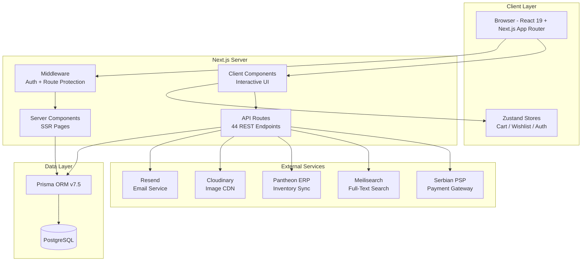

**Pattern:** Monolithic Next.js application with RESTful API routes, server-side rendering for public pages, and client-side interactivity via React + Zustand. The app uses a three-role system (B2C, B2B, Admin) with role-based access at both middleware and API levels.

---

## 2. Technology Stack

| Layer | Technology | Version | Purpose |
|-------|-----------|---------|---------|
| Framework | Next.js (App Router) | 16.1.7 | SSR, routing, API |
| UI | React + React DOM | 19.2.3 | Component rendering |
| Language | TypeScript | 5.x | Type safety |
| Database | PostgreSQL | - | Primary data store |
| ORM | Prisma | 7.5.0 | DB access & migrations |
| Auth | NextAuth | 5.0.0-beta.30 | JWT sessions, middleware |
| State | Zustand | 5.0.12 | Client state (persist) |
| Styling | Tailwind CSS | 4.x | Utility-first CSS |
| Validation | Zod | 4.3.6 | Request/schema validation |
| Email | Resend | 6.9.4 | Transactional & batch email |
| Editor | Tiptap | Various | Rich text (newsletter/blog) |
| Carousel | Swiper | 12.1.2 | Product carousels |
| Icons | Lucide React | - | SVG icon library |
| Animations | Framer Motion | - | Page transitions |
| Upload | Cloudinary + Local | - | Image/video storage |
| Testing | Vitest + Testing Library | 4.1.0 | Unit & perf tests |
| Security | bcryptjs, isomorphic-dompurify | - | Hashing, XSS prevention |

---

## 3. Project Structure

```
altamoda/
├── src/
│   ├── app/                          # Next.js App Router
│   │   ├── layout.tsx                # Root layout (providers, header, footer)
│   │   ├── page.tsx                  # Home page
│   │   ├── api/                      # 44 REST API endpoints
│   │   │   ├── auth/[...nextauth]/   # NextAuth handlers
│   │   │   ├── users/                # User CRUD + approval
│   │   │   ├── products/             # Product CRUD + search + import
│   │   │   ├── cart/                 # Cart CRUD + merge + stock
│   │   │   ├── orders/               # Order CRUD + status + quick
│   │   │   ├── brands/               # Brand CRUD
│   │   │   ├── categories/           # Category CRUD (tree)
│   │   │   ├── attributes/           # Dynamic attribute CRUD
│   │   │   ├── newsletter/           # Full newsletter system
│   │   │   ├── reviews/              # Product reviews
│   │   │   ├── wishlist/             # Wishlist toggle
│   │   │   ├── upload/               # File upload
│   │   │   └── admin/                # Admin-only endpoints
│   │   ├── admin/                    # 13 admin pages
│   │   ├── account/                  # Login + profile
│   │   ├── products/                 # Catalog + detail
│   │   ├── brands/                   # Brand pages
│   │   ├── cart/                     # Shopping cart
│   │   ├── checkout/                 # Checkout flow
│   │   ├── newsletter/               # Subscribe/unsubscribe
│   │   └── ...                       # Other public pages
│   ├── components/                   # Shared components
│   │   ├── Header.tsx                # Navigation
│   │   ├── Footer.tsx                # Footer
│   │   ├── ChatWidget.tsx            # Live chat
│   │   ├── CookieConsent.tsx         # GDPR banner
│   │   ├── LanguageToggle.tsx        # SR/EN/RU switcher
│   │   ├── providers/                # AuthProvider, CartProvider
│   │   └── admin/TiptapEditor.tsx    # Rich text editor
│   ├── lib/                          # Core utilities
│   │   ├── auth.ts                   # NextAuth config + credentials
│   │   ├── auth.config.ts            # JWT + role-based middleware
│   │   ├── auth-helpers.ts           # requireAuth/Admin/B2b
│   │   ├── api-utils.ts             # Response helpers, error handler
│   │   ├── rate-limit.ts             # Sliding-window rate limiters
│   │   ├── db.ts                     # Prisma singleton
│   │   ├── email.ts                  # Resend integration
│   │   ├── email-templates.ts        # HTML email builders
│   │   ├── upload.ts                 # File validation + save
│   │   ├── utils.ts                  # formatPrice, slugify, VAT
│   │   ├── constants.ts              # Business rules
│   │   ├── stores/                   # Zustand (cart, auth, wishlist)
│   │   ├── validations/              # Zod schemas
│   │   └── i18n/                     # Internationalization (3 langs)
│   ├── types/                        # TypeScript declarations
│   └── middleware.ts                 # Route protection
├── prisma/
│   └── schema.prisma                 # 31 models, 15 enums
├── tests/                            # Vitest test suite
│   ├── unit/                         # API, lib, store, validation tests
│   └── performance/                  # Performance benchmarks
├── public/uploads/                   # Local file storage
└── Configuration files               # next.config, tsconfig, etc.
```

---

## 4. Database Schema & Relations

### 4.1 Complete Entity-Relationship Diagram

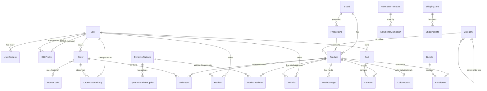

### 4.2 Domain Groupings

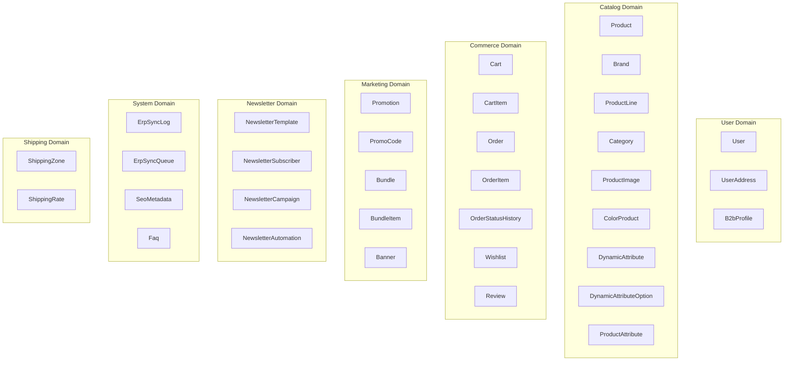

### 4.3 Detailed Table Descriptions

#### User Domain

**User** (`users`)
| Field | Type | Constraints | Description |
|-------|------|-------------|-------------|
| id | String (CUID) | PK | Unique identifier |
| email | String | UNIQUE | Login email |
| passwordHash | String | NOT NULL | bcrypt hashed password |
| name | String | NOT NULL | Display name |
| phone | String? | - | Optional phone |
| role | UserRole | DEFAULT b2c | b2c / b2b / admin |
| status | UserStatus | DEFAULT active | active / pending / suspended |
| avatarUrl | String? | - | Profile image URL |
| createdAt | DateTime | AUTO | Registration date |
| updatedAt | DateTime | AUTO | Last update |

**UserAddress** (`user_addresses`)
| Field | Type | Constraints | Description |
|-------|------|-------------|-------------|
| id | String (CUID) | PK | - |
| userId | String | FK -> User, CASCADE | Owner |
| label | String | NOT NULL | "Home", "Office", etc. |
| street | String | NOT NULL | Street address |
| city | String | NOT NULL | City name |
| postalCode | String | NOT NULL | Postal code |
| country | String | DEFAULT "Srbija" | Country |
| isDefault | Boolean | DEFAULT false | Default address flag |

**B2bProfile** (`b2b_profiles`)
| Field | Type | Constraints | Description |
|-------|------|-------------|-------------|
| id | String (CUID) | PK | - |
| userId | String | FK -> User, UNIQUE, CASCADE | 1:1 with User |
| salonName | String | NOT NULL | Business name |
| pib | String? | - | Tax ID (PIB) |
| maticniBroj | String? | - | Company registration number |
| address | String? | - | Business address |
| discountTier | Int | DEFAULT 0 | Discount percentage tier |
| creditLimit | Decimal(12,2)? | - | Credit limit in RSD |
| paymentTerms | Int? | - | Payment terms in days |
| approvedAt | DateTime? | - | Approval timestamp |
| approvedBy | String? | FK -> User | Admin who approved |
| erpSubjectId | String? | UNIQUE | External ERP ID |

#### Catalog Domain

**Product** (`products`)
| Field | Type | Constraints | Description |
|-------|------|-------------|-------------|
| id | String (CUID) | PK | - |
| sku | String | UNIQUE | Stock keeping unit |
| nameLat | String | NOT NULL | Name in Latin script |
| nameCyr | String? | - | Name in Cyrillic |
| slug | String | UNIQUE | URL-friendly identifier |
| brandId | String? | FK -> Brand | Associated brand |
| productLineId | String? | FK -> ProductLine | Product line/series |
| categoryId | String? | FK -> Category | Primary category |
| description | String? | - | Full description |
| purpose | String? | - | Product purpose |
| ingredients | String? | - | Ingredient list |
| usageInstructions | String? | - | How to use |
| warnings | String? | - | Safety warnings |
| shelfLife | String? | - | Expiration info |
| importerInfo | String? | - | Importer details |
| priceB2c | Decimal(10,2) | NOT NULL | Retail price (RSD) |
| priceB2b | Decimal(10,2)? | - | Wholesale price |
| oldPrice | Decimal(10,2)? | - | Previous price (for sale display) |
| costPrice | Decimal(10,2)? | - | Cost price (internal) |
| stockQuantity | Int | DEFAULT 0 | Current stock |
| lowStockThreshold | Int | DEFAULT 5 | Alert threshold |
| weightGrams | Int? | - | Weight in grams |
| volumeMl | Int? | - | Volume in milliliters |
| isProfessional | Boolean | DEFAULT false | B2B-only product |
| isActive | Boolean | DEFAULT true | Soft delete flag |
| isNew | Boolean | DEFAULT false | "New" badge flag |
| isFeatured | Boolean | DEFAULT false | Featured on homepage |
| isBestseller | Boolean | DEFAULT false | Bestseller badge |
| gender | String? | - | Target gender |
| erpId | String? | - | External ERP product ID |
| barcode | String? | - | Barcode/EAN |
| vatRate | Int | DEFAULT 20 | VAT percentage |
| vatCode | String? | - | ERP VAT code |
| seoTitle | String? | - | SEO meta title |
| seoDescription | String? | - | SEO meta description |
| createdAt | DateTime | AUTO | - |
| updatedAt | DateTime | AUTO | - |

**Brand** (`brands`)
| Field | Type | Constraints | Description |
|-------|------|-------------|-------------|
| id | String (CUID) | PK | - |
| name | String | NOT NULL | Brand name |
| slug | String | UNIQUE | URL slug |
| logoUrl | String? | - | Logo image |
| description | String? | - | Short description |
| content | String? | - | Rich text content (brand page) |
| isActive | Boolean | DEFAULT true | Active flag |

**ProductLine** (`product_lines`)
| Field | Type | Constraints | Description |
|-------|------|-------------|-------------|
| id | String (CUID) | PK | - |
| brandId | String | FK -> Brand | Parent brand |
| name | String | NOT NULL | Line name |
| slug | String | UNIQUE | URL slug |
| description | String? | - | Description |

**Category** (`categories`) - Self-referential tree
| Field | Type | Constraints | Description |
|-------|------|-------------|-------------|
| id | String (CUID) | PK | - |
| parentId | String? | FK -> Category (self) | Parent category |
| nameLat | String | NOT NULL | Name in Latin |
| nameCyr | String? | - | Name in Cyrillic |
| slug | String | UNIQUE | URL slug |
| sortOrder | Int | DEFAULT 0 | Display order |
| isActive | Boolean | DEFAULT true | Active flag |
| depth | Int | DEFAULT 0 | Tree depth (0 = root) |

**ColorProduct** (`color_products`) - Hair color data
| Field | Type | Constraints | Description |
|-------|------|-------------|-------------|
| id | String (CUID) | PK | - |
| productId | String | FK -> Product, UNIQUE, CASCADE | 1:1 with Product |
| colorLevel | SmallInt | NOT NULL | Color level (1-10) |
| undertoneCode | String | NOT NULL | Undertone code |
| undertoneName | String | NOT NULL | Undertone display name |
| hexValue | String | NOT NULL | CSS hex color |
| shadeCode | String | NOT NULL | Shade identifier |

**DynamicAttribute** (`dynamic_attributes`)
| Field | Type | Constraints | Description |
|-------|------|-------------|-------------|
| id | String (CUID) | PK | - |
| nameLat | String | NOT NULL | Name in Latin |
| nameCyr | String? | - | Name in Cyrillic |
| slug | String | UNIQUE | URL slug |
| type | AttributeType | DEFAULT boolean | boolean/text/number/select |
| filterable | Boolean | DEFAULT true | Can be used as filter |
| showInFilters | Boolean | DEFAULT true | Show in sidebar |
| sortOrder | Int | DEFAULT 0 | Display order |

**ProductAttribute** (`product_attributes`)
| Field | Type | Constraints | Description |
|-------|------|-------------|-------------|
| id | String (CUID) | PK | - |
| productId | String | FK -> Product, CASCADE | - |
| attributeId | String | FK -> DynamicAttribute, CASCADE | - |
| value | String | NOT NULL | Attribute value |
| | | @@unique([productId, attributeId]) | One value per product per attribute |

#### Commerce Domain

**Cart** (`carts`)
| Field | Type | Constraints | Description |
|-------|------|-------------|-------------|
| id | String (CUID) | PK | - |
| userId | String? | FK -> User, CASCADE | Null for guest carts |
| sessionId | String? | - | Guest session identifier |
| createdAt | DateTime | AUTO | - |
| updatedAt | DateTime | AUTO | - |

**CartItem** (`cart_items`)
| Field | Type | Constraints | Description |
|-------|------|-------------|-------------|
| id | String (CUID) | PK | - |
| cartId | String | FK -> Cart, CASCADE | Parent cart |
| productId | String | FK -> Product | Product reference |
| quantity | Int | DEFAULT 1 | Quantity |
| | | @@unique([cartId, productId]) | One entry per product per cart |

**Order** (`orders`)
| Field | Type | Constraints | Description |
|-------|------|-------------|-------------|
| id | String (CUID) | PK | - |
| orderNumber | String | UNIQUE | Format: ALT-YYYY-XXXX |
| userId | String | FK -> User | Customer |
| status | OrderStatus | DEFAULT novi | novi/u_obradi/isporuceno/otkazano |
| subtotal | Decimal(10,2) | NOT NULL | Sum of items |
| discountAmount | Decimal(10,2) | DEFAULT 0 | Discount applied |
| shippingCost | Decimal(10,2) | DEFAULT 0 | Shipping fee |
| total | Decimal(10,2) | NOT NULL | Final total |
| currency | String | DEFAULT "RSD" | Currency code |
| paymentMethod | PaymentMethod | NOT NULL | card/bank_transfer/cash_on_delivery/invoice |
| paymentStatus | PaymentStatus | DEFAULT pending | pending/paid/failed/refunded |
| shippingMethod | String? | - | Delivery method |
| trackingNumber | String? | - | Shipping tracking |
| shippingAddress | Json? | - | Delivery address snapshot |
| billingAddress | Json? | - | Billing address snapshot |
| notes | String? | - | Customer notes |
| promoCodeId | String? | FK -> PromoCode | Applied promo code |
| erpSynced | Boolean | DEFAULT false | Synced to Pantheon |
| erpId | String? | - | External ERP order ID |
| createdAt | DateTime | AUTO | - |
| updatedAt | DateTime | AUTO | - |

**OrderItem** (`order_items`)
| Field | Type | Constraints | Description |
|-------|------|-------------|-------------|
| id | String (CUID) | PK | - |
| orderId | String | FK -> Order, CASCADE | Parent order |
| productId | String | FK -> Product | Product reference |
| productName | String | NOT NULL | Snapshot of name at purchase |
| productSku | String | NOT NULL | Snapshot of SKU |
| quantity | Int | NOT NULL | Quantity ordered |
| unitPrice | Decimal(10,2) | NOT NULL | Price per unit at purchase |
| totalPrice | Decimal(10,2) | NOT NULL | quantity x unitPrice |

**OrderStatusHistory** (`order_status_history`)
| Field | Type | Constraints | Description |
|-------|------|-------------|-------------|
| id | String (CUID) | PK | - |
| orderId | String | FK -> Order, CASCADE | - |
| status | OrderStatus | NOT NULL | New status value |
| changedBy | String? | FK -> User | Admin who changed |
| note | String? | - | Change reason |
| createdAt | DateTime | AUTO | Timestamp |

**Review** (`reviews`)
| Field | Type | Constraints | Description |
|-------|------|-------------|-------------|
| id | String (CUID) | PK | - |
| productId | String | FK -> Product, CASCADE | - |
| userId | String | FK -> User | Reviewer |
| rating | SmallInt | NOT NULL | 1-5 stars |
| createdAt | DateTime | AUTO | - |
| | | @@unique([productId, userId]) | One review per user per product |

**Wishlist** (`wishlists`)
| Field | Type | Constraints | Description |
|-------|------|-------------|-------------|
| id | String (CUID) | PK | - |
| userId | String | FK -> User, CASCADE | - |
| productId | String | FK -> Product | - |
| createdAt | DateTime | AUTO | - |
| | | @@unique([userId, productId]) | One entry per user per product |

#### Marketing Domain

**Promotion** (`promotions`)
| Field | Type | Constraints | Description |
|-------|------|-------------|-------------|
| id | String (CUID) | PK | - |
| name | String | NOT NULL | Promotion name |
| type | PromoType | NOT NULL | percentage / fixed |
| value | Decimal(10,2) | NOT NULL | Discount value |
| targetType | PromotionTargetType | NOT NULL | product/category/brand/all |
| targetId | String? | - | Target entity ID |
| audience | Audience | DEFAULT all | b2b/b2c/all |
| startDate | DateTime | NOT NULL | Start date |
| endDate | DateTime | NOT NULL | End date |
| isActive | Boolean | DEFAULT true | Active flag |

**PromoCode** (`promo_codes`)
| Field | Type | Constraints | Description |
|-------|------|-------------|-------------|
| id | String (CUID) | PK | - |
| code | String | UNIQUE | Coupon code |
| type | PromoType | NOT NULL | percentage / fixed |
| value | Decimal(10,2) | NOT NULL | Discount value |
| minOrderValue | Decimal(10,2)? | - | Minimum order to apply |
| maxUses | Int? | - | Total usage limit |
| currentUses | Int | DEFAULT 0 | Times used |
| perUserLimit | Int | DEFAULT 1 | Uses per user |
| audience | Audience | DEFAULT all | Target audience |
| validFrom | DateTime | NOT NULL | Start date |
| validUntil | DateTime | NOT NULL | End date |
| isActive | Boolean | DEFAULT true | Active flag |

**Bundle** (`bundles`)
| Field | Type | Constraints | Description |
|-------|------|-------------|-------------|
| id | String (CUID) | PK | - |
| nameLat | String | NOT NULL | Bundle name (Latin) |
| nameCyr | String? | - | Bundle name (Cyrillic) |
| slug | String | UNIQUE | URL slug |
| description | String? | - | Description |
| bundlePrice | Decimal(10,2) | NOT NULL | Discounted bundle price |
| originalPrice | Decimal(10,2) | NOT NULL | Sum of individual prices |
| imageUrl | String? | - | Bundle image |
| isActive | Boolean | DEFAULT true | Active flag |

**Banner** (`banners`)
| Field | Type | Constraints | Description |
|-------|------|-------------|-------------|
| id | String (CUID) | PK | - |
| title | String | NOT NULL | Banner heading |
| subtitle | String? | - | Subheading |
| imageUrl | String | NOT NULL | Desktop image |
| mobileImageUrl | String? | - | Mobile image |
| linkUrl | String? | - | Click target |
| position | String | NOT NULL | Placement area |
| sortOrder | Int | DEFAULT 0 | Display order |
| isActive | Boolean | DEFAULT true | Active flag |
| startDate | DateTime? | - | Schedule start |
| endDate | DateTime? | - | Schedule end |

#### Newsletter Domain

**NewsletterTemplate** (`newsletter_templates`)
| Field | Type | Constraints | Description |
|-------|------|-------------|-------------|
| id | String (CUID) | PK | - |
| name | String | NOT NULL | Template name |
| description | String? | - | Description |
| subject | String | NOT NULL | Email subject line |
| htmlContent | Text | NOT NULL | Full HTML template |
| thumbnail | String? | - | Preview image |
| isDefault | Boolean | DEFAULT false | System template flag |

**NewsletterSubscriber** (`newsletter_subscribers`)
| Field | Type | Constraints | Description |
|-------|------|-------------|-------------|
| id | String (CUID) | PK | - |
| email | String | UNIQUE | Subscriber email |
| segment | NewsletterSegment | DEFAULT b2c | b2b/b2c/all |
| isSubscribed | Boolean | DEFAULT true | Active subscription |
| subscribedAt | DateTime | AUTO | Sign-up date |
| unsubscribedAt | DateTime? | - | Unsubscribe date |

**NewsletterCampaign** (`newsletter_campaigns`)
| Field | Type | Constraints | Description |
|-------|------|-------------|-------------|
| id | String (CUID) | PK | - |
| title | String | NOT NULL | Internal title |
| subject | String | NOT NULL | Email subject |
| content | Text | NOT NULL | Campaign HTML content |
| segment | NewsletterSegment | DEFAULT b2c | Target audience |
| status | CampaignStatus | DEFAULT draft | draft/scheduled/sending/sent/failed |
| sentAt | DateTime? | - | When sent |
| sentCount | Int | DEFAULT 0 | Emails sent |
| openCount | Int | DEFAULT 0 | Opens tracked |
| clickCount | Int | DEFAULT 0 | Clicks tracked |
| scheduledAt | DateTime? | - | Scheduled send time |
| templateId | String? | FK -> NewsletterTemplate | Base template |

#### System Domain

**ErpSyncLog** (`erp_sync_logs`) - Sync audit trail
| Field | Type | Description |
|-------|------|-------------|
| id | String (CUID) | PK |
| syncType | String | Type of sync (products, orders, etc.) |
| direction | SyncDirection | inbound / outbound |
| itemsSynced | Int | Count of synced items |
| status | SyncStatus | success / failed / in_progress |
| message | String? | Result message |
| details | Json? | Detailed sync data |
| startedAt | DateTime | Start time |
| completedAt | DateTime? | Completion time |

**ErpSyncQueue** (`erp_sync_queue`) - Async retry queue
| Field | Type | Description |
|-------|------|-------------|
| id | String (CUID) | PK |
| entityType | String | Entity being synced |
| entityId | String | Entity ID |
| direction | SyncDirection | inbound / outbound |
| payload | Json | Data to sync |
| status | String | pending / processing / done / failed |
| attempts | Int | Retry count (max 5) |
| maxAttempts | Int | DEFAULT 5 |
| lastError | String? | Last error message |
| nextRetryAt | DateTime? | Next retry time |
| | | @@index([status, nextRetryAt]) |

**SeoMetadata** (`seo_metadata`)
| Field | Type | Constraints | Description |
|-------|------|-------------|-------------|
| id | String (CUID) | PK | - |
| entityType | String | NOT NULL | product/brand/category |
| entityId | String | NOT NULL | Entity ID |
| locale | String | DEFAULT "sr-Latn" | Language locale |
| metaTitle | String? | - | Page title |
| metaDescription | String? | - | Meta description |
| ogTitle | String? | - | Open Graph title |
| ogDescription | String? | - | Open Graph description |
| ogImage | String? | - | Social share image |
| canonicalUrl | String? | - | Canonical URL |
| | | @@unique([entityType, entityId, locale]) | One per entity per locale |

### 4.4 Key Relationship Patterns

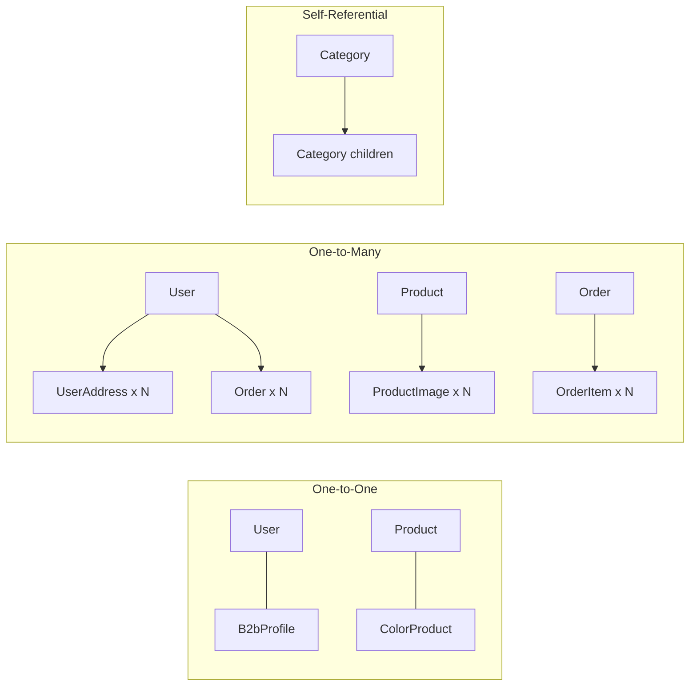

**Cascade Deletes:** UserAddress, B2bProfile, ProductImage, ColorProduct, ProductAttribute, CartItem, OrderItem, OrderStatusHistory, Review, Wishlist, ShippingRate, DynamicAttributeOption all cascade delete when parent is removed.

**Soft Deletes:** Product, Category use `isActive=false` instead of deletion.

---

## 5. Authentication & Authorization

### 5.1 Auth Flow

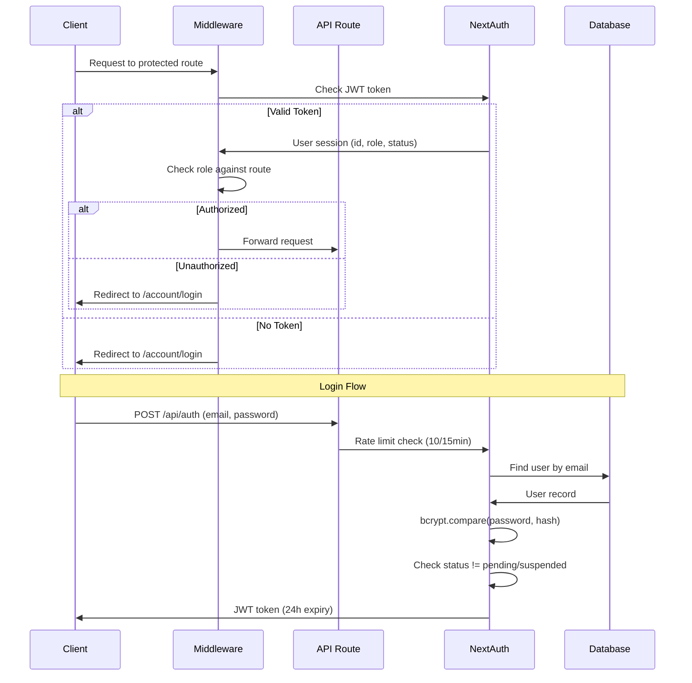

### 5.2 Route Protection Matrix

| Route Pattern | Required Role | Middleware | API-Level |
|---------------|--------------|-----------|-----------|
| `/admin/*` | admin | Yes | `requireAdmin()` |
| `/account/*` (except login) | any authenticated | Yes | `requireAuth()` |
| `/quick-order/*` | b2b or admin | Yes | `requireB2b()` |
| `/checkout/*` | public (guests allowed) | Passes through | API checks at order creation |
| `/api/products` GET | public | No | Optional auth for B2C/B2B pricing |
| `/api/cart/*` | authenticated | No | `requireAuth()` |
| `/api/orders` POST | authenticated | No | `requireAuth()` + rate limit |
| `/api/admin/*` | admin | No | `requireAdmin()` |
| `/api/newsletter` POST | public | No | Rate limited |

### 5.3 B2B Approval Workflow

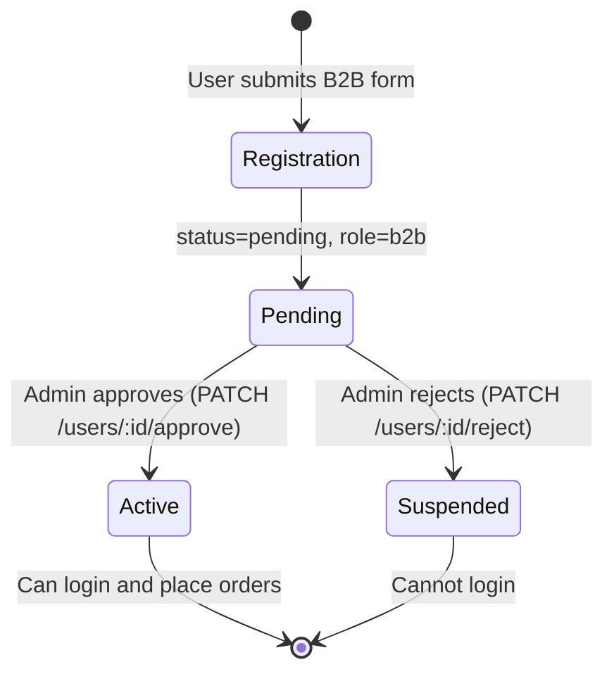

---

## 6. API Endpoints Reference

### 6.1 Authentication

#### `POST/GET /api/auth/[...nextauth]`
- **Purpose:** NextAuth handlers (login, session, callbacks)
- **Rate Limit:** `authRateLimiter` - 10 attempts per 15 minutes per IP
- **Request:** Handled by NextAuth (credentials: email + password)
- **Response:** JWT session token
- **Connected Data:** Queries `User` table, checks `passwordHash` via bcryptjs, verifies `status`

---

### 6.2 Users

#### `POST /api/users` - Registration
- **Auth:** Public (rate limited)
- **Rate Limit:** `registrationRateLimiter` - 5 per hour per IP
- **Request Body:**
  ```json
  {
    "email": "string (required)",
    "password": "string (min 8 chars)",
    "name": "string (required)",
    "phone": "string (optional)",
    "salonName": "string (B2B only)",
    "pib": "string (B2B only)",
    "maticniBroj": "string (B2B only)",
    "address": "string (B2B only)"
  }
  ```
- **Validation:** `registerB2cSchema` or `registerB2bSchema` (auto-detected by presence of salonName/pib)
- **Response:** `{ id, email, name, role, status }`
- **Connected Data:** Creates `User` + `B2bProfile` (if B2B) in transaction. B2B users get `status=pending`.

#### `GET /api/users/me` - Current User Profile
- **Auth:** Required
- **Response:**
  ```json
  {
    "id": "string",
    "email": "string",
    "name": "string",
    "phone": "string?",
    "role": "b2c|b2b|admin",
    "status": "active|pending|suspended",
    "avatarUrl": "string?",
    "createdAt": "datetime",
    "b2bProfile": { "salonName", "pib", "discountTier", ... },
    "addresses": [{ "id", "label", "street", "city", ... }]
  }
  ```
- **Connected Data:** Prisma includes `b2bProfile` and `addresses` relations

#### `PUT /api/users/me` - Update Profile
- **Auth:** Required
- **Request Body:** `{ name?, phone? }`
- **Response:** Updated user object

#### `POST /api/users/check-status` - Account Status Check
- **Auth:** Public (rate limited)
- **Rate Limit:** `checkStatusRateLimiter`
- **Request Body:** `{ email: "string" }`
- **Response:** `{ status: "active" | "pending" | "suspended" }`
- **Security Note:** Returns "active" for non-existent users to prevent account enumeration

#### `PATCH /api/users/[id]/approve` - Approve B2B User
- **Auth:** Admin only
- **Request:** Path param `id`
- **Response:** `{ message, userId }`
- **Connected Data:** Transaction updates `User.status=active` + `B2bProfile.approvedAt` + `B2bProfile.approvedBy`

#### `PATCH /api/users/[id]/reject` - Reject B2B User
- **Auth:** Admin only
- **Request:** Path param `id`
- **Response:** `{ message, userId }`
- **Connected Data:** Updates `User.status=suspended`

#### `GET /api/admin/users` - Admin User List
- **Auth:** Admin only
- **Query Params:** `page, limit, search, role, status`
- **Response:**
  ```json
  {
    "users": [{
      "id", "email", "name", "role", "status", "createdAt",
      "b2bProfile": { "salonName", ... },
      "_count": { "orders": 5 },
      "totalSpent": 45000
    }],
    "pagination": { "page", "limit", "total", "totalPages" }
  }
  ```
- **Connected Data:** Includes `b2bProfile`, counts orders, aggregates `Order.total` sum per user

---

### 6.3 Products

#### `GET /api/products` - Product Listing
- **Auth:** Optional (affects visibility + pricing)
- **Query Params:**
  | Param | Type | Description |
  |-------|------|-------------|
  | page | number | Page number (default 1) |
  | limit | number | Items per page (default 12, max 100) |
  | category | string | Category ID filter |
  | brand | string[] | Brand ID(s) filter |
  | search | string | Text search (name, SKU) |
  | sort | string | popular/price_asc/price_desc/newest/name_asc |
  | priceMin | number | Min price filter |
  | priceMax | number | Max price filter |
  | isNew | boolean | New products only |
  | onSale | boolean | Products with oldPrice |
  | isFeatured | boolean | Featured products |
  | isBestseller | boolean | Bestsellers only |
  | colorLevel | number | Hair color level filter |
  | colorUndertone | string | Color undertone filter |
  | hasColor | boolean | Only color products |
  | gender | string | Gender filter |
  | attr_* | string | Dynamic attribute filters (e.g. `attr_volume=500ml`) |
- **Response:**
  ```json
  {
    "products": [{
      "id", "sku", "nameLat", "slug",
      "brand": { "id", "name", "slug" },
      "category": { "id", "nameLat", "slug" },
      "images": [{ "url", "altText", "isPrimary" }],
      "colorProduct": { "colorLevel", "hexValue", ... },
      "priceB2c": 1500, "priceB2b": 1200, "oldPrice": 1800,
      "stockQuantity": 25,
      "avgRating": 4.5, "reviewCount": 12
    }],
    "pagination": { "page": 1, "limit": 12, "total": 150, "totalPages": 13 }
  }
  ```
- **Connected Data:**
  - Includes `Brand`, `Category`, `ProductImage` (primary), `ColorProduct`
  - Batch aggregates `Review` ratings via `groupBy`
  - Dynamic `ProductAttribute` filtering via subquery
  - **B2C visibility rule:** `isProfessional=true` products are hidden from B2C users
  - **Sort:** Always puts in-stock items before out-of-stock items

#### `POST /api/products` - Create Product
- **Auth:** Admin only
- **Request Body:** All product fields + `images[]` + color data
- **Connected Data:** Creates `Product`, `ProductImage[]`, `ColorProduct` (optional)

#### `GET /api/products/[id]` - Product Detail
- **Auth:** Optional
- **Request:** Path param `id` (accepts both CUID and slug)
- **Response:**
  ```json
  {
    "id", "sku", "nameLat", "nameCyr", "slug",
    "brand": { "id", "name", "slug" },
    "productLine": { "id", "name", "slug" },
    "category": { "id", "nameLat", "slug", "parent": { "id", "nameLat" } },
    "images": [{ "id", "url", "altText", "type", "isPrimary", "sortOrder" }],
    "colorProduct": { "colorLevel", "undertoneCode", "undertoneName", "hexValue", "shadeCode" },
    "productAttributes": [{ "value", "attribute": { "nameLat", "slug", "type" } }],
    "reviews": [{ "id", "rating", "createdAt", "user": { "name" } }],
    "avgRating": 4.2,
    "reviewCount": 8,
    "relatedProducts": [{ "id", "nameLat", "slug", "price", "image" }],
    ...all product fields
  }
  ```
- **Connected Data:**
  - Fetches `Brand`, `ProductLine`, `Category` (with parent), `ProductImage[]`, `ColorProduct`, `ProductAttribute[]` (with attribute definition)
  - Top 10 `Review`s with user names
  - `Review` aggregate for avgRating/count
  - Related products: same category or productLine (up to 8)

#### `PUT /api/products/[id]` - Update Product
- **Auth:** Admin only
- **Validation:** `updateProductSchema`
- **Connected Data:** Updates product, upserts/removes `ColorProduct` as needed

#### `DELETE /api/products/[id]` - Soft Delete Product
- **Auth:** Admin only
- **Connected Data:** Sets `isActive=false` (soft delete)

#### `GET /api/products/search` - Autocomplete Search
- **Auth:** Optional
- **Query Params:** `q` (min 2 chars)
- **Response:** Array of 5 products: `{ id, name, slug, sku, brand, price, image, isProfessional }`
- **Connected Data:** Searches `Product.nameLat`, `Product.sku`, `Brand.name` using `contains` (case-insensitive). B2C users don't see `isProfessional` products.

#### `GET /api/products/colors` - Color Matrix
- **Auth:** Public
- **Query Params:** `brandLine, level, undertone`
- **Response:**
  ```json
  {
    "colors": {
      "5": {
        "N": [{ "id", "hexValue", "shadeCode", "product": {...} }],
        "G": [...]
      }
    },
    "brandLines": ["line-slug-1", "line-slug-2"]
  }
  ```
- **Connected Data:** `ColorProduct` with `Product` (brand, productLine, images), grouped by level then undertone

#### `GET /api/products/color-facets` - Color Filter Options
- **Auth:** Public
- **Response:** `{ levels: [1,2,...10], undertones: ["N","G",...], totalColorProducts: 150 }`
- **Connected Data:** Distinct values from `ColorProduct` table

#### `POST /api/products/import` - Bulk Import
- **Auth:** Admin only
- **Request:** `FormData` with CSV/XLSX files (max 10MB each, 10,000 rows max)
- **Supported Formats:**
  - Pantheon product export
  - Pantheon category export
  - Pantheon barcode export
  - Alta Moda custom CSV
- **Response:** `{ files[], results[], totals: { created, updated, skipped, errors } }`
- **Connected Data:** Batch creates/updates `Product`, `Category`, `Brand`, `ProductLine`, handles SKU/slug deduplication, price conversions

---

### 6.4 Cart

#### `GET /api/cart` - Get Cart Items
- **Auth:** Required
- **Response:**
  ```json
  {
    "items": [{
      "id": "cartItemId",
      "productId": "string",
      "name": "string",
      "brand": "string",
      "price": 1500,
      "quantity": 2,
      "image": "url",
      "sku": "string",
      "stockQuantity": 25
    }]
  }
  ```
- **Connected Data:** `CartItem` -> `Product` (with `Brand`, primary `ProductImage`). Price is role-dependent (B2B gets `priceB2b`, B2C gets `priceB2c`).

#### `POST /api/cart` - Add to Cart
- **Auth:** Required
- **Validation:** `addToCartSchema`
- **Request Body:** `{ productId: "string", quantity: number }`
- **Response:** Updated cart
- **Connected Data:** Creates/finds `Cart` for user, upserts `CartItem` (increments quantity if exists)

#### `PUT /api/cart/[itemId]` - Update Quantity
- **Auth:** Required (ownership verified)
- **Validation:** `updateCartItemSchema`
- **Request Body:** `{ quantity: number }`
- **Response:** Updated item

#### `DELETE /api/cart/[itemId]` - Remove Item
- **Auth:** Required (ownership verified)
- **Response:** Success message

#### `POST /api/cart/merge` - Merge Guest Cart
- **Auth:** Required
- **Request Body:** `{ items: [{ productId: "string", quantity: number }] }`
- **Response:** `{ message: "Cart merged" }`
- **Connected Data:** Transaction-based. Validates all product IDs exist, upserts `CartItem`s (sums quantities with existing). Used when guest user logs in to merge their localStorage cart with server cart.

#### `POST /api/cart/validate-stock` - Stock Check
- **Auth:** Public (rate limited: 30/min)
- **Request Body:** `{ productIds: ["id1", "id2"] }`
- **Response:** `{ success: true, data: { "id1": 1, "id2": 0 } }` (1=in stock, 0=out)
- **Security:** Returns binary availability (not exact quantities) to prevent inventory scraping

---

### 6.5 Orders

#### `GET /api/orders` - List Orders
- **Auth:** Required
- **Query Params:** `page, limit`
- **Response:**
  ```json
  {
    "orders": [{
      "id", "orderNumber", "status", "total", "createdAt",
      "items": [{ "productName", "quantity", "unitPrice" }],
      "user": { "id", "name", "email", "role" }
    }],
    "pagination": { "page", "limit", "total", "totalPages" }
  }
  ```
- **Connected Data:** Users see their own orders. Admins see all orders. Includes `OrderItem[]` and `User`.

#### `POST /api/orders` - Create Order
- **Auth:** Required
- **Rate Limit:** `orderRateLimiter` - 5 per minute
- **Validation:** `createOrderSchema`
- **Request Body:**
  ```json
  {
    "items": [{ "productId": "string", "quantity": 1 }],
    "shippingMethod": "standard|express|pickup",
    "shippingAddress": { "street", "city", "postalCode", "country" },
    "billingAddress": { "street", "city", "postalCode", "country" },
    "paymentMethod": "card|bank_transfer|cash_on_delivery|invoice",
    "notes": "string (optional)"
  }
  ```
- **Response:** `{ id, orderNumber, total, status, itemCount }`
- **Connected Data (Transaction):**
  1. Validates all `Product`s exist and have sufficient stock
  2. Calculates prices from DB (not from client - security)
  3. Atomically decrements `Product.stockQuantity`
  4. Creates `Order` + `OrderItem[]` + initial `OrderStatusHistory`
  5. Clears user's `Cart`
  6. Shipping calculation: pickup=0, express=690, standard=350 (free if total >= 5000 RSD)

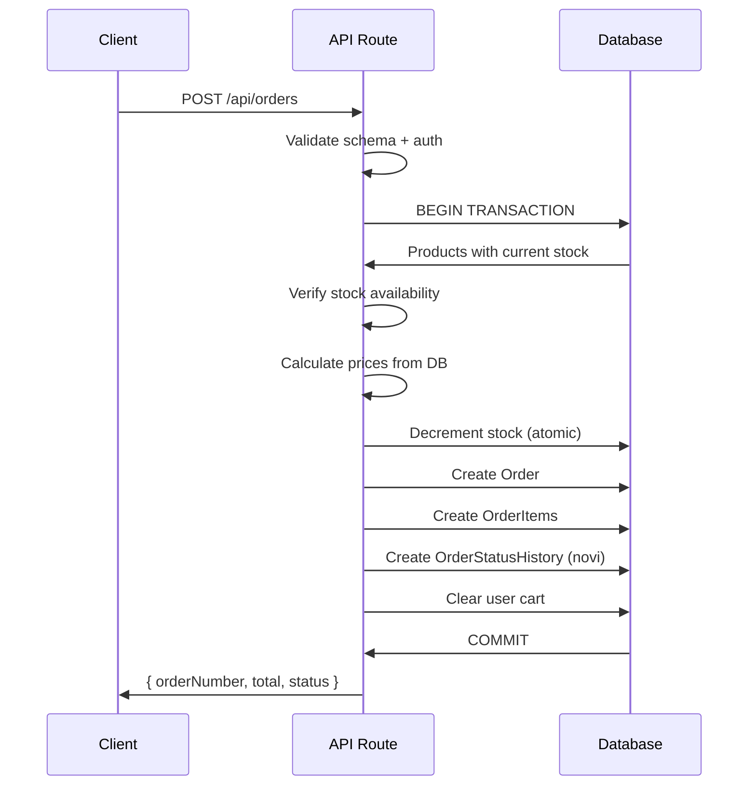

#### `GET /api/orders/[id]` - Order Detail
- **Auth:** Owner or Admin
- **Response:** Full order with items (including product images), status history (with admin names), user info
- **Connected Data:** Deep includes: `OrderItem` -> `Product` -> `ProductImage`, `OrderStatusHistory` -> `User`, `User`

#### `PATCH /api/orders/[id]/status` - Update Order Status
- **Auth:** Admin only
- **Validation:** `updateStatusSchema`
- **Request Body:** `{ status: "u_obradi|isporuceno|otkazano", note: "string (optional)" }`
- **State Machine:**
  ```mermaid
  stateDiagram-v2
      [*] --> novi: Order created
      novi --> u_obradi: Processing
      novi --> otkazano: Cancelled
      u_obradi --> isporuceno: Delivered
      u_obradi --> otkazano: Cancelled
      isporuceno --> [*]
      otkazano --> [*]
  ```
- **Connected Data:** Transaction updates `Order.status` + creates `OrderStatusHistory` record with admin ID

#### `POST /api/orders/quick` - B2B Quick Order
- **Auth:** B2B only (`requireB2b()`)
- **Request Body (discriminated union):**
  ```json
  // SKU Lookup
  { "type": "sku", "sku": "ABC-123" }

  // CSV Batch
  { "type": "csv", "rows": [{ "sku": "ABC-123", "quantity": 5 }] }

  // Repeat Previous Order
  { "type": "repeat", "orderId": "order-id" }
  ```
- **Response:** Product lookup result, CSV preview with pricing summary, or previous order items with current prices
- **Connected Data:** Queries `Product` by SKU (case-insensitive), validates batch, or fetches `OrderItem[]` with current `Product` prices

---

### 6.6 Brands

#### `GET /api/brands` - List Brands
- **Auth:** Optional (admin sees inactive brands with `?all=true`)
- **Response:**
  ```json
  {
    "brands": [{
      "id", "name", "slug", "logoUrl", "description", "isActive",
      "productLines": [{ "id", "name", "slug" }],
      "_count": { "products": 45 }
    }]
  }
  ```
- **Connected Data:** Includes `ProductLine[]`, counts `Product`s

#### `POST /api/brands` - Create Brand
- **Auth:** Admin only
- **Request Body:** `{ name, description?, logoUrl? }`
- **Connected Data:** Auto-generates `slug` from name (handles Serbian characters)

#### `GET /api/brands/[id]` - Brand Detail
- **Auth:** Public
- **Response:** Brand with productLines and product count

#### `PUT /api/brands/[id]` - Update Brand
- **Auth:** Admin only
- **Request Body:** `{ name?, logoUrl?, description?, content? }`
- **Connected Data:** Re-generates slug if name changes

---

### 6.7 Categories

#### `GET /api/categories` - Category Tree
- **Auth:** Public
- **Response:** Hierarchical tree structure (nested children)
- **Connected Data:** All active `Category` records, sorted by depth then sortOrder, assembled into tree

#### `POST /api/categories` - Create Category
- **Auth:** Admin only
- **Request Body:** `{ nameLat, nameCyr?, parentId?, sortOrder? }`
- **Connected Data:** Auto-calculates `depth` from parent, auto-generates `slug`

#### `GET /api/categories/[id]` - Category Detail
- **Auth:** Public
- **Connected Data:** Includes active `children[]` and `parent`

#### `PUT /api/categories/[id]` - Update Category
- **Auth:** Admin only
- **Request Body:** `{ nameLat?, nameCyr?, sortOrder?, isActive? }`

#### `DELETE /api/categories/[id]` - Soft Delete
- **Auth:** Admin only
- **Connected Data:** Sets `isActive=false`

---

### 6.8 Attributes

#### `GET /api/attributes` - List Attributes
- **Auth:** Public
- **Query Params:** `filters=true` (only filterable attributes)
- **Response:**
  ```json
  {
    "attributes": [{
      "id", "nameLat", "nameCyr", "slug", "type", "filterable", "showInFilters",
      "options": [{ "id", "value", "sortOrder" }]
    }]
  }
  ```
- **Connected Data:** Includes `DynamicAttributeOption[]` sorted by sortOrder

#### `POST /api/attributes` - Create Attribute
- **Auth:** Admin only
- **Request Body:** `{ nameLat, nameCyr?, type, filterable?, showInFilters?, options?: [{ value }] }`

#### `PUT /api/attributes/[id]` - Update Attribute
- **Auth:** Admin only
- **Request Body:** `{ nameLat?, nameCyr?, filterable?, showInFilters?, sortOrder? }`

#### `DELETE /api/attributes/[id]` - Delete Attribute
- **Auth:** Admin only
- **Connected Data:** Hard delete (cascades to `ProductAttribute` records)

---

### 6.9 Reviews

#### `GET /api/reviews` - Product Reviews
- **Auth:** Public
- **Query Params:** `productId (required), page, limit`
- **Response:**
  ```json
  {
    "reviews": [{ "id", "rating", "createdAt", "user": { "name" } }],
    "avgRating": 4.2,
    "count": 15,
    "pagination": { "page", "limit", "total", "totalPages" }
  }
  ```
- **Connected Data:** `Review` with `User.name`, plus aggregate average

#### `POST /api/reviews` - Submit Review
- **Auth:** Required
- **Validation:** `createReviewSchema`
- **Request Body:** `{ productId: "string", rating: 1-5 }`
- **Response:** Created review
- **Connected Data:** Validates `Product` exists. Returns 409 if user already reviewed this product (enforced by @@unique constraint).

---

### 6.10 Wishlist

#### `GET /api/wishlist` - Get Wishlist
- **Auth:** Required
- **Response:**
  ```json
  {
    "items": [{
      "id", "productId", "name", "brand", "price", "oldPrice",
      "image", "rating", "inStock", "slug"
    }]
  }
  ```
- **Connected Data:** `Wishlist` -> `Product` (with `Brand`, `ProductImage`), batch aggregates `Review` ratings

#### `POST /api/wishlist` - Toggle Wishlist Item
- **Auth:** Required
- **Request Body:** `{ productId: "string" }`
- **Behavior:** Toggle - creates if not exists, deletes if already exists
- **Response:** `{ added: true/false }`

#### `DELETE /api/wishlist` - Remove from Wishlist
- **Auth:** Required
- **Query Params:** `productId`
- **Connected Data:** Deletes by `userId + productId` compound

---

### 6.11 Newsletter

#### `POST /api/newsletter` - Subscribe
- **Auth:** Public
- **Rate Limit:** `newsletterRateLimiter` - 5 per hour
- **Validation:** `subscribeSchema`
- **Request Body:** `{ email: "string", segment?: "b2b|b2c|all" }`
- **Response:** `{ message, subscriber }`
- **Connected Data:** Creates or re-activates `NewsletterSubscriber`. Sends welcome email via Resend (non-blocking).

#### `GET /api/newsletter` - List Subscribers (Admin)
- **Auth:** Admin only
- **Query Params:** `search, segment, page, limit`
- **Response:** `{ subscribers[], total, page, limit }`

#### `DELETE /api/newsletter` - Unsubscribe
- **Auth:** Public
- **Request Body:** `{ email: "string" }`
- **Connected Data:** Sets `isSubscribed=false`, records `unsubscribedAt`

#### `DELETE /api/newsletter/[id]` - Hard Delete Subscriber
- **Auth:** Admin only

#### `GET /api/newsletter/stats` - Subscriber Stats
- **Auth:** Admin only
- **Response:** `{ totalActive, b2bCount, b2cCount }`

#### `POST /api/newsletter/campaigns` - Create Campaign
- **Auth:** Admin only
- **Validation:** `createCampaignSchema`
- **Request Body:** `{ title, subject, content, segment?, templateId? }`
- **Response:** Created campaign with `status=draft`

#### `GET /api/newsletter/campaigns` - List Campaigns
- **Auth:** Admin only
- **Query Params:** `status, page, limit`

#### `PUT /api/newsletter/campaigns/[id]` - Update Campaign
- **Auth:** Admin only
- **Restriction:** Only `status=draft` campaigns can be updated

#### `DELETE /api/newsletter/campaigns/[id]` - Delete Campaign
- **Auth:** Admin only
- **Restriction:** Cannot delete `status=sent` campaigns

#### `POST /api/newsletter/campaigns/[id]/send` - Send Campaign
- **Auth:** Admin only
- **Request:** Path param `id`
- **Connected Data Flow:**
  ```mermaid
  sequenceDiagram
      participant A as Admin
      participant API as API
      participant DB as Database
      participant R as Resend

      A->>API: POST /campaigns/:id/send
      API->>DB: Get campaign (must be draft/scheduled)
      API->>DB: Get subscribers matching segment
      API->>DB: Update status -> "sending"
      API->>R: sendBatchEmails (up to 100/batch)
      R-->>API: Delivery results
      API->>DB: Update status -> "sent", sentCount, sentAt
      API->>A: Updated campaign
  ```

#### `GET /api/newsletter/campaigns/[id]/preview` - Preview Campaign
- **Auth:** Admin only
- **Response:** `{ html: "rendered HTML string" }`

#### `POST /api/newsletter/templates` - Create Template
- **Auth:** Admin only
- **Request Body:** `{ name, subject, htmlContent, description?, thumbnail?, isDefault? }`

#### `GET /api/newsletter/templates` - List Templates
- **Auth:** Admin only
- **Response:** Ordered by isDefault desc, then createdAt desc

#### `PUT /api/newsletter/templates/[id]` - Update Template
- **Auth:** Admin only

#### `DELETE /api/newsletter/templates/[id]` - Delete Template
- **Auth:** Admin only
- **Restriction:** Cannot delete default templates

#### `POST /api/newsletter/templates/[id]/duplicate` - Clone Template
- **Auth:** Admin only
- **Response:** New template with name `"{original} (kopija)"`

#### `POST /api/newsletter/templates/seed` - Seed Defaults
- **Auth:** Admin only
- **Response:** `{ message, created, updated }`
- **Connected Data:** Creates/updates default templates from hardcoded template library

#### `POST /api/newsletter/test` - Send Test Email
- **Auth:** Admin only
- **Request Body:** `{ email: "string" }`

---

### 6.12 Admin Colors

#### `GET /api/admin/colors` - Color Matrix
- **Auth:** Admin only
- **Query Params:** `brandLine, level, undertone, search`
- **Response:**
  ```json
  {
    "matrix": { "5": { "N": [colors...], "G": [colors...] } },
    "levels": [1,2,...10],
    "undertones": ["N","G","R",...],
    "brandLines": [{ "id", "name", "slug", "brandName" }],
    "total": 250
  }
  ```
- **Connected Data:** `ColorProduct` -> `Product` (with brand, productLine, category, images)

#### `POST /api/admin/colors` - Create Color Entry
- **Auth:** Admin only
- **Request Body:** `{ productId, colorLevel, undertoneCode, undertoneName, hexValue, shadeCode }`

#### `PUT /api/admin/colors/[id]` - Update Color
- **Auth:** Admin only

#### `DELETE /api/admin/colors/[id]` - Delete Color
- **Auth:** Admin only

---

### 6.13 Upload

#### `POST /api/upload` - File Upload
- **Auth:** Admin only
- **Request:** `FormData` with `file` field
- **Validation:**
  - Max 10MB
  - Magic byte verification (checks file header, not just extension)
  - Allowed: JPEG, PNG, GIF, WebP, MP4, WebM
- **Response:** `{ url: "/uploads/filename.ext" }`
- **Connected Data:** Saves to `public/uploads/` directory

---

### 6.14 Cross-Endpoint Data Flow Diagram

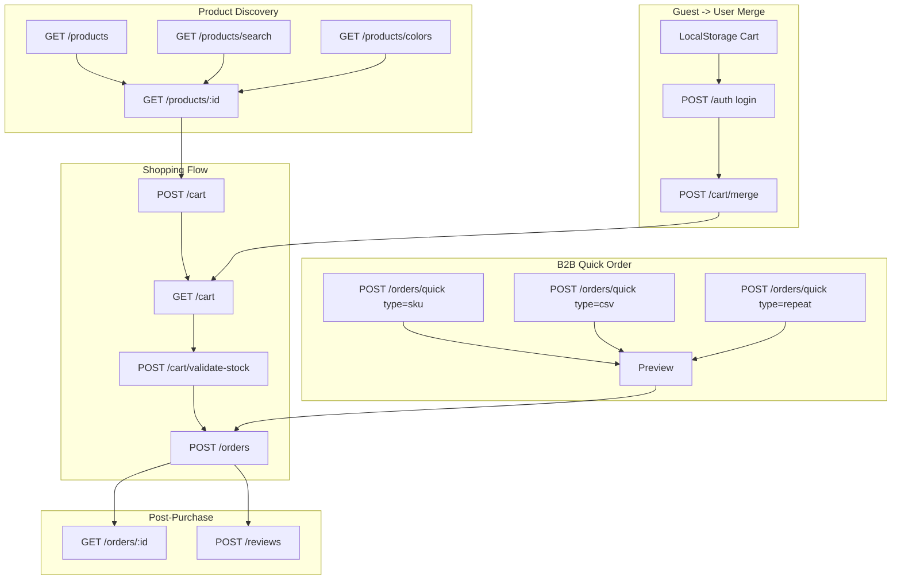

---

## 7. Client-Side State Management

### 7.1 Zustand Stores

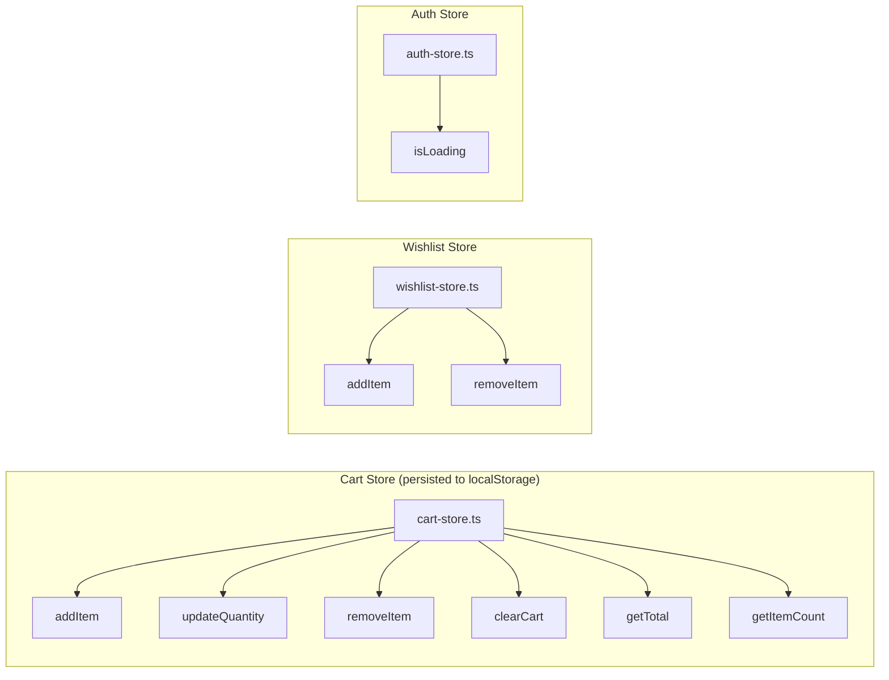

**Cart Provider** (`CartProvider.tsx`):
- Wraps app to sync localStorage cart with server cart
- On login: merges guest cart items via `POST /api/cart/merge`
- Listens for auth state changes to trigger sync

### 7.2 Internationalization

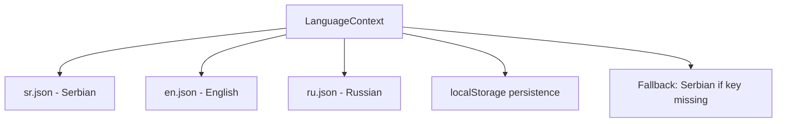

---

## 8. External Integrations

### 8.1 Integration Map

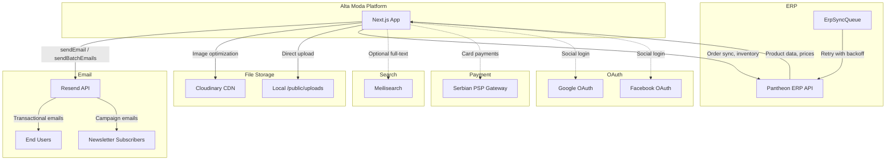

### 8.2 ERP Sync Retry Strategy

The Pantheon ERP integration uses exponential backoff:
| Attempt | Delay |
|---------|-------|
| 1 | 1 minute |
| 2 | 5 minutes |
| 3 | 15 minutes |
| 4 | 1 hour |
| 5 | 4 hours |

Max 5 attempts per sync item. Failed items remain in queue with error details.

---

## 9. Security Architecture

### 9.1 Security Layers

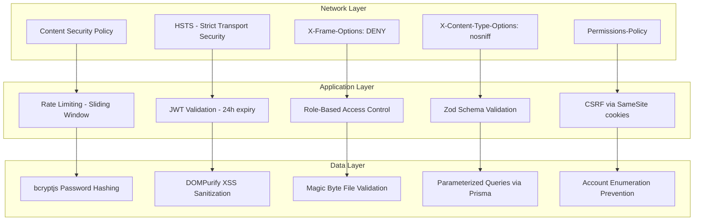

### 9.2 Rate Limiters

| Limiter | Limit | Window | Applied To |
|---------|-------|--------|-----------|
| Auth | 10 requests | 15 min | POST /api/auth |
| Registration | 5 requests | 1 hour | POST /api/users |
| Order Creation | 5 requests | 1 min | POST /api/orders |
| Newsletter | 5 requests | 1 hour | POST /api/newsletter |
| Stock Check | 30 requests | 1 min | POST /cart/validate-stock |
| Status Check | (custom) | - | POST /users/check-status |

**Implementation:** In-memory sliding window (per IP). Not distributed - each server instance has its own window.

---

## 10. Architecture Quality Assessment

### 10.1 Strengths

| Area | Assessment | Details |
|------|-----------|---------|
| **Database Design** | Excellent | Well-normalized schema, proper use of relations, cascade deletes, composite unique constraints, soft deletes where appropriate |
| **Security** | Very Good | Multi-layer: CSP headers, rate limiting, JWT, RBAC, input validation, XSS prevention, magic byte upload verification, account enumeration prevention, inventory scraping prevention |
| **API Design** | Good | Consistent REST patterns, proper HTTP status codes, unified error handling via `withErrorHandler`, pagination throughout |
| **Validation** | Excellent | Zod schemas at every API boundary, server-side price calculation (not trusting client), stock validation in transactions |
| **Order Processing** | Excellent | Transactional stock management prevents race conditions, state machine for order status, audit trail via OrderStatusHistory |
| **B2B/B2C Separation** | Very Good | Clean role-based visibility, separate pricing, professional product gating, B2B approval workflow |
| **Bilingual Support** | Good | Latin/Cyrillic field pairs, 3-language UI translations, locale-aware SEO metadata |
| **ERP Integration** | Good | Async queue with retry backoff, sync logging, designed for eventual consistency |
| **Testing** | Good | Dedicated test infrastructure with unit, security, and performance test categories |

### 10.2 Areas for Improvement

#### Critical Issues

**1. In-Memory Rate Limiting (High Priority)**
- **Problem:** Rate limiters use in-memory storage. In a multi-instance deployment (e.g., Vercel, multiple containers), each instance has its own counter. An attacker can bypass limits by hitting different instances.
- **Recommendation:** Replace with Redis-backed rate limiting (e.g., `@upstash/ratelimit` or Redis `INCR` with `EXPIRE`). This is essential before scaling horizontally.

**2. Missing Database Indexes (High Priority)**
- **Problem:** Only 1 explicit index exists (`ErpSyncQueue` on status+nextRetryAt). Common query patterns lack indexes:
  - `Product.brandId`, `Product.categoryId`, `Product.productLineId` (FK lookups)
  - `Product.isActive + priceB2c` (filtered price sorts)
  - `Order.userId + createdAt` (user order history)
  - `CartItem.cartId` (cart loading)
  - `Review.productId` (product reviews)
- **Recommendation:** Add composite indexes for all frequent query patterns. Run `EXPLAIN ANALYZE` on production queries to identify slow paths.

**3. No Refresh Token / Session Rotation (Medium Priority)**
- **Problem:** JWT tokens are valid for 24 hours with no rotation. If a token is compromised, it remains valid until expiry.
- **Recommendation:** Implement shorter-lived access tokens (15 min) with refresh tokens, or use NextAuth's built-in session rotation.

#### Architectural Improvements

**4. Component Architecture (Medium Priority)**
- **Problem:** Only 9 shared components exist. Most UI logic likely lives in page files, leading to large, monolithic page components that are hard to test and reuse.
- **Recommendation:** Extract reusable UI components (ProductCard, OrderSummary, PriceDisplay, FilterSidebar, etc.) into a proper component library. This will improve maintainability and enable isolated testing.

**5. No API Versioning (Low Priority)**
- **Problem:** All routes are at `/api/*` with no version prefix. Breaking changes to the API will affect all clients simultaneously.
- **Recommendation:** Consider `/api/v1/*` prefix if external API consumers exist (mobile app, B2B integrations). For internal-only use, this is lower priority.

**6. Missing Pagination on Some Endpoints (Low Priority)**
- **Problem:** Some list endpoints (brands, categories, attributes) return all records without pagination. Acceptable for small datasets but could become a problem at scale.
- **Recommendation:** Add pagination with sensible defaults to all list endpoints.

**7. Promotion System Unused (Low Priority)**
- **Problem:** `Promotion` and `PromoCode` tables exist in the schema but no API endpoints apply promotions to cart/order totals. The `PromoCode` relation on `Order` exists but isn't utilized in the order creation flow.
- **Recommendation:** Implement promo code validation and application in the checkout/order creation flow.

**8. Newsletter Automations Unused (Low Priority)**
- **Problem:** `NewsletterAutomation` table exists but no API endpoints trigger or manage automations.
- **Recommendation:** Implement automation triggers (e.g., welcome series, abandoned cart, post-purchase) or remove the unused table.

**9. Search Optimization (Medium Priority)**
- **Problem:** Product search uses SQL `LIKE`/`contains` queries, which are slow for large catalogs. Meilisearch is configured in env but integration code isn't visible.
- **Recommendation:** Complete the Meilisearch integration for full-text search with typo tolerance, faceted search, and relevance ranking.

**10. Error Monitoring & Observability (Medium Priority)**
- **Problem:** No visible error tracking (Sentry, DataDog, etc.) or structured logging. Errors are caught by `withErrorHandler` but only returned as JSON responses.
- **Recommendation:** Add structured logging and error tracking for production visibility. The ERP sync system especially needs monitoring.

### 10.3 Architecture Score Summary

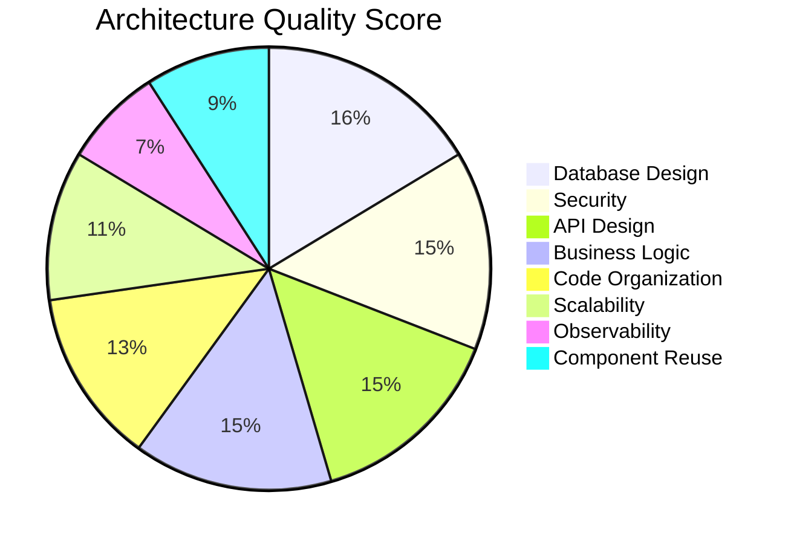

| Category | Score (1-10) | Notes |
|----------|-------------|-------|
| Database Design | 9/10 | Excellent normalization, relations, constraints |
| Security | 8/10 | Multi-layer protection, minor gaps (in-memory rate limit) |
| API Design | 8/10 | Consistent, well-validated, proper auth |
| Business Logic | 8/10 | Solid order processing, B2B workflow, ERP sync |
| Code Organization | 7/10 | Clean separation but page-heavy components |
| Scalability | 6/10 | In-memory rate limits, missing indexes, SQL search |
| Observability | 4/10 | No structured logging, monitoring, or alerting |
| Component Reuse | 5/10 | Very few shared components for a large app |

### 10.4 Recommended Priority Actions

1. **Add Redis-backed rate limiting** - Required before horizontal scaling
2. **Add database indexes** - Immediate performance win, no code changes needed
3. **Extract shared UI components** - Improves maintainability and testability
4. **Add error monitoring** (Sentry or similar) - Required for production reliability
5. **Implement promo code checkout flow** - Complete existing but unused feature
6. **Complete Meilisearch integration** - Better search UX for growing catalog
7. **Add structured logging** - Essential for debugging production issues

---

## Appendix: Enums Reference

```typescript
enum UserRole       { b2c, b2b, admin }
enum UserStatus     { active, pending, suspended }
enum OrderStatus    { novi, u_obradi, isporuceno, otkazano }
enum PaymentMethod  { card, bank_transfer, cash_on_delivery, invoice }
enum PaymentStatus  { pending, paid, failed, refunded }
enum PromotionTargetType { product, category, brand, all }
enum PromoType      { percentage, fixed }
enum Audience       { b2b, b2c, all }
enum AttributeType  { boolean, text, number, select }
enum MediaType      { image, video, gif }
enum ShippingMethod { standard, express }
enum SyncDirection  { inbound, outbound }
enum SyncStatus     { success, failed, in_progress }
enum NewsletterSegment { b2b, b2c, all }
enum CampaignStatus { draft, scheduled, sending, sent, failed }
```

---

## Appendix: Business Constants

```typescript
CURRENCY = 'RSD'
FREE_SHIPPING_THRESHOLD = 5000    // RSD
MIN_B2B_ORDER = 10000             // RSD
B2B_BULK_DISCOUNT = 15            // percent
ORDER_PREFIX = 'ALT'              // ALT-2026-0001
ERP_DEFAULT_VAT_RATE = 20         // percent
ERP_SYNC_MAX_RETRIES = 5
PAGINATION_DEFAULT_LIMIT = 12
PAGINATION_MAX_LIMIT = 100
```
