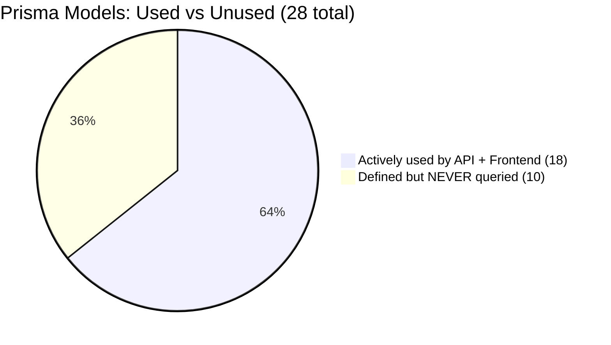
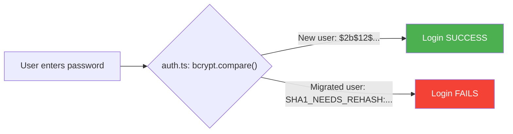
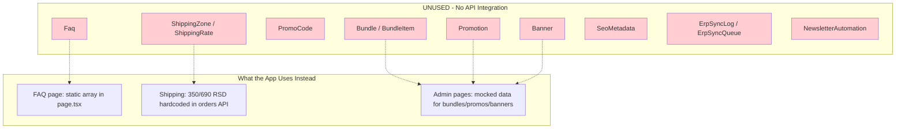
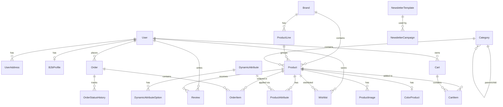
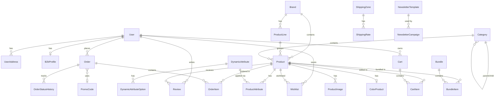

# Database Migration & Alignment Analysis

> **Generated:** 2026-04-04
> **Branch:** `correct_data`
> **Source:** Old MySQL (`altamoda_db.sql`) → New PostgreSQL (Prisma ORM)
> **Tests:** 33 files, 544 tests — all passing

---

## Table of Contents

1. [High-Level Architecture: Old vs New](#1-high-level-architecture-old-vs-new)
2. [Model Usage Status](#2-model-usage-status)
3. [Migration Mapping: Every Table](#3-migration-mapping-every-table)
4. [Data Flow: API ↔ Database ↔ Frontend](#4-data-flow-api--database--frontend)
5. [Critical Issues Found](#5-critical-issues-found)
6. [What IS Working Correctly](#6-what-is-working-correctly)
7. [Unused Tables — Dead Schema Weight](#7-unused-tables--dead-schema-weight)
8. [Entity Relationship Diagram](#8-entity-relationship-diagram)
9. [ID Mapping Strategy](#9-id-mapping-strategy)
10. [Data Integrity & Skipping Logic](#10-data-integrity--skipping-logic)
11. [Data Loss Summary](#11-data-loss-summary)
12. [Summary & Action Items](#12-summary--action-items)

---

## 1. High-Level Architecture: Old vs New

```mermaid
graph LR
    subgraph "OLD MySQL (altamoda_db.sql)"
        OB[brands]
        OC[categories]
        OF[features]
        OFO[feature_options]
        OP[products]
        OPI[product_images]
        OPC[product_categories]
        OPO[product_options]
        OU[users]
        OO[orders]
        OOI[order_items]
        ON[newsletter_subscribers]
        OW[wishes]
    end

    subgraph "NEW PostgreSQL (Prisma)"
        NB[Brand]
        NPL[ProductLine]
        NC[Category]
        NDA[DynamicAttribute]
        NDAO[DynamicAttributeOption]
        NP[Product]
        NPI[ProductImage]
        NPA[ProductAttribute]
        NCP[ColorProduct]
        NU[User]
        NUA[UserAddress]
        NB2B[B2bProfile]
        NO[Order]
        NOI[OrderItem]
        NOSH[OrderStatusHistory]
        NR[Review]
        NCart[Cart]
        NCI[CartItem]
        NWish[Wishlist]
        NNS[NewsletterSubscriber]
        NNC[NewsletterCampaign]
        NNT[NewsletterTemplate]
        NNA[NewsletterAutomation]
        NProm[Promotion]
        NPromo[PromoCode]
        NBun[Bundle]
        NBunI[BundleItem]
        NBan[Banner]
        NFAQ[Faq]
        NSZ[ShippingZone]
        NSR[ShippingRate]
        NSEO[SeoMetadata]
        NERP1[ErpSyncLog]
        NERP2[ErpSyncQueue]
    end

    OB -->|migrated| NB
    OC -->|migrated| NC
    OF -->|migrated| NDA
    OFO -->|migrated| NDAO
    OP -->|migrated| NP
    OPI -->|migrated| NPI
    OPC -->|"partial: first only"| NP
    OPO -->|migrated| NPA
    OU -->|migrated| NU
    OU -->|extracted| NUA
    OU -->|extracted| NB2B
    OO -->|"partial: skip guest"| NO
    OOI -->|migrated| NOI
    ON -->|migrated| NNS
    OW -->|migrated| NWish

    style NPL fill:#ff9800,stroke:#e65100
    style NCP fill:#ff9800,stroke:#e65100
    style NR fill:#ff9800,stroke:#e65100
    style NCart fill:#ff9800,stroke:#e65100
    style NCI fill:#ff9800,stroke:#e65100
    style NOSH fill:#ff9800,stroke:#e65100
    style NProm fill:#f44336,stroke:#b71c1c
    style NPromo fill:#f44336,stroke:#b71c1c
    style NBun fill:#f44336,stroke:#b71c1c
    style NBunI fill:#f44336,stroke:#b71c1c
    style NBan fill:#f44336,stroke:#b71c1c
    style NFAQ fill:#f44336,stroke:#b71c1c
    style NSZ fill:#f44336,stroke:#b71c1c
    style NSR fill:#f44336,stroke:#b71c1c
    style NSEO fill:#f44336,stroke:#b71c1c
    style NERP1 fill:#f44336,stroke:#b71c1c
    style NERP2 fill:#f44336,stroke:#b71c1c
    style NNC fill:#ff9800,stroke:#e65100
    style NNT fill:#ff9800,stroke:#e65100
    style NNA fill:#ff9800,stroke:#e65100
```



**Legend:**
- **Default (green)** = Migrated from old DB with data
- **Orange** = New tables, empty after migration, but actively used by app code
- **Red** = New tables, empty after migration, AND not queried by any app code

---

## 2. Model Usage Status



| Status | Models |
|--------|--------|
| **Migrated + Actively Used** | Brand, Category, Product, ProductImage, DynamicAttribute, DynamicAttributeOption, ProductAttribute, User, UserAddress, B2bProfile, Order, OrderItem, NewsletterSubscriber, Wishlist |
| **New + Actively Used (empty after migration)** | ProductLine, ColorProduct, Review, Cart, CartItem, OrderStatusHistory, NewsletterTemplate, NewsletterCampaign |
| **Defined but NEVER queried by app** | Bundle, BundleItem, Promotion, PromoCode, Banner, Faq, ShippingZone, ShippingRate, SeoMetadata, ErpSyncLog, ErpSyncQueue, NewsletterAutomation |

---

## 3. Migration Mapping: Every Table

### 3.1 Brands

| Old MySQL Column | New PostgreSQL Field | Transformation |
|------------------|---------------------|----------------|
| `id` (int) | — | Lookup map (old int → new CUID) |
| `name` | `name` | Direct copy |
| `uri` | `slug` (unique) | Direct copy |
| `logo` | `logoUrl` | Prefixed: `https://www.altamoda.rs/uploads/store/brands/{logo}` |
| `description_sr` | `description` | HTML entity decoded |
| — | `isActive` | Default `true` |
| `title_en`, `description_en` | — | **Discarded** |
| `seo_title_tag_sr/en` | — | **Discarded** |
| `seo_meta_description_sr/en` | — | **Discarded** |

### 3.2 Categories

| Old MySQL Column | New PostgreSQL Field | Transformation |
|------------------|---------------------|----------------|
| `id` (int) | — | Lookup map |
| `parent` (int/NULL) | `parentId` | Resolved via ID map (2-pass approach) |
| `name_sr` | `nameLat` | Direct copy |
| — | `nameCyr` | NULL (not in old DB) |
| `uri_sr` | `slug` (unique) | With uniqueness enforcement |
| `level` (1-based) | `depth` (0-based) | `depth = level - 1` |
| `active` (tinyint) | `isActive` | Boolean conversion |
| — | `sortOrder` | Default `0` |
| `name_en`, `seo_*`, `icon`, `image` | — | **Discarded** |

### 3.3 Features → DynamicAttributes

| Old MySQL Column | New PostgreSQL Field | Transformation |
|------------------|---------------------|----------------|
| `id` (int) | — | Lookup map |
| `name_sr` | `nameLat` | Direct copy |
| `name_en` | `slug` | Slugified from English name |
| — | `type` | Hardcoded `"select"` |
| — | `filterable` | Default `true` |
| — | `showInFilters` | Default `true` |
| `mandatory` | — | **Discarded** |

### 3.4 Feature Options → DynamicAttributeOptions

| Old MySQL Column | New PostgreSQL Field | Transformation |
|------------------|---------------------|----------------|
| `id` (int) | — | Lookup map |
| `feature_id` | `attributeId` | Resolved via features ID map |
| `name_sr` | `value` | Direct copy |
| — | `sortOrder` | Insertion order (0-based per attribute) |

### 3.5 Products

| Old MySQL Column | New PostgreSQL Field | Transformation |
|------------------|---------------------|----------------|
| `id` (int) | — | Lookup map |
| `code` | `sku` (unique) | Direct; fallback `OLD-{id}` if empty |
| `name_sr` | `nameLat` | HTML entity decoded |
| `uri_sr` | `slug` (unique) | With collision suffix (`-2`, `-3`...) |
| `manufacturer_id` | `brandId` | Resolved via brands ID map |
| `description_sr` | `description` | HTML entity decoded |
| `aditional_info_1_sr` | `usageInstructions` | HTML entity decoded |
| `no_pdv_price` | `priceB2c` | Direct decimal |
| `promotion_price` | `oldPrice` | Only if different from `no_pdv_price` and > 0 |
| `stock` | `stockQuantity` | Direct integer |
| `product_active` | `isActive` | Boolean conversion |
| `new` | `isNew` | Boolean conversion |
| `top` | `isFeatured` | Boolean conversion |
| `recommended` | `isBestseller` | Boolean conversion |
| `meta_tag_sr` | `seoTitle` | HTML entity decoded |
| `seo_description_sr` | `seoDescription` | HTML entity decoded |
| — | `isProfessional` | Default `false` |
| — | `priceB2b` | **NULL** (not in old DB) |
| — | `nameCyr`, `ingredients`, `costPrice`, `weightGrams`, `volumeMl`, `gender`, `erpId`, `barcode`, `vatRate`, `vatCode` | NULL / defaults |
| `name_en`, `description_en`, `sale`, `sold_out`, `have_stock`, `sales_count` | — | **Discarded** |

### 3.6 Product Images

| Old MySQL Column | New PostgreSQL Field | Transformation |
|------------------|---------------------|----------------|
| `product_id` | `productId` | Resolved via products ID map |
| `filename` | `url` | Prefixed: `https://www.altamoda.rs/uploads/store/products/{filename}` |
| `main_image` | `isPrimary` | Boolean conversion |
| — | `type` | Default `"image"` |
| — | `sortOrder` | `0` if primary, `1` if secondary |

### 3.7 Product Categories (Many-to-Many → Single FK)

| Old MySQL Column | New PostgreSQL Field | Transformation |
|------------------|---------------------|----------------|
| `product_id` | Product.`categoryId` | UPDATE on existing product |
| `category_id` | Product.`categoryId` | **First** category found per product only |

> **Data loss:** Products that belonged to multiple categories now only appear in one.

### 3.8 Product Options → ProductAttributes

| Old MySQL Column | New PostgreSQL Field | Transformation |
|------------------|---------------------|----------------|
| `product_id` | `productId` | Resolved via products ID map |
| `option_id` | `attributeId` + `value` | Resolved via option→feature lookup chain |

### 3.9 Users → User + UserAddress + B2bProfile

**User table:**

| Old MySQL Column | New PostgreSQL Field | Transformation |
|------------------|---------------------|----------------|
| `email` | `email` (unique) | Duplicates skipped |
| `password` (SHA1) | `passwordHash` | Prefixed: `SHA1_NEEDS_REHASH:{hash}` |
| `first_name` + `last_name` | `name` | Concatenated; fallback `"Unknown"` |
| `phone` | `phone` | Direct copy |
| `user_type` | `role` | `legal_entity` → `b2b`, else → `b2c` |
| `blocked_user` | `status` | `1` → `suspended`, `0` → `active` |
| `date_registered` | `createdAt` | Parsed; invalid → `2015-01-01` |

**UserAddress table (created if address OR city exists):**

| Old MySQL Column | New PostgreSQL Field | Transformation |
|------------------|---------------------|----------------|
| `address` | `street` | Direct; fallback `"-"` |
| `city` | `city` | Direct; fallback `"-"` |
| `postal_number` | `postalCode` | Direct; fallback `"00000"` |
| — | `label` | Default `"Glavna adresa"` |
| — | `country` | Default `"Srbija"` |
| — | `isDefault` | `true` |

**B2bProfile table (created for `legal_entity` users with `company_name`):**

| Old MySQL Column | New PostgreSQL Field | Transformation |
|------------------|---------------------|----------------|
| `company_name` | `salonName` | Direct copy |
| `company_pib` | `pib` | Direct copy |
| `company_reg_number` | `maticniBroj` | Direct copy |
| `address` | `address` | Direct copy |
| — | `discountTier` | Default `0` |

### 3.10 Orders

| Old MySQL Column | New PostgreSQL Field | Transformation |
|------------------|---------------------|----------------|
| `id` | `orderNumber` | Format: `AM-{id.padStart(6, '0')}` |
| `user_id` | `userId` | Resolved; **SKIP entire order if NULL or not found** |
| `status` (1-3) | `status` | `1→novi`, `2→u_obradi`, `3→isporuceno` |
| `items_price` | `subtotal` | Direct decimal |
| `shipping_price` | `shippingCost` | Direct decimal |
| `total_price` | `total` | Direct decimal |
| `payment_type` (1-3) | `paymentMethod` | `1→cash_on_delivery`, `2→bank_transfer`, `3→card` |
| `completed` | `paymentStatus` | `1→paid`, `0→pending` |
| `additional_instructions` | `notes` | HTML entity decoded |
| `status_1_date` | `createdAt` | Parsed datetime |
| Address fields | `shippingAddress` | JSON: `{ name, street, city, postalCode, phone }` |
| — | `currency` | Default `"RSD"` |
| — | `discountAmount` | Default `0` |

### 3.11 Order Items

| Old MySQL Column | New PostgreSQL Field | Transformation |
|------------------|---------------------|----------------|
| `order_id` | `orderId` | Resolved via orders ID map |
| `product_id` | `productId` | Resolved via products ID map |
| — | `productName` | Resolved from products cache |
| — | `productSku` | Resolved from products cache |
| `amount` | `quantity` | Direct integer |
| `price` | `unitPrice` | Direct decimal |
| — | `totalPrice` | Computed: `quantity * unitPrice` |

### 3.12 Newsletter Subscribers

| Old MySQL Column | New PostgreSQL Field | Transformation |
|------------------|---------------------|----------------|
| `email` | `email` (unique) | Duplicates skipped |
| `date` | `subscribedAt` | Parsed; invalid → `2015-01-01` |
| — | `segment` | Default `b2c` |
| — | `isSubscribed` | Default `true` |
| `language` | — | **Discarded** |

### 3.13 Wishes → Wishlists

| Old MySQL Column | New PostgreSQL Field | Transformation |
|------------------|---------------------|----------------|
| `user` | `userId` | Resolved; skip if not found |
| `product` | `productId` | Resolved; skip if not found |
| — | `createdAt` | Default `now()` |

---

## 4. Data Flow: API ↔ Database ↔ Frontend

```mermaid
flowchart TD
    subgraph Frontend
        PP[Products Page]
        PD[Product Detail]
        CP[Colors Page]
        CartP[Cart Page]
        CO[Checkout]
        WL[Wishlist]
        ACC[Account]
        ADM[Admin Panel]
        FAQ[FAQ Page]
    end

    subgraph API["API Routes"]
        A1["GET /api/products"]
        A2["GET /api/products/:id"]
        A3["GET /api/products/colors"]
        A4["GET/POST /api/cart"]
        A5["POST /api/orders"]
        A6["GET/POST /api/wishlist"]
        A7["GET/POST /api/reviews"]
        A8["GET /api/brands"]
        A9["GET /api/categories"]
        A10["GET/POST /api/newsletter"]
        A11["Admin APIs"]
    end

    subgraph DB["PostgreSQL via Prisma"]
        Product
        Brand
        Category
        ProductLine
        ProductImage
        ColorProduct
        DynAttr["DynamicAttribute + Options"]
        ProdAttr[ProductAttribute]
        Cart_T["Cart + CartItem"]
        Order_T["Order + OrderItem + StatusHistory"]
        User_T["User + Address + B2bProfile"]
        Review_T[Review]
        Wishlist_T[Wishlist]
        Newsletter_T[NewsletterSubscriber]
    end

    PP --> A1 --> Product & Brand & Category & ProductImage & DynAttr & ProdAttr & Review_T
    PD --> A2 --> Product & Brand & Category & ProductLine & ProductImage & ColorProduct & ProdAttr & Review_T
    CP --> A3 --> ColorProduct & ProductLine & Brand & ProductImage
    CartP --> A4 --> Cart_T & Product & ProductImage
    CO --> A5 --> Order_T & Product & Cart_T & User_T
    WL --> A6 --> Wishlist_T & Product & ProductImage & Review_T
    ACC --> User_T
    ADM --> A11 --> Order_T & User_T & Product & Newsletter_T
    FAQ -.->|"HARDCODED, not from DB"| FAQ

    style FAQ fill:#f44336,color:#fff
```



### API → Prisma Query Summary

| API Route | Prisma Models Queried | Relations Included |
|-----------|----------------------|-------------------|
| `GET /api/products` | Product, Brand, Category, ProductImage, Review, ColorProduct, ProductAttribute, DynamicAttribute | brand, category, images (isPrimary), colorProduct, productAttributes.attribute |
| `GET /api/products/:id` | Product, Brand, ProductLine, Category, ProductImage, ColorProduct, ProductAttribute, DynamicAttribute, Review | All above + productLine, category.parent, reviews.user, related products |
| `GET /api/products/search` | Product, Brand, ProductImage | brand, images (isPrimary) |
| `GET /api/products/colors` | ColorProduct, Product, Brand, ProductLine, ProductImage | product.brand, product.productLine, product.images |
| `GET /api/brands` | Brand, ProductLine, Product (_count) | productLines |
| `GET /api/categories` | Category | Self-join (parent/children tree) |
| `GET /api/attributes` | DynamicAttribute, DynamicAttributeOption | options |
| `GET /api/cart` | Cart, CartItem, Product, Brand, ProductImage | items.product.brand, items.product.images |
| `POST /api/cart` | Product, Cart, CartItem | — |
| `POST /api/orders` | Product, Order, OrderItem, OrderStatusHistory, Cart | Transactional with stock validation |
| `GET /api/orders` | Order, OrderItem, User | items, user |
| `GET /api/orders/:id` | Order, OrderItem, OrderStatusHistory, Product, ProductImage, User | items.product.images, statusHistory.changedByUser |
| `GET /api/wishlist` | Wishlist, Product, Brand, ProductImage, Review | product.brand, product.images |
| `GET /api/reviews` | Review, User | user (name only) |
| `POST /api/users` | User, B2bProfile | — |
| `GET /api/users/me` | User, B2bProfile, UserAddress | b2bProfile, addresses |
| `GET /api/newsletter` | NewsletterSubscriber | — |
| `GET /api/newsletter/campaigns` | NewsletterCampaign | — |

---

## 5. Critical Issues Found

### Issue #1: SHA1 Passwords — Migrated Users CANNOT Log In

**Severity:** CRITICAL / BLOCKING

The migration stores old passwords as:
```
SHA1_NEEDS_REHASH:e5fa44f2b31c1fb553b6021e7360d07d5d91ff5e
```

But `src/lib/auth.ts` uses `bcryptjs.compare()` which **cannot verify SHA1 hashes**. Every single migrated user will get "invalid credentials" on login.



**Required fix in `src/lib/auth.ts`:**
1. Check if `passwordHash` starts with `SHA1_NEEDS_REHASH:`
2. Extract the SHA1 hash, verify against `crypto.createHash('sha1').update(password).digest('hex')`
3. If valid, rehash with bcrypt and UPDATE the DB record
4. Then proceed with login
5. If no prefix, use normal `bcrypt.compare`

---

### Issue #2: Guest Orders Lost During Migration

**Severity:** HIGH

The old DB allowed `user_id = NULL` on orders (guest checkout). The new schema has a **required** `userId` FK with `onDelete: Restrict`. All guest orders were **silently skipped** during migration.

**Impact:** Historical order data is incomplete. Revenue totals, analytics, and order history will show lower numbers than reality.

---

### Issue #3: B2B Pricing Not Migrated

**Severity:** HIGH

The `priceB2b` field is `NULL` for all migrated products. The old DB had no B2B-specific pricing concept.

**App behavior:** The API falls back to `priceB2c` when `priceB2b` is null, so it **won't crash**. But B2B users see retail prices instead of wholesale.

**Fix:** Manually populate `priceB2b` for professional products.

---

### Issue #4: Product Categories Collapsed (Many-to-Many → Single FK)

**Severity:** MEDIUM

Old DB had a `product_categories` junction table allowing products in multiple categories. New schema has a single `categoryId` on Product. Only the **first** category per product was kept.

**Impact:** Products that were cross-listed (e.g., in "Shampoo" AND "Sale") now only appear in one category. Category pages may show fewer products than expected.

---

### Issue #5: ProductLine Table Empty After Migration

**Severity:** MEDIUM

The old DB had no concept of product lines. The `ProductLine` table is empty. However, the **colors page** (`GET /api/products/colors`) actively queries `ProductLine` for brand line tabs.

**Impact:** Colors page shows no brand line filtering tabs. Products can't be grouped by line.

---

### Issue #6: ColorProduct Table Empty After Migration

**Severity:** MEDIUM

No hair color data (colorLevel, undertoneCode, hexValue, etc.) existed in the old MySQL DB. The `ColorProduct` table is empty.

**Impact:** The entire colors page (`/colors`) will show no products. Color-based filters on the products page return nothing.

---

## 6. What IS Working Correctly

| Area | Status | Notes |
|------|--------|-------|
| Product listing & filtering | ✅ | All filters (brand, category, price, search, attributes, gender, flags) query correct fields |
| Product detail page | ✅ | Fetches brand, category, images, attributes, reviews correctly |
| Brand listing | ✅ | Includes product counts and product lines |
| Category tree | ✅ | Hierarchical tree with parent/child resolved via 2-pass migration |
| Dynamic attributes & filtering | ✅ | Features→DynamicAttributes migration preserves filter functionality |
| Cart operations | ✅ | Add/remove/update/merge all use correct FK relationships |
| Order creation | ✅ | Transactional with stock validation, correct FK chains |
| Order status workflow | ✅ | State machine enforced (`novi→u_obradi→isporuceno`) |
| Wishlist | ✅ | Toggle add/remove with unique constraint respected |
| Reviews | ✅ | Rating aggregation via Prisma `groupBy` |
| Newsletter subscribe/unsubscribe | ✅ | Idempotent re-subscribe logic |
| Admin user management | ✅ | B2B approval flow with transactional updates |
| New user registration | ✅ | bcrypt hashing, B2B profile creation |
| Role-based product visibility | ✅ | B2C → non-professional, B2B → professional |
| Price display by role | ✅ | Falls back to `priceB2c` when `priceB2b` is null |
| Image URLs | ✅ | Prefixed with `altamoda.rs` domain during migration |
| Slug uniqueness | ✅ | Collision detection with suffix appending |
| Stock validation | ✅ | Multi-layer: display → pre-checkout → transactional |
| Search & autocomplete | ✅ | Searches name, SKU, brand name — role-aware |
| Pagination | ✅ | Consistent across all list endpoints (default 12, max 100) |

---

## 7. Unused Tables — Dead Schema Weight

These models have **zero Prisma queries** anywhere in the codebase:



| Unused Model | Admin UI Exists? | What App Uses Instead |
|-------------|-----------------|----------------------|
| Bundle / BundleItem | Yes (mocked data) | Nothing — feature not implemented |
| Promotion | Yes (mocked data) | Nothing — no automatic discounts |
| PromoCode | Yes (mocked data) | Order validation accepts field but never processes it |
| Banner | Yes (mocked data) | Nothing — no homepage banners from DB |
| Faq | No | Hardcoded array in `src/app/faq/page.tsx` |
| ShippingZone / ShippingRate | Yes (mocked UI) | Hardcoded: 350 RSD standard, 690 RSD express, free > 5000 RSD |
| SeoMetadata | No | Product SEO fields used directly (`seoTitle`, `seoDescription`) |
| ErpSyncLog / ErpSyncQueue | No | Pantheon integration not yet active |
| NewsletterAutomation | No | No automated email workflows implemented |

---

## 8. Entity Relationship Diagram

### Active Models (queried by app)



### Full Schema (including unused)



---

## 9. ID Mapping Strategy

All old integer primary keys are mapped to new CUID strings via in-memory `Map<number, string>` objects during migration:

| Map Variable | Old Table | Maps To |
|-------------|-----------|---------|
| `brandIdMap` | brands.id | Brand.id |
| `categoryIdMap` | categories.id | Category.id |
| `attributeIdMap` | features.id | DynamicAttribute.id |
| `optionIdMap` | feature_options.id | DynamicAttributeOption.id |
| `productIdMap` | products.id | Product.id |
| `userIdMap` | users.id | User.id |
| `orderIdMap` | orders.id | Order.id |

**Additional caches:**
- `productNameCache`: old product id → `nameLat` (for order item snapshots)
- `productSkuCache`: old product id → `sku` (for order item snapshots)
- `featureOptionMeta`: option_id → `{ featureId, value }` (for attribute resolution)
- `categoryParentCache`: old id → old parent id (for 2-pass category update)

---

## 10. Data Integrity & Skipping Logic

### Records Silently Skipped During Migration

| Scenario | Entity | Reason |
|----------|--------|--------|
| `user_id = NULL` | Orders | New schema requires `userId` FK |
| Non-existent `user_id` | Orders | Foreign key would fail |
| Duplicate email | Users | Unique constraint on `email` |
| Duplicate email | Newsletter Subscribers | Unique constraint on `email` |
| Missing product/option reference | Product Attributes | FK would fail |
| Duplicate `(productId, attributeId)` | Product Attributes | Unique constraint |
| Duplicate `(userId, productId)` | Wishlists | Unique constraint |
| Missing product reference | Product Images | FK would fail |
| Order items for skipped orders | Order Items | Parent order doesn't exist |
| Empty/null email | Users, Subscribers | Not useful without email |

### Fallback Defaults

| Field | Condition | Fallback |
|-------|-----------|----------|
| Product name | Empty | `"Product {id}"` |
| Product SKU | Empty | `"OLD-{product_id}"` |
| Product slug | Empty | Slugified from name, or `"item"` |
| User name | Empty | `"Unknown"` |
| Dates | Invalid/NULL | `2015-01-01T00:00:00Z` |
| Address street | Empty | `"-"` |
| Address city | Empty | `"-"` |
| Postal code | Empty | `"00000"` |
| Slug collision | Duplicate | Appended `-2`, `-3`, etc. |
| SKU collision | Duplicate | Appended `-2`, `-3`, etc. |

### HTML Entity Decoding

Applied to all text fields: `&amp;→&`, `&lt;→<`, `&gt;→>`, `&quot;→"`, `&#039;→'`, `&nbsp;→ `

---

## 11. Data Loss Summary

### Critical / High Impact

| # | Data Lost | Reason | App Impact |
|---|-----------|--------|------------|
| 1 | Guest orders | `userId` required in new schema | Historical revenue data incomplete |
| 2 | Products in multiple categories | Many-to-many → single FK | Products appear in fewer category pages |
| 3 | Product variant options | `order_items.options` field not migrated | Historical order detail incomplete |
| 4 | B2B pricing | Not in old DB | B2B users see retail prices |
| 5 | All English translations | Only Serbian kept | No English localization data |
| 6 | Multiple user addresses | Only first address migrated | Users with multiple shipping addresses lost extras |

### Medium Impact

| # | Data Lost | Source |
|---|-----------|--------|
| 7 | English product metadata (names, descriptions, SEO) | Products, categories, brands |
| 8 | Category descriptions and images | Categories table |
| 9 | Brand SEO metadata | Brands table |
| 10 | Order status timestamps (status_2_date, status_3_date) | Orders — only creation date kept |
| 11 | Order language preferences | Orders table |
| 12 | Newsletter language preferences | Newsletter subscribers |
| 13 | Promo code references (as string) | Orders — not linked to PromoCode entity |

### Low Impact

| # | Data Lost | Source |
|---|-----------|--------|
| 14 | Feature mandatory flag | Features table |
| 15 | Product sale/promotion flags | Products (sale, sold_out, have_stock) |
| 16 | Product popularity metrics | Products (sales_count) |
| 17 | Billing address data | Orders |
| 18 | `vp_prices` flag (B2B pricing access) | Users |
| 19 | `notify_email` preference | Users |

---

## 12. Summary & Action Items

### Must Fix (Blocking)

| # | Issue | File(s) | Impact |
|---|-------|---------|--------|
| 1 | **SHA1 password rehash not implemented** | `src/lib/auth.ts` | All migrated users cannot log in |

### Should Fix (Data Quality)

| # | Issue | Impact |
|---|-------|--------|
| 2 | Populate `priceB2b` for professional products | B2B users see retail prices |
| 3 | Populate `ProductLine` data | Colors page brand tabs empty |
| 4 | Populate `ColorProduct` for hair color products | Color picker page non-functional |
| 5 | Review guest order migration strategy | Historical data gap |

### Nice to Have (Future Features)

| # | Issue | Impact |
|---|-------|--------|
| 6 | Connect ShippingZone/ShippingRate to checkout | Admin can't manage shipping rates |
| 7 | Connect FAQ table to FAQ page | Admin can't manage FAQ content |
| 8 | Build APIs for Bundle, Promotion, PromoCode, Banner | Schema exists but features not wired |
| 9 | Implement ERP sync queue processing | Pantheon integration placeholder only |
| 10 | Wire up SeoMetadata per entity | SEO currently pulled from product fields directly |

---

### Conclusion

The migration successfully transferred the core business data — **products, users, orders, categories, attributes, images, newsletter subscribers, and wishlists** — and the application's API routes are correctly aligned with the new PostgreSQL schema for all 18 active models.

The **one critical blocker** is the SHA1 password issue: migrated users cannot authenticate until `src/lib/auth.ts` is updated to detect and rehash `SHA1_NEEDS_REHASH:` prefixed passwords.

All other issues either represent missing data that needs manual population (B2B prices, product lines, color products) or future features where the schema is ready but the API/frontend integration hasn't been built yet. The app gracefully degrades in all cases — null B2B prices fall back to B2C, empty color/product-line tables simply show no results.
