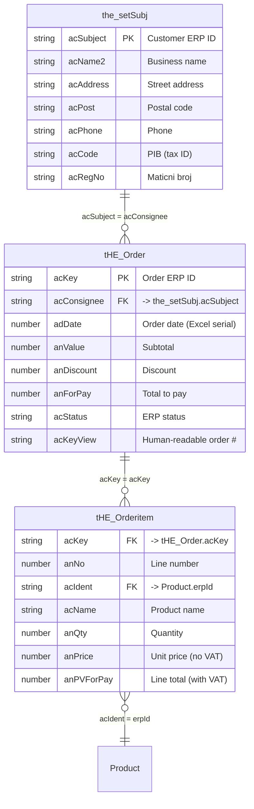
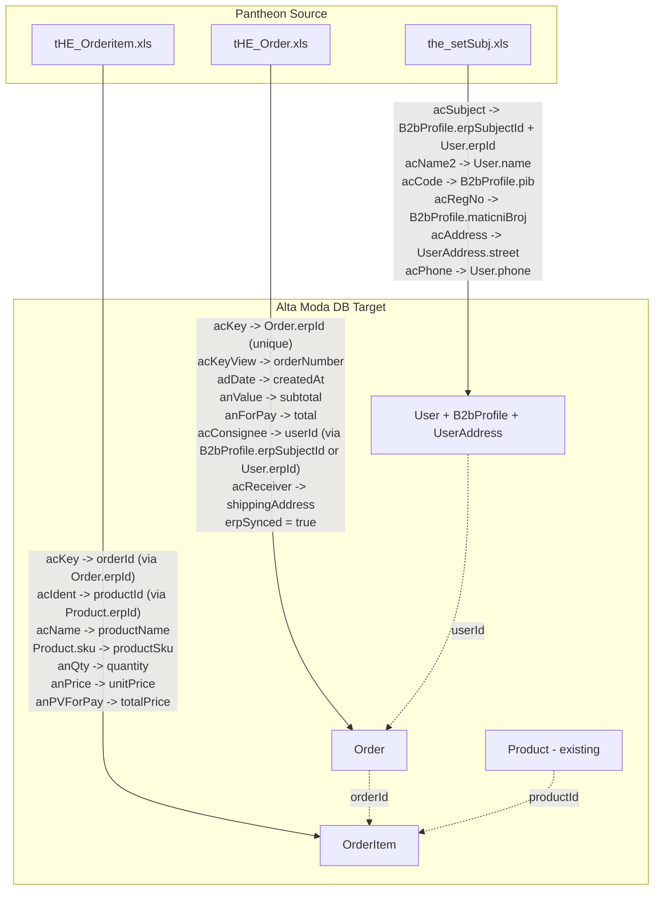
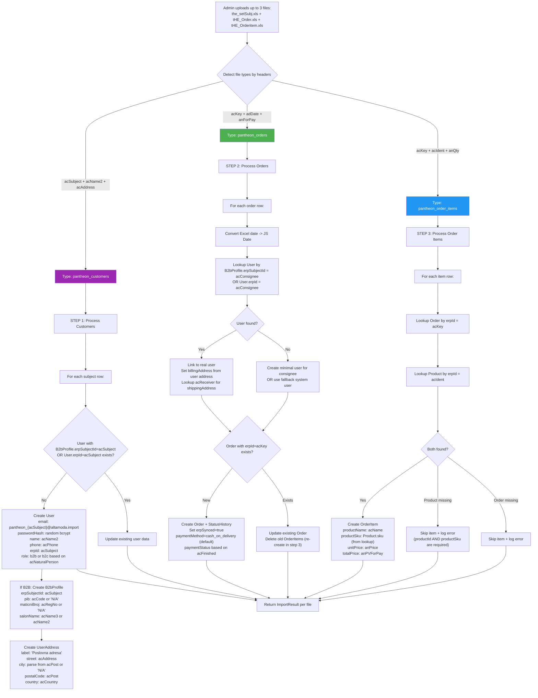
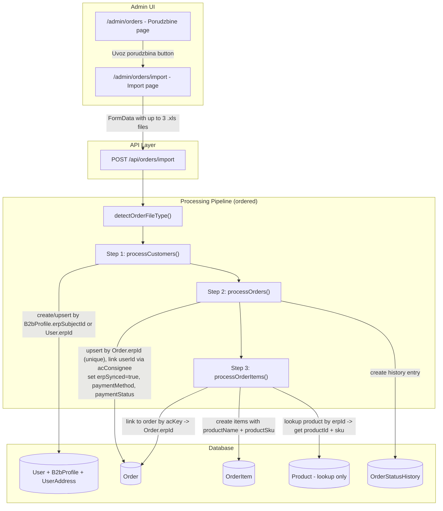

# Pantheon Orders Import - Feature Analysis & Implementation Plan

## 1. Overview

Import orders from Pantheon ERP via three Excel files into the Alta Moda database. This mirrors how we already import products from Pantheon (commit `6b35410` / `5882d30`) but targets the orders system.

**Source files:**
- `the_setSubj.xls` - Customer/subject master data (B2B clients with addresses, phones, registration numbers)
- `tHE_Order.xls` - Order headers (totals, dates, status, customer reference)
- `tHE_Orderitem.xls` - Order line items (products, quantities, prices)

**The join keys across all three files:**
```
the_setSubj.acSubject  =  tHE_Order.acConsignee   (customer link)
tHE_Order.acKey        =  tHE_Orderitem.acKey      (order-items link)
tHE_Orderitem.acIdent  =  Product.erpId            (product link)
```

---

## 2. Pantheon Source Files Analysis

### the_setSubj.xls - Customers/Subjects (100 rows in sample)

This is the Pantheon **customer master table**. It contains B2B clients (salons, businesses) with full address and registration data.

| Pantheon Column | Description | Example Value | Relevant? |
|---|---|---|---|
| `acSubject` | **Unique customer ID** (ERP) | `00916` | **YES** - join key to Order.acConsignee |
| `acName2` | Business/person name | `ANA BOJIĆ PR FRIZERSKI SALON Hair Studio by Ana Novi Sad` | **YES** - customer name |
| `acName3` | Short/trade name | `ANNY` | YES - display name |
| `acAddress` | Street address | `Trg Feher Ferenca 1, prvi sprat stan 5` | **YES** - shipping address |
| `acPost` | Postal code | `RS-21000` | **YES** - postal code |
| `acCountry` | Country | `Srbija` | **YES** - country |
| `acPhone` | Phone number | `0640031002` | **YES** - contact info |
| `acCode` | Tax ID (PIB) | `111944739` | **YES** - B2B profile |
| `acRegNo` | Registration number (Maticni broj) | `65757818` | **YES** - B2B profile |
| `acBuyer` | Is buyer flag | `T` | YES - filter buyers only |
| `acActive` | Active flag | `T` / `Z` | YES |
| `acNaturalPerson` | B2C (T) vs B2B (F) | `F` (99% are businesses) | **YES** - determines user role |
| `acCurrency` | Preferred currency | `RSD` | OPTIONAL |
| `acWayOfSale` | Sale method | `Z` | OPTIONAL |

**Key insights:**
- 98 of 100 subjects are buyers (`acBuyer: T`), 99 of 100 are legal entities (`acNaturalPerson: F`) = **B2B clients**
- **No email column exists** - we'll need to generate placeholder emails or make email optional
- Has PIB (`acCode`) and Maticni Broj (`acRegNo`) which map perfectly to our `B2bProfile` model
- Subject IDs in sample range `00858-00967` (only 100 rows), but orders reference IDs like `28143`, `95`, `29679` - **the sample file is a partial export**. Only 3 of 74 order consignees matched. Full export from Pantheon team will be needed for production.

### tHE_Order.xls (100 rows in sample)

| Pantheon Column | Description | Example Value | Relevant? |
|---|---|---|---|
| `acKey` | **Unique order ID** (ERP) | `2601000000001` | **YES** - maps to `erpId` |
| `acKeyView` | Human-readable order key | `26-010-000001` | **YES** - maps to `orderNumber` |
| `adDate` | Order date (Excel serial) | `46027` (= 2026-01-15) | **YES** - maps to `createdAt` |
| `acStatus` | ERP status code | `1` | **YES** - needs status mapping |
| `acConsignee` | Customer ERP ID | `28143` | **YES** - customer lookup |
| `acReceiver` | Receiver ERP ID | `28143` | **YES** - for shipping address |
| `acContactPrsn` | Contact person name | `Alenka Stojnovic` | YES |
| `anValue` | Subtotal (without VAT) | `5550` | **YES** - maps to `subtotal` |
| `anDiscount` | Discount amount | `849` | **YES** - maps to `discountAmount` |
| `anVAT` | VAT amount | `1110` | YES - for verification |
| `anForPay` | **Total to pay** (with VAT) | `6660` | **YES** - maps to `total` |
| `acCurrency` | Currency code | `RSD` | **YES** - maps to `currency` |
| `acFinished` | Finished flag | `F` / empty | YES - status context |
| `acPayMethod` | Payment method | (empty in data) | OPTIONAL |
| `acNote` | Notes (RTF with address info!) | RTF text with address | **YES** - parse for address/notes |
| `acWayOfSale` | Sale channel | `Z` | OPTIONAL |
| `adTimeIns` | Insert timestamp | `46027.367...` | YES - precise timestamp |
| `anQId` | Internal queue ID | `94362` | Links to OrderItem.`anOrderQId` |
| `acAddress` | Address (often empty) | (empty) | YES - if present |
| `acPost` | Postal code (often empty) | (empty) | YES - if present |
| `acContactPrsn3` | Secondary contact | `Alenka Stojnovic` | OPTIONAL |

### tHE_Orderitem.xls (100 rows in sample, 19 unique orders)

| Pantheon Column | Description | Example Value | Relevant? |
|---|---|---|---|
| `acKey` | **Order FK** - links to tHE_Order.acKey | `2601000000001` | **YES** - order link |
| `anNo` | Line number within order | `2`, `3`, `4` | YES - sort order |
| `acIdent` | **Product ERP ID** | `1490` | **YES** - links to Product.erpId |
| `acName` | Product name | `RK SEQ BOND INS 010NB` | **YES** - maps to `productName` |
| `anQty` | Quantity ordered | `1` | **YES** - maps to `quantity` |
| `anPrice` | Unit price (without VAT) | `1850` | **YES** - maps to `unitPrice` |
| `anSalePrice` | Sale price (with VAT) | `2220` | YES - verification |
| `anRebate` | Rebate/discount % | `0` | YES - item-level discount |
| `acVATCode` | VAT code | `R2` | YES |
| `anVAT` | VAT rate (%) | `20` | YES |
| `acUM` | Unit of measure | `KOM` (piece) | OPTIONAL |
| `anPVForPay` | Line total to pay | `2220` | **YES** - maps to `totalPrice` |
| `anOrderQId` | Links to Order.anQId | `94362` | Alternate join key |
| `anLastprice` | Last known cost price | `946.39` | OPTIONAL |

---

## 3. Data Mapping: Pantheon -> Alta Moda DB

### Full 3-File Relationship



### Mapping to Alta Moda DB



---

## 4. Key Challenges & Decisions

### 4.1. User Assignment (`userId` - Required FK) - UPDATED WITH SUBJECTS FILE

**Problem**: Our `Order` model requires a `userId`. Pantheon orders reference customers via `acConsignee` which maps to `the_setSubj.acSubject`.

**Now that we have `the_setSubj.xls`**, the approach changes significantly. We can actually **create real users** from the subjects file and properly link orders to them.

**Existing schema support:** `B2bProfile` already has `erpSubjectId` (unique) field that maps to Pantheon's `acSubject`. This was added in the `pantheon_alignment` migration. For B2B customers (~99%), we use this existing field. For the rare B2C customer, we need `erpId` on User.

**The subjects file gives us:**
- `acName2` - Business name (maps to `User.name`)
- `acAddress` + `acPost` + `acCountry` - Full address (maps to `UserAddress`)
- `acPhone` - Phone (maps to `User.phone`)
- `acCode` - PIB / Tax ID (maps to `B2bProfile.pib`)
- `acRegNo` - Maticni Broj (maps to `B2bProfile.maticniBroj`)
- `acNaturalPerson` - `F` = B2B, `T` = B2C (maps to `User.role`)

**What's missing:**
- **No email column** in subjects file. Our User model requires `email` as unique field.

**Required fields with no direct mapping (must handle in code):**
- `User.passwordHash` - **required**. Generate a random bcrypt hash for imported users (they can't log in anyway without a real email).
- `UserAddress.label` - **required**. Default to `"Poslovna adresa"` for B2B, `"Adresa"` for B2C.
- `UserAddress.city` - **required**. Parse from `acPost` prefix (e.g., `RS-21000` = Novi Sad) or use `"N/A"` as fallback. Consider building a postal code → city lookup map for Serbian postal codes.

**Revised approach (3-step import):**

| Step | File | Action |
|---|---|---|
| **1. Customers first** | `the_setSubj.xls` | Create User + B2bProfile + UserAddress. Generate placeholder email: `pantheon_{acSubject}@altamoda.import` |
| **2. Orders second** | `tHE_Order.xls` | Create Order linked to User via `acConsignee` -> lookup by `B2bProfile.erpSubjectId` (B2B) or `User.erpId` (B2C) |
| **3. Items last** | `tHE_Orderitem.xls` | Create OrderItem linked to Order + Product |

**Schema additions needed:**
```prisma
// Add to User model:
erpId  String?  @unique @map("erp_id")  // Pantheon acSubject (primarily for B2C subjects)

// Add @unique to Order.erpId (currently not unique, needed for upsert):
erpId  String?  @unique @map("erp_id")  // Pantheon acKey
```

> **Note:** `B2bProfile.erpSubjectId` already exists and is unique. For B2B customers (~99%), use this as the primary lookup key. `User.erpId` is needed as a universal fallback and for the rare B2C subject.

**Customer lookup strategy during order processing:**
1. First: `SELECT user FROM B2bProfile WHERE erpSubjectId = acConsignee` (covers 99% B2B)
2. Fallback: `SELECT user FROM User WHERE erpId = acConsignee` (covers B2C)
3. Last resort: Create minimal placeholder user with `erpId = acConsignee`

**Email handling options:**
| Option | Approach |
|---|---|
| **A) Placeholder emails** | `pantheon_{acSubject}@altamoda.import` - works immediately, admin can update real emails later |
| **B) Make email optional** | Schema change, but breaks login flow |
| **Recommended** | **Option A** - placeholder emails. They're clearly identifiable as imports and can be updated when real customers register |

**Fallback for unmatched customers**: If `acConsignee` doesn't match any subject (partial export issue), create a minimal "unknown" user per consignee ID with placeholder data, or use a single system import user. Log these as warnings.

### 4.2. Product Linking (`productId` - Required FK)

**Problem**: `OrderItem.productId` is required. Items reference products via `acIdent` which maps to `Product.erpId`. Products must exist in DB first.

**Additional required fields on OrderItem:**
- `productName` - required. Use `acName` from order item row.
- `productSku` - **required**. Must be looked up from `Product.sku` after finding the product by `erpId`. If product not found, this becomes a blocker for that item.

**Solution**:
- Lookup products by `erpId` (from `acIdent`)
- If product found: use `Product.id` for `productId` and `Product.sku` for `productSku`
- If product not found: **skip the item and log error** (cannot create OrderItem without valid `productId` and `productSku`)
- Import should report which items couldn't be linked

**Requirement**: Products should be imported BEFORE orders.

### 4.3. Status Mapping

```
Pantheon acStatus + acFinished  -->  Alta Moda OrderStatus
─────────────────────────────────────────────────────────
"1" + "F" (not finished)        -->  u_obradi (processing)
"1" + "" or "T" (finished)      -->  isporuceno (delivered)
"0" or cancelled                -->  otkazano (cancelled)
New/default                     -->  novi (new)
```

> Note: In sample data all 100 orders have `acStatus: "1"` and most have `acFinished: "F"`. We may need to refine this mapping when we get more data with varied statuses.

### 4.4. Date Conversion

Pantheon uses **Excel serial date numbers** (e.g., `46027` = days since 1900-01-01). The `xlsx` library can handle this, but we need explicit conversion:

```typescript
function excelDateToJS(serial: number): Date {
  // Excel epoch: Jan 1, 1900 (with the "1900 leap year bug")
  const epoch = new Date(1900, 0, 1)
  return new Date(epoch.getTime() + (serial - 2) * 86400000)
}
```

For timestamps like `46027.367...`, the decimal part represents the time of day.

### 4.5. Payment Method Mapping

`acPayMethod` is empty in all sample data. **`Order.paymentMethod` is a required field (no default in schema)** so this must always be handled.

```
"" (empty)     -->  cash_on_delivery (safest default for retail)
"V"            -->  bank_transfer (virman)
"K"            -->  card
"G"            -->  cash_on_delivery
```

**`Order.paymentStatus`** also needs mapping. Since these are historical ERP orders:
```
acFinished = "T" or ""  -->  paid (delivered orders are presumably paid)
acFinished = "F"        -->  pending
acStatus = "0"          -->  failed or pending (depends on context)
```

**`Order.erpSynced`** should be set to `true` for all imported orders — they originate from Pantheon, so we must NOT push them back to the ERP sync queue.

### 4.6. Address Extraction from `acNote`

Many orders store customer address info in the `acNote` field as RTF text. Example:
```
Dzemka Selimovic Gajeva 17, 11a 21000 Novi Sad 0638698611 sasketa123@gmail.com
```

We should:
1. Strip RTF formatting tags
2. Store raw text in `notes`
3. Optionally parse into `shippingAddress` JSON structure

### 4.7. Consignee vs Receiver (`acConsignee` vs `acReceiver`)

In Pantheon, these are distinct concepts:
- `acConsignee` = the **buyer** (who pays) → maps to `Order.userId` and `Order.billingAddress`
- `acReceiver` = the **delivery recipient** (who receives goods) → maps to `Order.shippingAddress`

These can be different entities (e.g., company orders shipped to a branch). During import:
1. `acConsignee` → look up User, link as `Order.userId`, populate `billingAddress` from that user's address
2. `acReceiver` → if different from `acConsignee`, look up that subject's address for `shippingAddress`
3. If `acReceiver` = `acConsignee` (most cases), use the same address for both

### 4.8. OrderItem Re-import Strategy

`OrderItem` has no `erpId` or natural unique key for upsert. When re-importing orders:
1. Find existing Order by `erpId`
2. **Delete all existing OrderItems** for that order
3. Re-create items from the import file
4. This is safe because ERP is the source of truth for item data

This must be wrapped in a transaction to avoid orphaned states.

---

## 5. Processing Pipeline



### Processing Order (3-Step, mirrors products approach):

1. **Customers First** - Process `the_setSubj.xls` -> create User + B2bProfile + UserAddress
2. **Orders Second** - Process `tHE_Order.xls` -> create Order records linked to users
3. **Items Last** - Process `tHE_Orderitem.xls` -> create OrderItem records linked to orders + products

This mirrors the products approach exactly: categories first (dependencies), products second (main records), barcodes third (linked data).

---

## 6. Files to Create / Modify

### 6.1. New API Route

**`src/app/api/orders/import/route.ts`** (NEW)

Create a new dedicated import endpoint for orders, separate from the products import. This keeps concerns clean and allows different validation/permissions.

Key responsibilities:
- File type detection for 3 file types: `pantheon_customers`, `pantheon_orders`, `pantheon_order_items`
- Customer/User creation from subjects with B2bProfile and UserAddress
- Excel date conversion
- RTF stripping for notes
- Order upsert logic (by erpId)
- OrderItem creation with product linking
- Return results in same `ImportResponse` format as products

### 6.2. Admin UI - Orders Page

**`src/app/admin/orders/page.tsx`** (MODIFY)

Add import button to the orders admin page (Porudzbine section), similar to how products page links to import:
- Add "Uvoz porudzbina" (Import Orders) button in the header
- Link to the order import page or embed import UI directly

### 6.3. Admin UI - Order Import Page

**`src/app/admin/orders/import/page.tsx`** (NEW)

Create an import page specifically for orders, reusing the same UI patterns from `src/app/admin/import/page.tsx`:
- Drag & drop upload zone
- Multi-file support (both order files at once)
- Processing progress indicator
- Results display with created/updated/skipped/errors stats

### 6.4. Schema Changes (Required)

**`prisma/schema.prisma`** (MODIFY)

```prisma
model User {
  // ... existing fields ...
  erpId  String?  @unique @map("erp_id")  // NEW - Pantheon acSubject ID (universal, covers B2C)
}

model Order {
  // CHANGE existing erpId to add @unique constraint:
  erpId  String?  @unique @map("erp_id")  // Was not unique, needed for upsert
}
```

**Optionally** (if empty PIB/maticniBroj values are common):
```prisma
model B2bProfile {
  pib          String?   // Change from required to optional
  maticniBroj  String?   @map("maticni_broj")  // Change from required to optional
}
```

These changes enable the full 3-file import chain:
- `the_setSubj.acSubject` -> `B2bProfile.erpSubjectId` (B2B, already exists) OR `User.erpId` (B2C, new)
- `tHE_Order.acConsignee` -> lookup User by `B2bProfile.erpSubjectId` or `User.erpId` -> `Order.userId`
- `tHE_Order.acKey` -> `Order.erpId` (now unique, enables upsert)
- `tHE_Orderitem.acIdent` -> `Product.erpId` -> `OrderItem.productId`

Product already has `erpId` for item linking (not unique, matched by query).

---

## 7. Implementation Architecture



---

## 8. Step-by-Step Implementation Plan

### Phase 1: Schema Migration
1. Add `erpId` field (unique) to User model in `prisma/schema.prisma`
2. Add `@unique` constraint to `Order.erpId` in `prisma/schema.prisma`
3. Optionally: make `B2bProfile.pib` and `B2bProfile.maticniBroj` optional (if empty values expected)
4. Run `npx prisma migrate dev` to create migration
5. Verify existing functionality not broken

### Phase 2: API Route (`/api/orders/import`)
1. Create file type detection for 3 file types:
   - `pantheon_customers`: detected by `acSubject` + `acName2` + `acAddress`
   - `pantheon_orders`: detected by `acKey` + `adDate` + `anForPay`
   - `pantheon_order_items`: detected by `acKey` + `acIdent` + `anQty`
2. Implement `processCustomers()` - parse the_setSubj rows:
   - Create User with `erpId` = `acSubject`, role = b2b/b2c based on `acNaturalPerson`
   - Generate placeholder email: `pantheon_{acSubject}@altamoda.import`
   - Generate random bcrypt `passwordHash` (imported users cannot log in)
   - For B2B: Create B2bProfile with `erpSubjectId` = `acSubject`, pib, maticniBroj, salonName
   - Handle empty pib/maticniBroj with `"N/A"` placeholder or make fields optional
   - Create UserAddress with label (`"Poslovna adresa"`), street, city (parsed from acPost), postalCode, country
   - Upsert by `B2bProfile.erpSubjectId` (B2B) or `User.erpId` (B2C) to handle re-imports
3. Implement Excel date conversion + RTF stripping utilities
4. Implement `processOrders()` - parse tHE_Order rows:
   - Lookup user by `B2bProfile.erpSubjectId` = `acConsignee`, fallback to `User.erpId`
   - If user not found: create minimal placeholder user for that consignee
   - Map all order fields, convert dates, extract address from notes
   - Set `paymentMethod` (default: `cash_on_delivery`), `paymentStatus` based on `acFinished`
   - Set `erpSynced = true` (these are FROM Pantheon, do not sync back)
   - Populate `shippingAddress` from `acReceiver` subject, `billingAddress` from `acConsignee` subject
   - Upsert by `erpId` = `acKey` (now unique). On update: delete existing OrderItems first.
5. Implement `processOrderItems()` - parse tHE_Orderitem rows:
   - Lookup order by `erpId` = `acKey`
   - Lookup product by `erpId` = `acIdent`
   - Create OrderItem with `productName` = `acName`, `productSku` = `Product.sku` (from lookup), proper price mapping
   - Skip items where product not found (both `productId` and `productSku` are required)
   - Wrap in transaction: all items for one order succeed or fail together
6. Return structured results (same shape as product import)

### Phase 3: Admin UI
1. Add "Uvoz porudzbina" button to `/admin/orders` page header
2. Create `/admin/orders/import` page (reuse patterns from `/admin/import/page.tsx`)
3. Support uploading all 3 files at once (auto-detect and process in correct order)
4. Wire up to `POST /api/orders/import`

### Phase 4: Testing & Validation
1. Test with sample files (100 subjects, 100 orders, 100 items)
2. Verify User + B2bProfile creation from subjects
3. Verify order-to-user linkage via acConsignee -> erpId
4. Verify order-item-product relationships
5. Check duplicate handling (re-import same files)
6. Verify dates display correctly in admin panel
7. Test partial imports (e.g., only orders file without subjects file)

---

## 9. Reuse from Product Import

We can directly reuse these patterns from the existing product import:

| Component | Reuse From | How |
|---|---|---|
| File parsing (CSV/XLS/XLSX) | `parseFile()` in products/import | Extract to shared util or copy |
| Column helper `col()` | products/import | Reuse for case-insensitive column access |
| File type detection pattern | `detectFileType()` | Extend or create parallel function |
| Import UI (drag & drop, results) | `/admin/import/page.tsx` | Copy & adapt for order context |
| Error collection pattern | products/import | Same per-row error tracking |
| Auth guard | `requireAdmin()` | Same middleware |
| Response format | `ImportResponse` type | Same shape |

---

## 10. Edge Cases to Handle

1. **Order without items**: Valid - create order, log warning
2. **Items without matching order**: Skip item, log error
3. **Product not found by erpId**: Skip item + log detailed error with `acIdent` so admin can import missing products first. Both `productId` and `productSku` are required in schema.
4. **Duplicate order (same erpId)**: Update existing order. **Delete all existing OrderItems first**, then recreate from import. Wrap in transaction.
5. **RTF note parsing failure**: Store raw text, don't crash
6. **Empty/missing dates**: Use import timestamp as fallback
7. **Files uploaded in wrong order**: Auto-detect and process in correct order (customers -> orders -> items) regardless of upload order
8. **Customer not in subjects file**: If `acConsignee` from order doesn't match any subject via `B2bProfile.erpSubjectId` or `User.erpId`, create a minimal placeholder user with `erpId = acConsignee` and placeholder data. This handles the partial export issue (sample only has IDs 00858-00967, but orders reference 28143, 95, etc.)
9. **Duplicate customer (same acSubject)**: Upsert by `B2bProfile.erpSubjectId` (B2B) or `User.erpId` (B2C) - update name, address, phone if changed
10. **Placeholder email conflicts**: Use `pantheon_{acSubject}@altamoda.import` pattern - guaranteed unique since acSubject is unique in Pantheon
11. **B2bProfile for natural persons**: Only create B2bProfile when `acNaturalPerson = F` (business). Skip for `T` (individual consumer). Both types get `User.erpId` set.
12. **Missing PIB/Maticni broj**: `B2bProfile.pib` and `maticniBroj` are required strings in schema. Either: (a) make them optional via migration, or (b) use `"N/A"` as placeholder for empty values. Option (a) is cleaner.
13. **Missing passwordHash**: Generate a random bcrypt hash (e.g., `bcrypt.hash(crypto.randomUUID(), 10)`) for imported users. They cannot log in without a real email.
14. **Missing UserAddress.city**: Parse from `acPost` (e.g., `RS-21000` -> lookup city name) or use `"N/A"`. Build a Serbian postal code map for common codes.
15. **Missing UserAddress.label**: Default to `"Poslovna adresa"` for B2B, `"Adresa"` for B2C.
16. **acReceiver != acConsignee**: When receiver differs from consignee, look up receiver subject for `shippingAddress`, use consignee for `billingAddress` and `userId`.
17. **Order.erpSynced flag**: Must be `true` for all imported orders to prevent ERP sync queue from re-pushing them to Pantheon.

---

## 11. Sample Data Quick Stats

| Metric | Value |
|---|---|
| **Subjects** | |
| Subjects in sample | 100 (IDs: 00858-00967) |
| Buyers | 98 of 100 |
| Legal entities (B2B) | 99 of 100 |
| Natural persons (B2C) | 1 of 100 |
| With address data | ~98% |
| With phone | ~90% |
| With PIB (acCode) | ~95% |
| Has email field | **NO** - not available in Pantheon subjects |
| **Orders** | |
| Orders in sample | 100 |
| Unique consignees | 74 |
| Consignees matching subjects | **3 of 74** (partial export!) |
| Order value range | 864 - 283,410 RSD |
| All statuses in sample | `1` (single status) |
| All currencies | RSD |
| Orders with address in notes | 56 of 100 |
| **Order Items** | |
| Items in sample | 100 (across 19 unique orders) |
| Avg items per order | ~5.3 |
| Product IDs referenced | Various (e.g., 1490, 1407, 1387, 5100, 3582) |

> **Important note for production:** The sample subjects file only contains 100 records (IDs 00858-00967) but orders reference 74 unique customers across a much wider range. You will need the **full subjects export** from the Pantheon team to properly link all orders to customers. Without it, ~96% of orders will get placeholder users.
