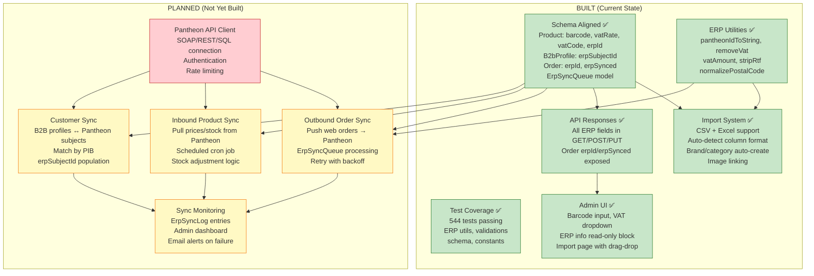
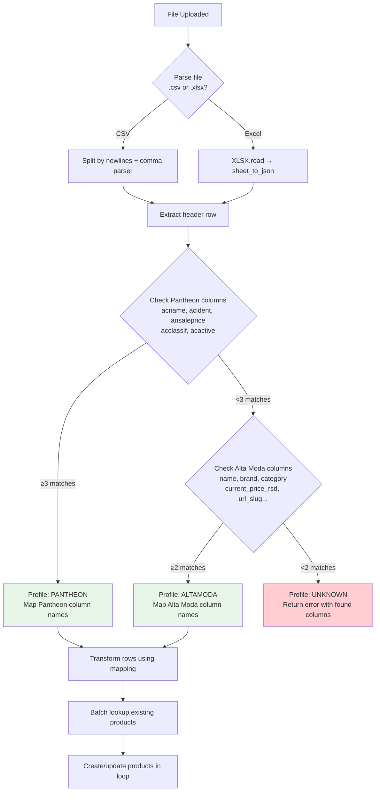

# Pantheon Alignment Audit — Detailed Analysis

**Date:** 2026-03-28
**Scope:** Full codebase audit of Pantheon ERP alignment, import system, schema changes, and API consistency

---

## Current State Overview

The project has completed **Phase 1-3** of the Pantheon integration plan:
- Schema migration (new fields, new models)
- Product import from CSV and Excel (including Pantheon `the_setItem.xls` format)
- API alignment (all endpoints expose ERP fields)
- Admin UI updates (barcode, VAT rate, ERP info display)
- ERP utility functions and constants
- Comprehensive test coverage (544 tests passing)

**What remains (planned for later phases):**
- Phase 4: Outbound order sync (push web orders to Pantheon)
- Phase 5: Inbound stock/price sync (pull from Pantheon on schedule)
- Phase 6: Customer sync (B2B profiles ↔ Pantheon subjects)

---

## Architecture: What's Built vs What's Planned



---

## Gap Analysis (Detailed)

### Gap 1: ErpSyncQueue — Model Exists, No Processor

**What exists:**
```prisma
// prisma/schema.prisma:630-645
model ErpSyncQueue {
  id          String   @id @default(cuid())
  entityType  String   // "order", "customer"
  entityId    String   // Order.id or User.id
  direction   SyncDirection
  payload     Json
  status      String   @default("pending")
  attempts    Int      @default(0)
  maxAttempts Int      @default(5)
  lastError   String?
  nextRetryAt DateTime?
  createdAt   DateTime @default(now())
  updatedAt   DateTime @updatedAt
  @@index([status, nextRetryAt])
}
```

**What's missing:**
- No code anywhere creates `ErpSyncQueue` entries
- No worker/cron that polls the queue and processes pending items
- No retry logic implementation (the retry delay constants exist in `constants.ts` but aren't used)
- Order creation (`POST /api/orders`) doesn't enqueue anything

**Why it matters:**
When Pantheon connection is established, web orders need to be pushed to Pantheon automatically. The queue model is the foundation for this — it's the "outbox pattern" that ensures orders get synced even if Pantheon is temporarily unavailable. Without a processor, orders pile up in our DB but never reach Pantheon.

**What's needed to activate:**
1. A queue processor function (`src/lib/sync/sync-worker.ts`) that:
   - Polls `ErpSyncQueue` for `status = 'pending'` or `status = 'retrying' AND nextRetryAt <= now()`
   - Calls the Pantheon API for each entry
   - Updates status to `done` or increments `attempts` with exponential backoff
2. A trigger in `POST /api/orders` that creates a queue entry after order creation
3. Either a cron job or a Next.js API route that the hosting platform calls periodically

**Blocked by:** Pantheon API client (need to know if SOAP, REST, or SQL connection — requires client input)

---

### Gap 2: ErpSyncLog — Model Exists, Never Written To

**What exists:**
```prisma
// prisma/schema.prisma:616-628
model ErpSyncLog {
  id          String        @id @default(cuid())
  syncType    String        // e.g., "products", "orders", "customers"
  direction   SyncDirection // inbound or outbound
  itemsSynced Int           @default(0)
  status      SyncStatus    // success, failed, in_progress
  message     String?
  details     Json?
  startedAt   DateTime      @default(now())
  completedAt DateTime?
}
```

**What's missing:**
- No code creates `ErpSyncLog` entries
- The product import (`POST /api/products/import`) is the most obvious place to log — it processes Pantheon data but doesn't record the sync operation
- No admin dashboard to view sync history

**Why it matters:**
Without sync logs, there's no way to:
- Know when the last successful sync happened
- Debug why certain products weren't imported
- Track sync failures over time
- Alert admins when syncs break

**What's needed:**
1. The import route should create an `ErpSyncLog` entry for each import (with `syncType: 'products'`, `direction: 'inbound'`)
2. Future sync operations should all log here
3. An admin page (`/admin/sync`) to view logs, filter by type/status, and manually retry

**Blocked by:** Nothing — this can be added now. It's a "nice to have" for import and a "must have" for automated sync.

---

### Gap 3: No Pantheon API Client

**What exists:**
- `.env.example` has placeholder variables: `PANTHEON_API_URL`, `PANTHEON_API_KEY`
- ERP constants define document types, order source codes, retry delays
- Utility functions handle Pantheon ID conversion, VAT calculations, RTF stripping

**What's missing:**
- No `src/lib/pantheon-client.ts` file
- No actual HTTP/SOAP/SQL connection code
- No authentication with Pantheon servers

**Why it matters:**
This is the central dependency for all automated sync. Without it:
- Import only works by manual file upload (admin downloads Excel from Pantheon, uploads to website)
- Orders must be manually entered into Pantheon
- Stock/price changes in Pantheon don't reflect on the website automatically

**Blocked by:** Client must provide:
1. Connection method (SOAP API, REST Zeus module, or direct SQL Server)
2. Pantheon server URL/IP
3. API key or database credentials
4. A "Web Kupac" subject ID for B2C orders

---

### Gap 4: Inbound Product/Stock Sync (Automated)

**What exists:**
- Manual import via CSV/Excel upload works
- Import handles both create and update (matches by SKU or erpId)
- Batch lookups prevent N+1 queries

**What's missing:**
- No scheduled/automatic sync that pulls product data from Pantheon
- No high-frequency stock sync (the integration plan specifies every 15-30 minutes)
- No price change detection

**Why it matters:**
Currently, if the warehouse sells 10 units of a product through the physical store (recorded in Pantheon), the website still shows the old stock count. Customers can order products that are actually out of stock. Similarly, if management changes prices in Pantheon, the website shows stale prices until someone manually re-imports.

**What's needed:**
1. `src/lib/sync/product-sync.ts` — fetches products from Pantheon API, upserts into our DB
2. `src/lib/sync/stock-sync.ts` — lighter operation, only updates `stockQuantity` and `priceB2c`
3. Cron job configuration (every 2-4 hours for full product sync, every 15-30 min for stock)
4. Stock adjustment logic: subtract pending unsynced web orders from Pantheon stock before overwriting

**Blocked by:** Pantheon API client (Gap 3)

---

### Gap 5: Outbound Order Sync

**What exists:**
- `Order.erpId` and `Order.erpSynced` fields track sync status
- `ErpSyncQueue` model ready for outbox pattern
- ERP constants define `ERP_WEB_ORDER_SOURCE = 'W'` and `ERP_DOC_TYPE_SALES_ORDER = 100`
- VAT calculation utilities ready (`removeVat`, `vatAmount`)

**What's missing:**
- No code pushes orders to Pantheon after creation
- No VAT splitting logic invoked during order push (the `removeVat` function exists but isn't called)
- No order status sync (when Pantheon marks order as shipped, website doesn't know)
- No mapping logic for B2C orders to the generic "Web Kupac" Pantheon subject

**Why it matters:**
Every web order must eventually appear in Pantheon for:
- Invoicing (accountants use Pantheon)
- Warehouse fulfillment (staff picks orders from Pantheon)
- Financial reporting

Without this, staff must manually enter every web order into Pantheon — defeats the purpose of the integration.

**What's needed:**
1. After `POST /api/orders` creates an order, insert into `ErpSyncQueue`
2. Queue processor maps our order fields to Pantheon format (including VAT split)
3. On success, update `Order.erpId` and `Order.erpSynced = true`
4. On failure, increment attempts and schedule retry

**Blocked by:** Pantheon API client (Gap 3) + "Web Kupac" subject ID from client

---

### Gap 6: Customer Sync (B2B Profiles ↔ Pantheon Subjects)

**What exists:**
- `B2bProfile.erpSubjectId` field for linking to Pantheon `the_setSubj.acSubject`
- API exposes `erpSubjectId` in admin users response
- `normalizePostalCode` utility for "RS-11000" → "11000" conversion

**What's missing:**
- No inbound customer sync (importing `the_setSubj` data)
- No outbound sync (pushing new B2B registrations to Pantheon)
- Admin users page doesn't display `erpSubjectId` in the UI
- No matching logic (PIB-based matching to link existing B2B users with Pantheon subjects)

**Why it matters:**
B2B salons exist in both systems. Without sync:
- New salons registering on the website aren't created in Pantheon
- Existing Pantheon customers can't be linked to their website accounts
- Discount tiers (`anRebate`) from Pantheon aren't reflected on the website
- Payment terms (`anDaysForPayment`) aren't synced

**What's needed:**
1. Import route or sync for `the_setSubj` → `User` + `B2bProfile` (match by PIB)
2. Outbound push when admin approves a B2B registration
3. Admin UI showing erpSubjectId and sync status per user

**Blocked by:** Pantheon API client (Gap 3)

---

### Gap 7: Admin Users Page Type Interface Incomplete

**What exists:**
- API returns `creditLimit`, `paymentTerms`, `erpSubjectId` in B2B profile responses
- Data is correct in the database

**What's missing:**
```typescript
// src/app/admin/users/page.tsx — current interface (line 25-32)
interface B2bProfile {
  salonName: string;
  pib: string;
  maticniBroj: string;
  address: string | null;
  discountTier: number;
  approvedAt: string | null;
  // MISSING: creditLimit, paymentTerms, erpSubjectId
}
```

The interface doesn't define these fields, so TypeScript doesn't enforce their usage. The API sends them, the UI ignores them. No visual indicator of whether a B2B user is linked to Pantheon.

**Impact:** Low — data integrity is fine (DB has the fields). This is purely a UI gap. Admin can't see Pantheon linkage status for users without querying the database directly.

**Not blocked by anything** — can be fixed immediately.

---

## Import System Deep Dive

### How Column Detection Works



### Import Performance Profile

For a typical import of **300 products** (like `altamoda_products.csv`):

| Operation | Queries | Notes |
|---|---|---|
| Auth check | 2 | `auth()` + `prisma.user.findUnique` |
| Load brands | 1 | `prisma.brand.findMany` |
| Load categories | 1 | `prisma.category.findMany` |
| Batch lookup SKUs | 1 | `prisma.product.findMany` |
| Batch lookup erpIds | 1 | `prisma.product.findMany` |
| Batch lookup slugs | 1 | `prisma.product.findMany` |
| Batch lookup images | 1 | `prisma.productImage.findMany` |
| Create/update products | ~300 | 1 per product (unavoidable with Prisma) |
| Create images | ~300 | 1 per product with image |
| Create new brands | ~15 | Only for brands not already in DB |
| Create new categories | ~50 | Only for categories not already in DB |
| **Total** | **~672** | |

For comparison, without batch lookups it would be **~2,400 queries** (8 per product).

### Known Edge Cases in Import

| Edge Case | Behavior | Risk |
|---|---|---|
| Two products with same name, no SKU | Both get auto-generated SKUs (`IMP-{slug}-{row}`) with different row numbers | No collision. Safe. |
| Product exists by erpId but different SKU | Found via `erpIdToId` map, updated. SKU not changed. | Correct behavior. |
| Brand name "L'Oréal" vs "L'Oreal" vs "Loreal" | Fuzzy match via `.includes()` would match "L'Oreal" to "L'Oréal" | Could false-match. Low risk in practice. |
| Excel file with multiple sheets | Only first sheet is read | Could miss data on other sheets. Acceptable. |
| CSV with UTF-16 encoding | Will fail to parse (assumes UTF-8) | User gets error message. Must re-save as UTF-8. |
| Price column contains "1,200" (comma) | `Number("1,200")` = NaN → error reported | Correct — forces clean data. |
| Import same file twice | Second run: 0 created, 300 updated, 0 errors | Idempotent. Correct. |

---

## Security Assessment

| Vector | Status | Details |
|---|---|---|
| **Authentication** | Secure | `requireAdmin()` validates JWT + re-checks DB status |
| **Authorization** | Secure | Only admin role can access import |
| **File upload** | Secure | 10MB limit, extension whitelist, parsed server-side |
| **SQL injection** | Not possible | Prisma ORM parameterizes all queries |
| **XSS** | Not applicable | Import stores to DB, doesn't render to HTML |
| **CSV injection** | Not applicable | Data stored as strings, never executed |
| **Path traversal** | Not applicable | File processed in memory, never written to disk |
| **Rate limiting** | Missing on import | No rate limit on `POST /api/products/import`. Admin-only mitigates this. |
| **Concurrent imports** | Race condition possible | Two simultaneous imports could create duplicate brands. Unique constraints prevent duplicate products. |

---

## Test Coverage Summary

| Area | Tests | Status |
|---|---|---|
| ERP utility functions | 24 tests | All passing |
| Product validation (new fields) | 14 tests | All passing |
| Prisma schema (new models/fields) | 10 tests | All passing |
| ERP constants | 4 tests | All passing |
| Auth helpers (DB re-check mock) | 13 tests | All passing |
| **Total new tests** | **65** | **All passing** |
| **Total project tests** | **544** | **All passing** |

### What's Not Tested

| Area | Why | Risk |
|---|---|---|
| Import route end-to-end | Requires DB + file upload integration test | Tested manually with real Pantheon Excel |
| Column detection logic | No unit test for `detectProfile()` | Low risk — well-structured, tested via manual import |
| Brand/category auto-creation | Requires DB integration test | Verified manually (14 brands, 51 categories created) |
| Concurrent import race conditions | Would need parallel test runner | Low risk — admin-only endpoint |
| ErpSyncQueue processing | No processor exists yet | N/A — not built yet |

---

## Recommendations

### Immediate (Can Do Now)

1. **Add `erpSubjectId` to admin users page interface** — 5 min fix, purely cosmetic
2. **Log imports to ErpSyncLog** — Add one `prisma.erpSyncLog.create()` call at the end of the import route to track what was imported and when
3. **Add VAT rate range check in import** — `if (vatRate < 0 || vatRate > 100) vatRate = 20` in `transformRow`

### Before Pantheon Goes Live

4. **Build Pantheon API client** — Blocked by client providing connection details
5. **Implement queue processor** — Process `ErpSyncQueue` entries on a schedule
6. **Add order → queue trigger** — Insert queue entry after order creation
7. **Build stock sync** — High-frequency pull of stock levels from Pantheon
8. **Build admin sync dashboard** — View `ErpSyncLog`, trigger manual syncs, retry failed items

### Nice to Have

9. **Replace fuzzy brand matching** with exact-only matching (remove `.includes()` fallback)
10. **Add integration tests** for the import route using test database
11. **Add rate limiting** to the import endpoint (even though it's admin-only)
12. **Support multi-sheet Excel** — Let user pick which sheet to import
