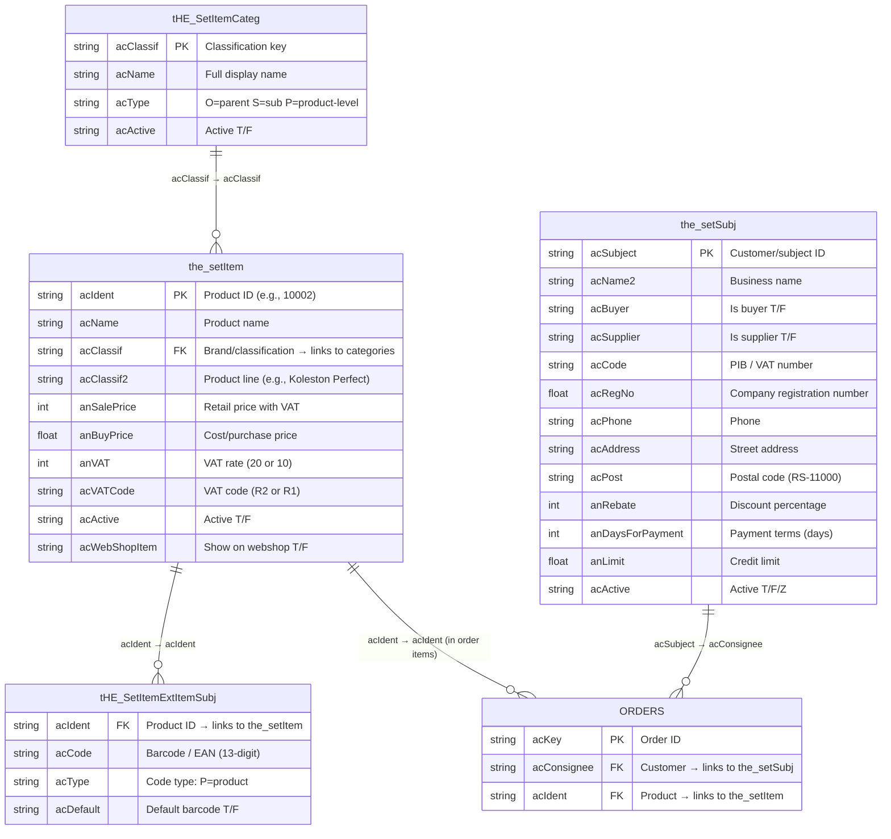
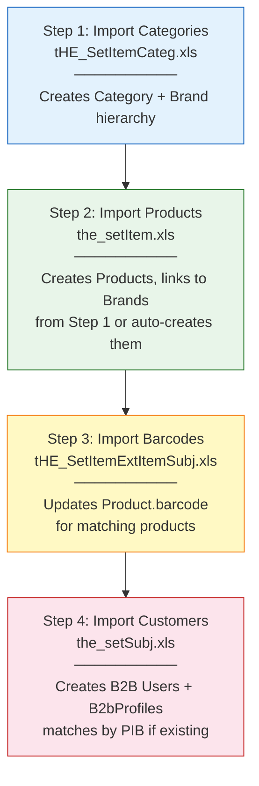
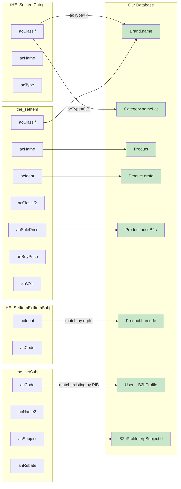

# Pantheon Data Relationships & Import Strategy

## The 4 Excel Files — What They Are

These are **sample exports** (100 rows each) from Pantheon's SQL Server database. In production, each table has thousands of rows. Here's what each one contains and how they connect.

---

## Entity Relationship Diagram



---

## How The Tables Connect

### Link 1: Products → Categories/Brands

```
the_setItem.acClassif  ──►  tHE_SetItemCateg.acClassif
```

Each product has an `acClassif` value (e.g., `"Wella"`, `"REDKEN"`). This value should match a row in `tHE_SetItemCateg` where that classification is defined with a full name and hierarchy type.

**What the sample data shows:**

| Products (the_setItem) | Categories (tHE_SetItemCateg) | Match? |
|---|---|---|
| acClassif = `"Wella"` | No row with acClassif = `"Wella"` | No match |
| acClassif = `"WELLA"` | No row with acClassif = `"WELLA"` | No match |
| acClassif = `"REDKEN"` | No row with acClassif = `"REDKEN"` | No match |

**Why no matches?** The sample export only has 100 rows per table. In the full Pantheon DB, there would be a category row for `"Wella"` and `"REDKEN"`. The 100-row samples don't overlap perfectly.

**For our import:** When we import products, we already auto-create brands from `acClassif`. The categories file would add the **hierarchy** (parent/child structure) and **display names** — but it's supplementary, not blocking.

---

### Link 2: Products → Barcodes

```
the_setItem.acIdent  ──►  tHE_SetItemExtItemSubj.acIdent
```

Each barcode row points to a product via `acIdent`. One product can have multiple barcodes (different packaging sizes, bundles, etc.).

**What the sample data shows:**
- 100 barcode rows in the file
- Only **9 of them** match product IDs that exist in the 100-row product sample
- Barcodes like `3474630715530` are real EAN-13 codes (scannable at checkout)

**For our import:** After importing products, we can scan the barcode file and update `Product.barcode` for each matching `erpId`. Products without barcode matches simply keep `barcode = null`.

---

### Link 3: Customers (independent)

```
the_setSubj.acSubject  ──►  used in orders as acConsignee
```

Customers don't directly link to products or categories. They link to **orders** (which we don't import from Excel — orders are created on the website).

**What the sample data shows:**
- 100 customer rows
- **98 are buyers** (`acBuyer = "T"`)
- **6 are suppliers** (can be both buyer and supplier)
- Most have PIB (`acCode`) and registration numbers
- Discount percentages (`anRebate`) are mostly 0 in the sample
- Status values include `"T"` (active), `"Z"` (unknown — likely "zatvoren"/closed), `"F"` (inactive)

**For our import:** Customers map to `User` + `B2bProfile`. We match existing users by PIB (`acCode` → `B2bProfile.pib`). New customers become B2B users.

---

## What's In Each File (Real Data Analysis)

### File 1: `the_setItem.xls` — Products

| Stat | Value |
|---|---|
| Total rows | 100 |
| With name | 99 (1 empty metadata row) |
| With price > 0 | 65 |
| With price = 0 | 34 (B2B items, unpriced) |
| Active (`acActive = "T"`) | 1 (sample is mostly inactive test data) |
| Unique brands (`acClassif`) | 3: Wella, WELLA, REDKEN |
| Unique product lines (`acClassif2`) | 2: Koleston Perfect, Chromatics |
| Columns | 201 (only ~15 meaningful) |

**Key fields we use:**
- `acIdent` → `Product.erpId` + `Product.sku`
- `acName` → `Product.nameLat`
- `acClassif` → `Brand.name`
- `acClassif2` → `ProductLine.name`
- `anSalePrice` → `Product.priceB2c`
- `anBuyPrice` → `Product.costPrice`
- `anVAT` → `Product.vatRate`
- `acVATCode` → `Product.vatCode`

**Note:** `"Wella"` and `"WELLA"` are the same brand with different casing. Our import should handle this with case-insensitive matching.

---

### File 2: `tHE_SetItemCateg.xls` — Categories & Brands

| Stat | Value |
|---|---|
| Total rows | 100 |
| Type "O" (parent/organizational) | 4 |
| Type "S" (sub-category) | 94 |
| Type "P" (product-level) | 2 |
| Active | Most are "T" |

**Hierarchy types explained:**

| `acType` | Count | Meaning | Our Model | Examples |
|---|---|---|---|---|
| `"O"` | 4 | Top-level organizational group | Parent `Category` | "Accessories", top-level groupings |
| `"S"` | 94 | Sub-category or product group | Child `Category` or `ProductLine` | "AGE RESTORE WELLA CARE", "ALL SOFT MEGA" |
| `"P"` | 2 | Product-facing classification | `Brand` | Direct brand entries |

**How to import:**
1. `acType = "O"` rows → Create as parent `Category` (`parentId = null`)
2. `acType = "S"` rows → Create as child `Category` or `ProductLine`
   - If the `acClassif` value matches a product's `acClassif2` → it's a `ProductLine`
   - Otherwise → it's a child `Category`
3. `acType = "P"` rows → Create as `Brand`

**Challenge:** The hierarchy doesn't have an explicit parent→child pointer. The relationship is implied by naming conventions (e.g., "AGE RESTORE WELLA CARE" is a sub-category under Wella). We may need to:
- Parse brand names from the sub-category names
- Or keep them flat (all as top-level categories) and let the admin organize later

---

### File 3: `tHE_SetItemExtItemSubj.xls` — Barcodes

| Stat | Value |
|---|---|
| Total rows | 100 |
| Matching products in sample | 9 out of 99 products |
| Multiple barcodes per product | Some (products can have different packaging) |
| Code type | All `"P"` (product barcode) |

**Sample data:**
```
acIdent: 10002  →  acCode: 9876543213212  (barcode for product 10002)
acIdent: 1001   →  acCode: 3474630715530  (barcode for product 1001)
acIdent: 1002   →  acCode: 3474630715615  (barcode for product 1002)
```

**How to import:**
1. For each barcode row, find the product where `Product.erpId = acIdent`
2. Set `Product.barcode = acCode`
3. If a product has multiple barcodes, use the one where `acDefault = "T"`, or the first one found

**This is the simplest import** — just a UPDATE query per matching product.

---

### File 4: `the_setSubj.xls` — Customers/Businesses

| Stat | Value |
|---|---|
| Total rows | 100 |
| Buyers | 98 |
| Suppliers | 6 |
| Active ("T") | 99 |
| Status "Z" (closed/archived) | Some |
| With PIB (`acCode`) | Most |
| With phone | Most |

**Sample data:**
```
acSubject: 00858  →  acName2: "Mario FS"       PIB: 108157350    Buyer: T
acSubject: 00859  →  acName2: "L'OREAL BALKAN"  PIB: 17573616     Supplier: T
```

**How to import:**
1. Filter: only import rows where `acBuyer = "T"` (skip suppliers)
2. Match existing users by PIB: `B2bProfile.pib = acCode`
3. If no match → create new `User` (role=b2b, status=active) + `B2bProfile`
4. If match → update `B2bProfile.erpSubjectId = acSubject`
5. Map fields:
   - `acName2` → `User.name` + `B2bProfile.salonName`
   - `acCode` → `B2bProfile.pib`
   - `acRegNo` → `B2bProfile.maticniBroj`
   - `anRebate` → `B2bProfile.discountTier`
   - `anDaysForPayment` → `B2bProfile.paymentTerms`
   - `anLimit` → `B2bProfile.creditLimit`
   - `acAddress` → `UserAddress.street`
   - `acPost` → `UserAddress.postalCode` (strip "RS-" prefix)
   - `acPhone` → `User.phone`

**Special handling:**
- Status `"Z"` likely means "zatvoren" (closed) → map to `User.status = "suspended"`
- Customers can be both buyer AND supplier → only import the buyer aspect
- No password in Pantheon data → generate random password hash or leave null (B2B users can reset via email)

---

## Import Order & Strategy



**Why this order?**

1. **Categories first** — so when products are imported, the brand/category hierarchy already exists
2. **Products second** — the main data, links to categories/brands
3. **Barcodes third** — enriches existing products (needs products to exist first)
4. **Customers last** — independent of products, but conceptually separate

**Alternative:** Import products first (which auto-creates brands), then categories to enrich the hierarchy. Both work, but categories-first is cleaner.

---

## How Each File Maps to Our Models

### Complete Field Mapping



---

## Implementation Plan for Full Import

### What Already Works
- Product import from `the_setItem.xls` (auto-detects Pantheon format, creates brands, maps all fields)

### What Needs to Be Built

#### 1. Category Import (`tHE_SetItemCateg.xls`)

**Endpoint:** `POST /api/admin/import/categories` or extend existing import route with file type detection

**Logic:**
```
For each row:
  if acType === "O" → upsert Category (parentId = null, nameLat = acName)
  if acType === "S" → upsert Category (try to find parent by name prefix, nameLat = acName)
  if acType === "P" → upsert Brand (name = acName)
```

**Complexity:** Medium — the parent/child hierarchy is implicit, not explicit. We may need to import them flat and let admin organize.

#### 2. Barcode Import (`tHE_SetItemExtItemSubj.xls`)

**Endpoint:** `POST /api/admin/import/barcodes` or extend existing import

**Logic:**
```
For each row where acType === "P":
  Find product where erpId = String(acIdent)
  If found → update Product.barcode = String(acCode)
  If not found → skip (product not imported yet)
```

**Complexity:** Low — simple update operation.

#### 3. Customer Import (`the_setSubj.xls`)

**Endpoint:** `POST /api/admin/import/customers`

**Logic:**
```
For each row where acBuyer === "T":
  Match by PIB: find B2bProfile where pib = acCode
  If found → update erpSubjectId, discountTier, paymentTerms, creditLimit
  If not found → create User (role=b2b) + B2bProfile + UserAddress
  Map acActive: "T"→active, "F"/"Z"→suspended
```

**Complexity:** Medium — needs to handle user creation with password, address creation, and PIB matching.

---

## Data Quality Issues in Sample Export

| Issue | File | Impact | Handling |
|---|---|---|---|
| `"Wella"` vs `"WELLA"` (case mismatch) | the_setItem | Could create duplicate brands | Case-insensitive matching already implemented |
| First row empty in products | the_setItem | Metadata/header row | Skipped (no name → skip) |
| First row empty in customers | the_setSubj | Metadata/header row | Skip rows where `acSubject` is empty |
| Status `"Z"` not documented | the_setSubj | Unknown status meaning | Treat as suspended (likely "zatvoren"/closed) |
| 0 products marked as webshop visible | the_setItem | Sample data issue, not production | We import all and set `isActive = true` |
| Only 9/99 products have barcodes | Cross-file | Sample mismatch (different 100-row windows) | Normal — just update what matches |
| acClassif2 mostly empty | the_setItem | Only 2 products have product line info | ProductLine created only when available |
| Categories don't match product brands | Cross-file | "Wella" in products, not in categories sample | Auto-create brands from products, categories add hierarchy later |

---

## Recommended Approach

### Option A: Single Import Page (Recommended)

Extend the existing `/admin/import` page to handle all 4 file types:

1. Admin uploads a file
2. System auto-detects which Pantheon table it is (by checking column names)
3. Imports accordingly with appropriate logic per table type
4. Shows results with file-type-specific feedback

**Column detection:**
- Has `acIdent` + `acName` + `anSalePrice` → `the_setItem` (Products)
- Has `acClassif` + `acName` + `acType` but NO `anSalePrice` → `tHE_SetItemCateg` (Categories)
- Has `acIdent` + `acCode` + `acType` but NOT `acName` as main field → `tHE_SetItemExtItemSubj` (Barcodes)
- Has `acSubject` + `acName2` + `acBuyer` → `the_setSubj` (Customers)

### Option B: Separate Import Pages

Create 4 separate import endpoints. Simpler per-endpoint but more admin navigation.

**Recommendation:** Option A — one page, auto-detect. The admin doesn't need to know which Pantheon table is which. They just upload files and the system figures it out.

---

## Summary

| File | Rows | Maps To | Links Via | Import Complexity |
|---|---|---|---|---|
| `the_setItem.xls` | 100 | Product, Brand | `acClassif` → Brand | **Done** |
| `tHE_SetItemCateg.xls` | 100 | Category, Brand, ProductLine | `acClassif` key | Medium |
| `tHE_SetItemExtItemSubj.xls` | 100 | Product.barcode | `acIdent` → Product.erpId | Low |
| `the_setSubj.xls` | 100 | User, B2bProfile, UserAddress | `acSubject`, `acCode` (PIB) | Medium |
