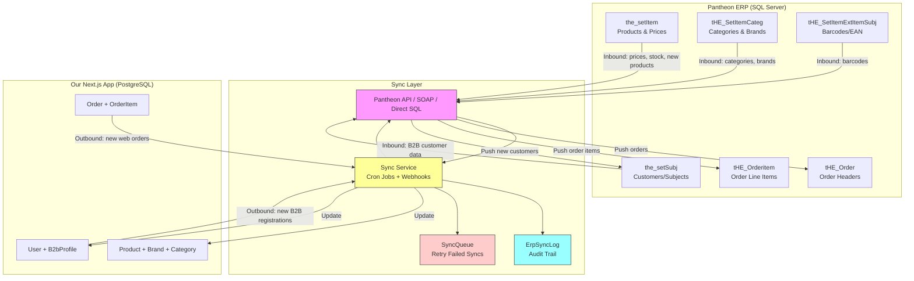
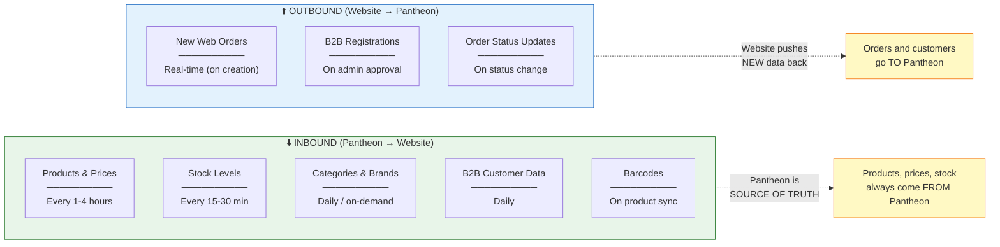
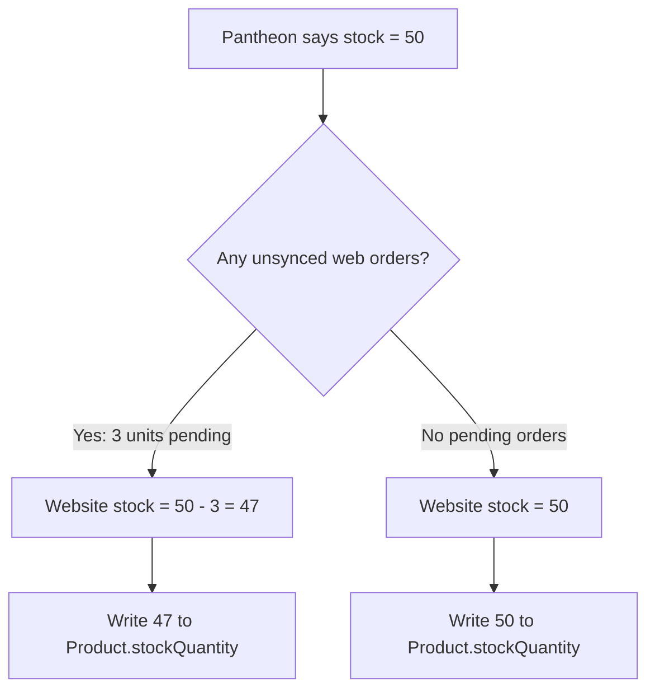
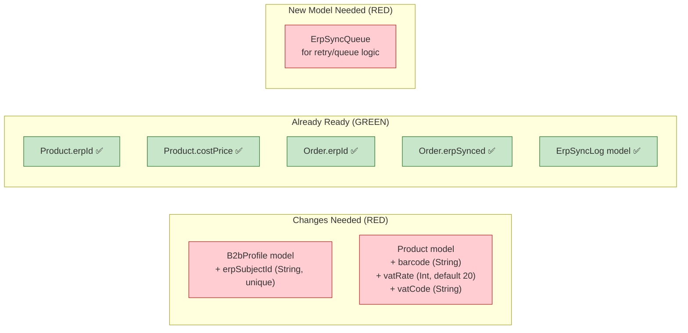
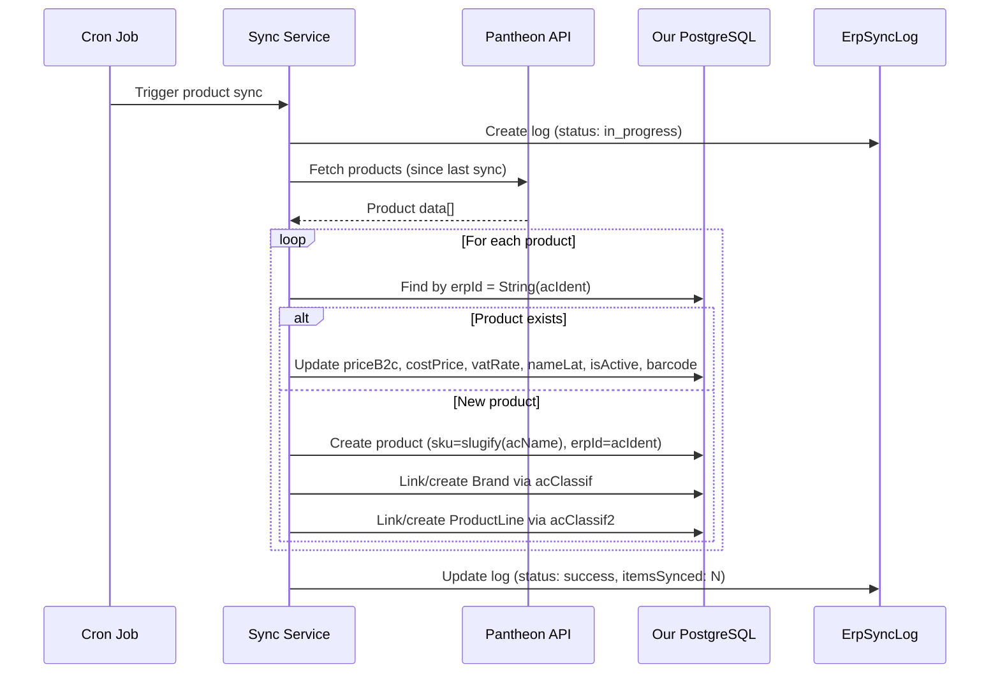
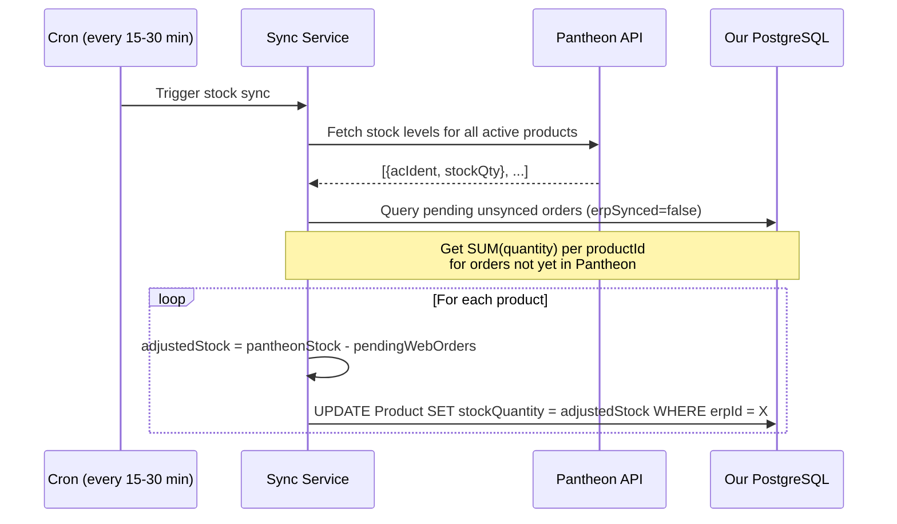
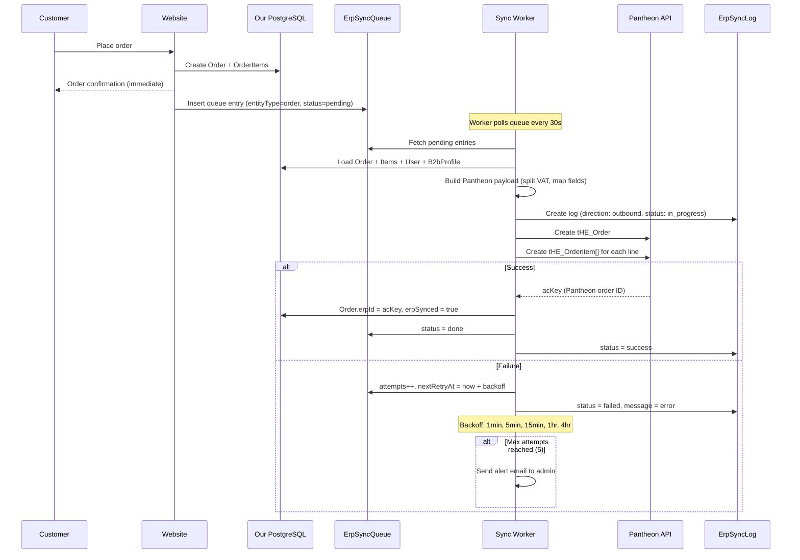

# Pantheon ERP Integration — Complete Analysis

## What is Pantheon and How Does It Relate to Alta Moda?

### The Big Picture

Alta Moda's business runs on **three separate systems** today:

1. **Datalab Pantheon (ERP)** — A Slovenian ERP system (SQL Server database), widely used in Serbia. This is the **brain of the business**. Warehouse staff, accountants, salespeople — everyone uses Pantheon daily to manage products, prices, stock, invoices, and customers. **This is the real database with real business data.**

2. **AdriaHost (old website)** — Just a web hosting provider where the current altamoda.rs website lives. The old site is likely a static/WordPress site with no real database of its own — it just displays product info that was manually uploaded. AdriaHost is irrelevant to the integration; it's just a server rack.

3. **This Next.js project (new website)** — Replaces the old AdriaHost site. Has its own PostgreSQL database (Prisma). **Needs to stay synchronized with Pantheon** because Pantheon is the source of truth for business operations.

### Why Pantheon Integration Matters

Without integration, the business would need to:
- Manually enter every web order into Pantheon (error-prone, slow)
- Manually update product prices on the website when they change in Pantheon
- Manually check stock levels — leading to overselling
- Manually create customer accounts in both systems

**With integration**, data flows automatically between the website and Pantheon.

---

## The 6 Pantheon Tables — Are They Real?

**Yes, these are real exports from Pantheon's SQL Server database.** Each table has 100 sample rows exported for analysis. The full Pantheon database has thousands of rows per table.

> Important: Most Pantheon columns are unused. Tables like `the_setItem` have 201 columns, but only ~15-20 carry meaningful data. The `acField*`/`anField*` columns are custom extension fields (almost all empty).

| Pantheon Table | Rows | Cols | Purpose | Maps to Our Project |
|---|---|---|---|---|
| **the_setItem** | 100 | 201 | Product catalog (master items) | `Product` model |
| **tHE_SetItemCateg** | 100 | 164 | Product categories/classifications | `Category` + `Brand` models |
| **tHE_SetItemExtItemSubj** | 100 | 14 | Barcode/EAN codes per product | `Product.barcode` (new field) |
| **tHE_Order** | 100 | 117 | Sales orders (headers) | `Order` model |
| **tHE_Orderitem** | 100 | 74 | Order line items | `OrderItem` model |
| **the_setSubj** | 100 | 207 | Customers/subjects (businesses) | `User` + `B2bProfile` models |

---

## Architecture: How the Integration Will Work



### Connection Method

Pantheon offers **three ways** to connect. We need to determine which one Alta Moda's Pantheon license supports:

| Method | Pros | Cons | Best For |
|---|---|---|---|
| **Pantheon SOAP API** | Official, documented, no direct DB access needed | Slower, verbose XML, limited query flexibility | Most common setup |
| **Direct SQL Server** | Full data access, fast queries, real-time capable | Security risk (DB exposed), tight coupling | On-premise setups |
| **Pantheon REST API** (Zeus) | Modern, JSON, easier to code | Requires Pantheon Zeus module (extra license) | If available |

> **Action needed:** Ask the client which Pantheon connection method they use / their IT admin can provide.

---

## Data Flow: What Goes Where and When



### Critical Rule: Source of Truth

| Data Type | Source of Truth | Reason |
|---|---|---|
| **Products** | Pantheon | Business adds/edits products in ERP |
| **Prices** | Pantheon | Prices set by management in ERP |
| **Stock** | Pantheon | Warehouse manages inventory in ERP |
| **Categories/Brands** | Pantheon | Category hierarchy managed in ERP |
| **Orders** | Website (then synced) | Customers place orders on website |
| **B2C Users** | Website only | B2C users only exist on website |
| **B2B Users** | Both (bidirectional) | B2B salons exist in both systems |

---

## Key Decisions (Resolved)

These decisions were debated and resolved. They inform every mapping and sync rule below.

### Decision 1: VAT Handling

**Our system stores prices WITH VAT (VAT-inclusive).** This matches Pantheon's `anSalePrice`.

- **Inbound:** `Product.priceB2c` = Pantheon `anSalePrice` (with VAT). No conversion needed.
- **Outbound orders:** We must **split out VAT** when pushing orders to Pantheon because Pantheon requires separate fields for pre-VAT amount, VAT amount, and total.
- **Formula for outbound:**
  ```
  priceWithoutVAT = priceWithVAT / (1 + vatRate/100)
  vatAmount       = priceWithVAT - priceWithoutVAT
  ```
  Example (20% VAT): price 1200 RSD → priceWithoutVAT = 1000, vatAmount = 200

### Decision 2: SKU Identity

**`Product.sku` keeps its current value. `Product.erpId` is the Pantheon link key.**

- Existing products already have SKUs (slug-based from CSV import). Changing them would break cart items, order history, and bookmarks.
- `erpId` is the field used for Pantheon sync lookups. It stores `String(acIdent)`.
- `acCode` from Pantheon is ignored for SKU purposes — it's a generic product code, not a unique identifier.
- For **new** products created by Pantheon sync (not in our DB yet), the SKU is generated as `slugify(acName)` (same as current CSV import logic).

### Decision 3: B2B Pricing Model

**Pantheon controls B2B pricing via per-customer rebate percentages, not flat B2B prices.**

- `B2bProfile.discountTier` stores the customer's rebate % from Pantheon (`the_setSubj.anRebate`)
- `Product.priceB2b` is **not synced from Pantheon** — it remains an optional override for admin use
- **Order price calculation (updated logic):**
  ```
  if (isB2b) {
    if (product.priceB2b)  → use product.priceB2b (admin override)
    else                   → use product.priceB2c * (1 - discountTier/100)
  } else {
    use product.priceB2c
  }
  ```
- When pushing B2B orders to Pantheon: set `tHE_Orderitem.anRebate` = customer's `discountTier`

### Decision 4: `erpSubjectId` Location

**`erpSubjectId` goes on `B2bProfile`, NOT on `User`.**

- Pantheon subjects are businesses (salons), not individual people
- B2C users will never have a Pantheon subject ID — putting it on `User` would leave it null for 90%+ of rows
- Matching logic: first match by `B2bProfile.pib` (= Pantheon `acCode`), then store `erpSubjectId` on match

### Decision 5: Order Number Format

**Our system keeps its own order number format (`ALT-2026-0042`). Pantheon assigns its own `acKeyView`.**

- When pushing to Pantheon: set `acWEBID` = our `Order.orderNumber` (e.g., "ALT-2026-0042")
- Pantheon will auto-generate its own `acKeyView` (e.g., "26-010-000055")
- We store Pantheon's `acKey` back in `Order.erpId` after successful push
- Two numbers coexist: our `orderNumber` for customer-facing, Pantheon's for accounting

### Decision 6: Stock Sync Strategy

**Pantheon stock overwrites our stock, but we subtract pending unsynced web orders.**



- Query: `SELECT SUM(quantity) FROM order_items WHERE order.erp_synced = false AND product_id = X`
- Subtract that from Pantheon's stock number before overwriting
- Once an order syncs to Pantheon successfully (`erpSynced = true`), Pantheon's stock already reflects it

### Decision 7: B2C Orders → Pantheon (Customer Mapping)

**B2C customers do NOT exist in Pantheon's `the_setSubj`.** When pushing a B2C web order:

- Use a **generic "Web Customer" subject** in Pantheon (a single `acSubject` entry representing all anonymous/B2C web buyers)
- Store the customer's name and address in `tHE_Order.acNote` / `acContactPrsn`
- The client/accountant can create a real Pantheon subject later if needed
- **Action needed:** Ask the client to create a "Web Kupac" subject in Pantheon and provide its `acSubject` ID

---

## Table-by-Table Field Mapping

### 1. `the_setItem` (Products) → `Product` model

The master product catalog. Each row is one SKU in Pantheon.

| Pantheon Field | Pantheon Type | Description | Our Prisma Field | Notes |
|---|---|---|---|---|
| `acIdent` | float → **store as String** | Unique product ID | `Product.erpId` | **Primary link key.** Convert: `String(Math.floor(acIdent))` |
| `acName` | string | Product name | `Product.nameLat` | |
| `acClassif` | string | Brand name | `Brand.name` (lookup/create) | Always treated as Brand — see Decision in Category section |
| `acClassif2` | string | Product line name | `ProductLine.name` (lookup/create) | |
| `anSalePrice` | int | Retail price (**with VAT**) | `Product.priceB2c` | VAT-inclusive, no conversion needed |
| `anRTPrice` | float | Retail price (without VAT) | — | Ignored. Can derive: `priceB2c / 1.2` |
| `anBuyPrice` | float | Cost/purchase price | `Product.costPrice` | |
| `anVAT` | int | VAT rate % | `Product.vatRate` (**NEW**) | 20 or 10 |
| `acVATCode` | string | VAT code | `Product.vatCode` (**NEW**) | "R2" = 20%, "R1" = 10% |
| `acCurrency` | string | Currency | — | Always "RSD". Matches our default. Ignored. |
| `acUM` | string | Unit of measure | — | Always "KOM" (pieces). Ignored. |
| `acActive` | string ("T"/"F") | Active in ERP | See combined rule below | |
| `acWebShopItem` | string ("T"/"F") | Visible on webshop | See combined rule below | |
| `acFieldSE` | string | Detailed description | `Product.description` | |
| `acCode` | string | Generic product code | — | **Ignored for SKU** (see Decision 2) |

**Combined Active Rule:**
```
Product.isActive = (acActive === "T") AND (acWebShopItem === "T")
```
A product must be active in ERP AND flagged for webshop to appear on the website.

### 2. `tHE_SetItemCateg` (Categories/Brands) → `Category` + `Brand` + `ProductLine`

This table contains a **mixed hierarchy** of categories, brands, and product lines. The `acType` field determines what each row represents, but we also cross-reference with `the_setItem.acClassif` and `acClassif2` to resolve ambiguity.

| Pantheon Field | Type | Description | Our Prisma Field | Notes |
|---|---|---|---|---|
| `acClassif` | string | Classification key | Depends on `acType` — see rules below | |
| `acName` | string | Full display name | `Category.nameLat` / `Brand.name` / `ProductLine.name` | |
| `acType` | string | Level type | — | Determines target model |
| `acActive` | string | Active flag | `.isActive` on target model | |

**Separation Rules (Concrete):**

| `acType` | Mapping Rule | Example |
|---|---|---|
| `"O"` | → **Parent `Category`** (top-level, `parentId = null`) | "Hair Care", "Skin Care" |
| `"S"` | → **Child `Category`** (sub-category, `parentId` = parent found by hierarchy) | "Shampoos", "Conditioners" |
| `"P"` | → **Resolve by cross-reference:** | |
| | If `acClassif` matches any `the_setItem.acClassif` → it's a **`Brand`** | "Wella", "REDKEN", "L'Oréal" |
| | If `acClassif` matches any `the_setItem.acClassif2` → it's a **`ProductLine`** | "Koleston Perfect", "Majirel" |
| | If it matches neither → default to **`Brand`** | Fallback |

**Implementation pseudocode:**
```ts
// Pre-compute lookup sets from the_setItem data
const brandNames = new Set(allProducts.map(p => p.acClassif))     // values used as brands
const lineNames  = new Set(allProducts.map(p => p.acClassif2))    // values used as product lines

for (const row of categRows) {
  if (row.acType === 'O') → upsert Category (parent)
  if (row.acType === 'S') → upsert Category (child)
  if (row.acType === 'P') {
    if (brandNames.has(row.acClassif)) → upsert Brand
    else if (lineNames.has(row.acClassif)) → upsert ProductLine
    else → upsert Brand (fallback)
  }
}
```

### 3. `tHE_SetItemExtItemSubj` (Barcodes) → `Product.barcode`

| Pantheon Field | Pantheon Type | Description | Our Prisma Field | Notes |
|---|---|---|---|---|
| `acIdent` | float → String | Product ID | Link via `Product.erpId` | Convert same as products: `String(Math.floor(acIdent))` |
| `acCode` | float → String | 13-digit EAN barcode | `Product.barcode` (**NEW**) | Convert: `String(Math.floor(acCode))` |
| `acType` | string | Code type | — | Filter: only import where `acType = "P"` |
| `acDefault` | string | Default barcode flag | — | If product has multiple barcodes, prefer `acDefault = "T"` |

**Note on multiple barcodes:** One product can have multiple barcode rows. We store only one barcode per product (the default, or the first one found). If the business later needs multiple barcodes, add a `ProductBarcode` join table.

### 4. `tHE_Order` (Orders) — Bidirectional

#### 4a. Inbound: Pantheon → Our DB (importing existing orders)

| Pantheon Field | Type | Description | Our Prisma Field | Notes |
|---|---|---|---|---|
| `acKey` | int → String | Unique order ID | `Order.erpId` | `String(acKey)` |
| `acKeyView` | string | Display order number | `Order.orderNumber` | Format: "26-010-000001" |
| `adDate` | datetime | Order date | `Order.createdAt` | |
| `acConsignee` | string | Customer subject ID | `Order.userId` | Lookup: find User where `B2bProfile.erpSubjectId = acConsignee` |
| `anValue` | int | Subtotal (**before VAT**) | — | We store VAT-inclusive. Convert: see VAT section below |
| `anVAT` | float | VAT amount | — | Used to calculate: `Order.subtotal = anValue + anVAT` |
| `anDiscount` | float | Discount amount | `Order.discountAmount` | |
| `anForPay` | float | Total to pay (**with VAT**) | `Order.total` | Direct mapping |
| `acCurrency` | string | Currency | `Order.currency` | |
| `acNote` | string | Notes (**RTF format!**) | `Order.notes` | **Must strip RTF.** See RTF stripping section below |
| `acStatus` | int | Status code | `Order.status` | See status mapping table below |
| `acFinished` | string ("T"/"F") | Finished flag | Combined with `acStatus` | See status mapping table below |

**VAT conversion for inbound orders:**
```
Our Order.subtotal = Pantheon anValue + anVAT   (we store VAT-inclusive subtotals)
Our Order.total    = Pantheon anForPay           (already VAT-inclusive)
```

#### 4b. Outbound: Our DB → Pantheon (pushing new web orders)

| Our Field | Pantheon Field | Conversion | Notes |
|---|---|---|---|
| `Order.orderNumber` | `acWEBID` | Direct (e.g., "ALT-2026-0042") | So Pantheon knows the web reference |
| — | `acDocType` | Hardcode: `100` | 100 = sales order |
| — | `acInsertedFrom` | Hardcode: `"W"` | "W" = web origin |
| `Order.createdAt` | `adDate` | Date format conversion | |
| B2bProfile.erpSubjectId OR generic | `acConsignee` | See Decision 7 | B2B → their subject ID. B2C → generic "Web Kupac" |
| Same as acConsignee | `acReceiver` | Same value | |
| `User.name` | `acContactPrsn` | Direct | Contact person name |
| `Order.subtotal` | `anValue` | `subtotal / (1 + vatRate/100)` | **Remove VAT** (Pantheon wants pre-VAT) |
| — | `anVAT` | `subtotal - anValue` | Calculated VAT amount |
| `Order.discountAmount` | `anDiscount` | Direct | |
| `Order.total` | `anForPay` | Direct | Already the final pay amount |
| `Order.currency` | `acCurrency` | Direct (always "RSD") | |
| `Order.notes` | `acNote` | Direct (plain text OK outbound) | |
| — | `acFinished` | Hardcode: `"F"` | New orders are not finished |
| — | `acStatus` | Hardcode: `1` | 1 = confirmed |
| — | `anDaysForPayment` | `B2bProfile.paymentTerms` or `0` | B2B: from profile. B2C: 0 (immediate) |
| Order shipping date or null | `adDeliveryDate` | Date or null | Optional |

### 5. `tHE_Orderitem` (Order Items) — Bidirectional

#### 5a. Inbound

| Pantheon Field | Type | Description | Our Prisma Field | Notes |
|---|---|---|---|---|
| `acKey` | int | Order ID | `OrderItem.orderId` | Lookup: find Order where `erpId = String(acKey)` |
| `anNo` | int | Line item number | — | Sequential, not stored |
| `acIdent` | int | Product ID | `OrderItem.productId` | Lookup: find Product where `erpId = String(acIdent)` |
| `acName` | string | Product name at order time | `OrderItem.productName` | |
| `anQty` | int | Quantity | `OrderItem.quantity` | |
| `anSalePrice` | int | Unit price (**with VAT**) | `OrderItem.unitPrice` | We store VAT-inclusive |
| `anPVForPay` | float | Total line amount (**with VAT**) | `OrderItem.totalPrice` | We store VAT-inclusive |
| `anRebate` | float | Discount % | — | Not stored per-item in our schema. Informational only. |

#### 5b. Outbound

| Our Field | Pantheon Field | Conversion | Notes |
|---|---|---|---|
| — | `anNo` | Auto-increment (1, 2, 3...) | Line number within order |
| `OrderItem.productId` → Product.erpId | `acIdent` | Lookup erpId, convert to float | |
| `OrderItem.productName` | `acName` | Direct | |
| `OrderItem.productSku` → Product.erpId | `acIdent` | Same as above | |
| `OrderItem.quantity` | `anQty` | Direct | |
| `OrderItem.unitPrice` | `anSalePrice` | Direct (VAT-inclusive) | |
| `OrderItem.unitPrice` | `anPrice` | `unitPrice / (1 + vatRate/100)` | **Remove VAT** |
| `OrderItem.totalPrice` | `anPVForPay` | Direct (VAT-inclusive) | |
| Product.vatRate or 20 | `anVAT` | Direct (20 or 10) | |
| B2bProfile.discountTier or 0 | `anRebate` | Direct | Customer's discount % |

### 6. `the_setSubj` (Customers) → `User` + `B2bProfile`

| Pantheon Field | Pantheon Type | Description | Our Prisma Field | Notes |
|---|---|---|---|---|
| `acSubject` | float → **String** | Subject ID | `B2bProfile.erpSubjectId` (**NEW**) | Convert: `String(Math.floor(acSubject))` |
| `acName2` | string | Business name | `B2bProfile.salonName` + `User.name` | |
| `acAddress` | string | Street | `UserAddress.street` | |
| `acPost` | string | Postal code | `UserAddress.postalCode` | **Strip "RS-" prefix:** `acPost.replace(/^RS-/, '')` |
| `acCountry` | string | Country | `UserAddress.country` | |
| `acPhone` | string | Phone | `User.phone` | |
| `acRegNo` | float → String | Registration number | `B2bProfile.maticniBroj` | `String(Math.floor(acRegNo))` |
| `acCode` | string | PIB/VAT number | `B2bProfile.pib` | **Primary match key for existing users** |
| `anRebate` | int | Default discount % | `B2bProfile.discountTier` | |
| `anDaysForPayment` | int | Payment terms (days) | `B2bProfile.paymentTerms` | |
| `anLimit` | float | Credit limit | `B2bProfile.creditLimit` | |
| `acBuyer` | string ("T"/"F") | Is buyer flag | — | **Filter: only import where `acBuyer = "T"`** |
| `acActive` | string ("T"/"F") | Active status | `User.status` | "T" → `active`, "F" → `suspended` |

**Customer sync matching logic:**
```
1. Find existing B2bProfile where pib = acCode (PIB is unique per business)
2. If found → update fields, set erpSubjectId
3. If not found → create User + B2bProfile with role='b2b', status='active'
4. Skip rows where acBuyer ≠ "T" (suppliers, internal subjects)
```

---

## Order Status Mapping

### Pantheon → Our System (Inbound)

| `acStatus` | `acFinished` | Meaning in Pantheon | Our `OrderStatus` |
|---|---|---|---|
| `0` | `"F"` | Draft / unconfirmed | `novi` |
| `1` | `"F"` | Confirmed, processing | `u_obradi` |
| `1` | `"T"` | Completed / delivered | `isporuceno` |
| `2` | `"F"` | Cancelled | `otkazano` |
| `9` | any | Storno (reversed) | `otkazano` |

> **Action needed:** Verify these status codes with the client's Pantheon admin. Pantheon status codes can vary by configuration. The mapping above is based on standard Datalab Pantheon defaults.

### Our System → Pantheon (Outbound)

| Our `OrderStatus` | `acStatus` | `acFinished` |
|---|---|---|
| `novi` | `1` | `"F"` |
| `u_obradi` | `1` | `"F"` |
| `isporuceno` | `1` | `"T"` |
| `otkazano` | `2` | `"F"` |

New web orders always push as `acStatus = 1, acFinished = "F"` (confirmed, not finished).

---

## RTF Stripping (for `acNote`)

Pantheon stores order notes in RTF format. Example:
```
{\rtf1\ansi\deff0{\fonttbl{\f0 Arial;}}{\pard Napomena za isporuku\par}}
```

**Strip to plain text using regex:**
```ts
function stripRtf(rtf: string): string {
  if (!rtf || !rtf.startsWith('{\\rtf')) return rtf || ''
  return rtf
    .replace(/\{\\[^{}]*\}/g, '')     // Remove RTF groups
    .replace(/\\[a-z]+\d*\s?/gi, '')   // Remove RTF commands
    .replace(/[{}]/g, '')              // Remove remaining braces
    .replace(/\r?\n/g, ' ')           // Normalize whitespace
    .trim()
}
```

---

## Schema Changes Required

### Summary



### 1. Add ERP subject ID to B2bProfile

```prisma
model B2bProfile {
  // ... existing fields
  erpSubjectId String? @unique @map("erp_subject_id") // Pantheon acSubject
}
```

### 2. Add barcode + VAT to Product

```prisma
model Product {
  // ... existing fields
  barcode  String? // EAN/GTIN barcode from Pantheon
  vatRate  Int     @default(20) @map("vat_rate")  // 20% or 10%
  vatCode  String? @map("vat_code")                // "R2" or "R1"
}
```

### 3. Add Sync Queue for retry logic

```prisma
model ErpSyncQueue {
  id          String   @id @default(cuid())
  entityType  String   @map("entity_type")    // "order", "customer"
  entityId    String   @map("entity_id")       // Order.id or User.id
  direction   SyncDirection
  payload     Json                             // Serialized data to push
  status      String   @default("pending")     // "pending", "retrying", "failed", "done"
  attempts    Int      @default(0)
  maxAttempts Int      @default(5) @map("max_attempts")
  lastError   String?  @map("last_error")
  nextRetryAt DateTime? @map("next_retry_at")
  createdAt   DateTime @default(now()) @map("created_at")
  updatedAt   DateTime @updatedAt @map("updated_at")

  @@index([status, nextRetryAt])
  @@map("erp_sync_queue")
}
```

### 4. Already Ready (no changes needed)

| Field | Model | Status |
|---|---|---|
| `erpId` | Product | Already exists as `String?` |
| `erpId` | Order | Already exists as `String?` |
| `erpSynced` | Order | Already exists as `Boolean` |
| `costPrice` | Product | Already exists as `Decimal?` |
| `ErpSyncLog` | — | Full model with direction, status, details |

---

## Sync Process Design

### Inbound Sync: Products (most critical)



### Inbound Sync: Stock (high frequency)



### Outbound Sync: Orders (real-time with retry)



---

## Error Handling & Retry Strategy

### Retry Backoff Schedule

| Attempt | Wait Before Retry | Cumulative Wait |
|---|---|---|
| 1 | 1 minute | 1 min |
| 2 | 5 minutes | 6 min |
| 3 | 15 minutes | 21 min |
| 4 | 1 hour | 1h 21min |
| 5 | 4 hours | 5h 21min |
| 6+ | **Stop.** Alert admin. | — |

### What Happens on Permanent Failure

1. `ErpSyncQueue.status` = `"failed"`
2. `ErpSyncLog` entry created with full error details
3. Email sent to admin via Resend (using existing email infrastructure)
4. Order remains functional on website (`erpSynced = false`)
5. Admin can manually retry from admin dashboard (`POST /api/admin/sync/retry/:queueId`)

### Idempotency Rules

Every sync operation MUST be safe to re-run:
- **Inbound products:** Upsert by `erpId`. Never create duplicates.
- **Inbound customers:** Match by `B2bProfile.pib` first, then `erpSubjectId`. Never create duplicate users.
- **Outbound orders:** Check `Order.erpSynced` before pushing. If already `true`, skip.
- **Outbound customers:** Check `B2bProfile.erpSubjectId` before pushing. If already set, skip.

---

## Implementation Plan

### Phase 1: Schema Migration + Connection (Week 1)

1. Add `erpSubjectId` to `B2bProfile` model
2. Add `barcode`, `vatRate`, `vatCode` to `Product` model
3. Add `ErpSyncQueue` model
4. Run `npx prisma migrate dev`
5. Determine Pantheon connection method (SOAP / REST / SQL) — **requires client input**
6. Set up `PANTHEON_API_URL` and `PANTHEON_API_KEY` in `.env`
7. Create `src/lib/pantheon-client.ts` — connection wrapper with error handling
8. Write integration test that connects and fetches 1 product

### Phase 2: Inbound Product Sync (Week 2)

1. Build `src/lib/sync/product-sync.ts`
   - Fetch `the_setItem` from Pantheon
   - Convert `acIdent` float → String
   - Upsert products by `erpId`
   - Link brands via `acClassif` (upsert Brand by name)
   - Link product lines via `acClassif2` (upsert ProductLine by name)
2. Build `src/lib/sync/category-sync.ts`
   - Fetch `tHE_SetItemCateg`
   - Apply separation rules (O → Category parent, S → Category child, P → Brand/ProductLine)
3. Build `src/lib/sync/barcode-sync.ts`
   - Fetch `tHE_SetItemExtItemSubj` where `acType = "P"`
   - Match to Product by `erpId`, set `barcode`
4. Create API route: `POST /api/admin/sync/products` (manual trigger, admin only)
5. Create cron job for automatic sync (configurable interval, default 2 hours)
6. Log all operations to `ErpSyncLog`

### Phase 3: Inbound Customer Sync + Stock Sync (Week 2-3)

1. Build `src/lib/sync/customer-sync.ts`
   - Fetch `the_setSubj` where `acBuyer = "T"`
   - Match existing users by PIB (`B2bProfile.pib` = `acCode`)
   - Strip "RS-" prefix from postal codes
   - Convert float IDs to strings
2. Build `src/lib/sync/stock-sync.ts`
   - High-frequency stock pull (every 15-30 min)
   - Subtract pending unsynced web orders before overwriting
3. Create API routes: `POST /api/admin/sync/customers`, `POST /api/admin/sync/stock`

### Phase 4: Outbound Order Sync (Week 3)

1. Build `src/lib/sync/order-sync.ts`
   - Split VAT from our prices for Pantheon fields
   - Map B2B customers to `acConsignee` via `erpSubjectId`
   - Map B2C customers to generic "Web Kupac" subject
   - Set `acDocType=100`, `acInsertedFrom='W'`, `acWEBID=orderNumber`
2. Build `src/lib/sync/sync-worker.ts`
   - Poll `ErpSyncQueue` every 30 seconds
   - Process pending entries with retry/backoff
3. Hook order creation to queue insertion (in `POST /api/orders`)
4. Store Pantheon's returned `acKey` back in `Order.erpId`

### Phase 5: Monitoring + Admin Dashboard (Week 4)

1. Admin sync dashboard page (`/admin/sync`)
   - Last sync time per type (products, stock, customers, orders)
   - Error count and recent failures
   - Manual sync trigger buttons
   - Queue status (pending, retrying, failed entries)
   - Manual retry button per failed entry
2. Email alerts for sync failures (after max retries)
3. Update B2B order pricing logic to use `discountTier` (see Decision 3)

---

## Key Mapping Table (Quick Reference)

```
PRODUCTS
  Product.erpId            ←  the_setItem.acIdent          (String(Math.floor(acIdent)))
  Product.nameLat          ←  the_setItem.acName
  Product.priceB2c         ←  the_setItem.anSalePrice      (VAT-inclusive)
  Product.costPrice        ←  the_setItem.anBuyPrice
  Product.vatRate          ←  the_setItem.anVAT             (20 or 10)
  Product.vatCode          ←  the_setItem.acVATCode         ("R2" or "R1")
  Product.barcode          ←  tHE_SetItemExtItemSubj.acCode (where acType="P")
  Product.isActive         ←  acActive="T" AND acWebShopItem="T"

CATALOG
  Brand.name               ←  the_setItem.acClassif
  ProductLine.name         ←  the_setItem.acClassif2
  Category.nameLat         ←  tHE_SetItemCateg.acName       (where acType="O"/"S")

ORDERS (outbound: website → Pantheon)
  Order.orderNumber        →  tHE_Order.acWEBID
  Order.subtotal / 1.2     →  tHE_Order.anValue             (remove VAT)
  Order.subtotal - anValue →  tHE_Order.anVAT               (VAT amount)
  Order.total              →  tHE_Order.anForPay
  Order.notes              →  tHE_Order.acNote
  hardcode "W"             →  tHE_Order.acInsertedFrom
  hardcode 100             →  tHE_Order.acDocType

ORDERS (inbound: Pantheon → website)
  tHE_Order.acKey          →  Order.erpId
  tHE_Order.anForPay       →  Order.total
  tHE_Order.anValue+anVAT  →  Order.subtotal                (add VAT back)

CUSTOMERS
  B2bProfile.erpSubjectId  ←→ the_setSubj.acSubject         (String(Math.floor()))
  B2bProfile.pib           ←→ the_setSubj.acCode            (match key)
  B2bProfile.maticniBroj   ←→ the_setSubj.acRegNo           (String(Math.floor()))
  B2bProfile.discountTier  ←→ the_setSubj.anRebate
  B2bProfile.paymentTerms  ←→ the_setSubj.anDaysForPayment
  B2bProfile.creditLimit   ←→ the_setSubj.anLimit
  UserAddress.postalCode   ←  the_setSubj.acPost            (strip "RS-" prefix)
```

---

## Important Considerations

### Technical

1. **Currency** — Pantheon uses RSD exclusively, matches our default
2. **VAT** — R2 = 20%, R1 = 10%. Stored per-product. Split out when pushing orders to Pantheon.
3. **RTF Notes** — Order notes (`acNote`) are stored in RTF format. Strip on import using the regex function above.
4. **Float ID conversion** — All Pantheon IDs (`acIdent`, `acSubject`, `acRegNo`, barcode `acCode`) are floats. Convert to String: `String(Math.floor(value))` to avoid precision loss.
5. **Postal code prefix** — Pantheon stores `"RS-11000"`, we store `"11000"`. Strip `"RS-"` on import.
6. **Order number coexistence** — Web orders keep our `ALT-YYYY-NNNN` format. Pantheon assigns its own `acKeyView`. Both stored.
7. **Existing ErpSyncLog** — Already in schema, ready for audit trail
8. **Product.erpId** — Already in schema, ready for Pantheon `acIdent`
9. **Order.erpId + erpSynced** — Already in schema, ready for sync tracking

### Business Rules

10. **Web orders** — Must set `acInsertedFrom = 'W'` and populate `acWEBID` so Pantheon knows the order came from the website
11. **B2B pricing** — Uses `discountTier` percentage from Pantheon (`anRebate`), applied at order time. `priceB2b` field is an optional admin override.
12. **Inactive products** — Sync must check BOTH `acActive = "T"` AND `acWebShopItem = "T"` — product must pass both checks to be visible on website
13. **Stock conflicts** — Pantheon stock overwrites website stock, but subtract pending unsynced web orders first to prevent phantom inventory
14. **B2C users** — Do NOT sync B2C users to Pantheon. Only B2B (business) customers exist in Pantheon's `the_setSubj`
15. **B2C orders** — Push using a generic "Web Kupac" subject in Pantheon. Customer name goes in `acContactPrsn`.

### Risk Mitigation

16. **Sync failures must not block orders** — Outbound sync is async via `ErpSyncQueue`. Customer gets confirmation immediately.
17. **Retry with backoff** — 5 attempts over ~5 hours. Admin email alert after final failure.
18. **Never overwrite prices locally** — Prices on the website should only come from Pantheon sync, never be editable in the admin panel (to prevent desync)
19. **Idempotent syncs** — Every sync operation is safe to re-run. Uses `erpId` / `erpSubjectId` / `pib` as dedup keys.

### Action Items (Require Client Input)

20. **Connection method** — Ask client: SOAP API, REST (Zeus), or direct SQL Server?
21. **Order status codes** — Verify the status mapping table with Pantheon admin
22. **"Web Kupac" subject** — Ask client to create a generic web customer subject in Pantheon and provide its `acSubject` ID
23. **VAT rate per product** — Confirm that `anVAT` on `the_setItem` is always 20% or 10% (no other rates used)
